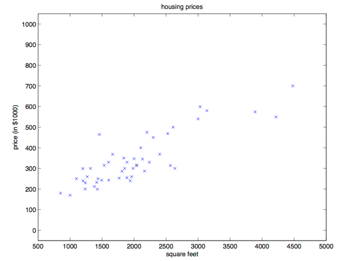
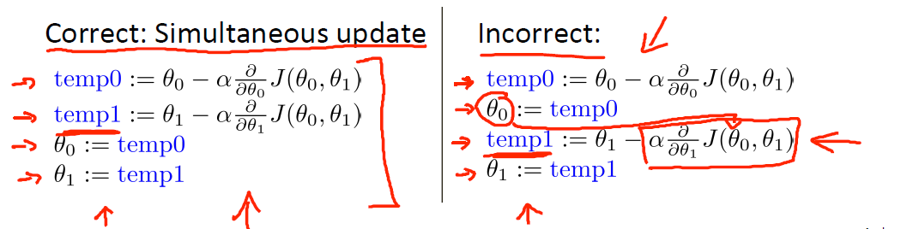
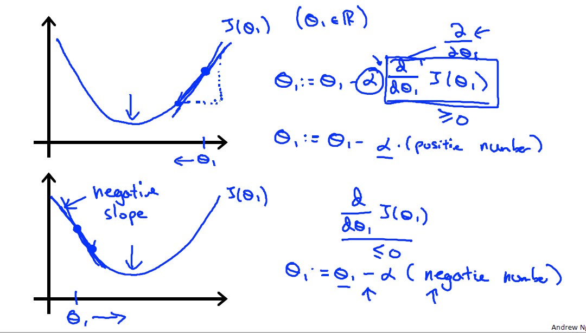
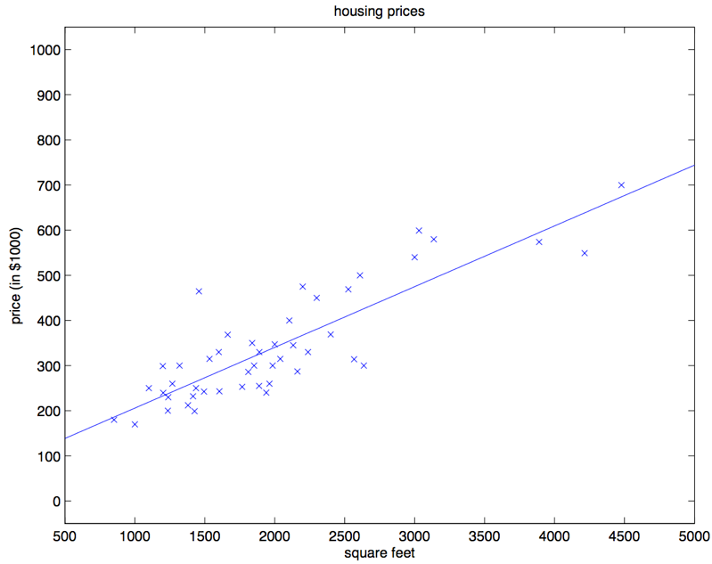

[上一章](00机器学习概述.md)，我们对机器学习做了简单的介绍，接下来，我们以线性回归作为机器学习的入门算法介绍并定义一些约定俗成的符号，这些符号在今后的学习中将反复出现，比如m表示样本数。接着，我们定义线性回归的损失函数，并通过梯度下降实现损失函数的最小化，并通过matlab实现。最后，我们介绍最小二乘法，并分析与梯度下降的不同之处。

# 1、线性回归（Linear Regression）

以吴恩达斯坦福的课程为例，假如咱们有一个数据集，里面的数据是俄勒冈州波特兰市的 47 套房屋的面积和价格：

| 居住面积（平方英尺） | 价格（千美元） |
| -------------------- | -------------- |
| 2104                 | 400            |
| 1600                 | 330            |
| 2400                 | 369            |
| 1416                 | 232            |
| 3000                 | 540            |
| ...                  | ...            |

用这些数据来投个图：



## 1.1、概念定义

这里要先规范一下符号和含义，这些符号的定义贯穿整个讲义。咱们假设 $x^{(i)}$ 表示 “输入的” 变量值（在这个例子中就是房屋面积），也可以叫做**输入特征**；然后咱们用 $y^{(i)}$ 来表示“输出值”，或者称之为**目标变量**，这个例子里面就是房屋价格。这样的一对 $(x^{(i)},y^{(i)})$就称为一组训练样本，然后咱们用来让机器来学习的数据集，就是一个长度为 m 的训练样本的列表-$\{(x^{(i)},y^{(i)}); i = 1,... ,m\}$-也叫做一个**训练集**。另外一定注意，这里的上标 (i) 只是作为训练集的索引记号，和数学乘方没有任何关系，千万别误解了。另外我们还会用大写的 X 来表示 **输入值的空间**，大写的 Y 表示**输出值的空间**。在本节的这个例子中，输入输出的空间都是实数域，所以  X = Y = R 。

然后再用更加规范的方式来描述一下监督学习问题，我们的目标是，给定一个训练集，来让机器学习一个函数 $h: X → Y$，让 $h(x)$ 能是一个与对应的真实 y 值比较接近的评估值。由于一些历史上的原因，这个函数 h 就被叫做**假设（hypothesis）**。用一个图来表示的话，这个过程大概就是下面这样：


如果我们要预测的目标变量是连续的，比如在咱们这个**房屋价格-面积**的案例中，这种学习问题就被称为**回归问题**。如果 y 只能取一小部分的离散的值（比如给定房屋面积，咱们要来确定这个房子是一个住宅还是公寓），这样的问题就叫做**分类问题**。

## 1.2、代价函数（Cost Function）

为了让我们的房屋案例更有意思，我们对数据集进行一下补充，增加上每一个房屋的卧室数目：

| 居住面积（平方英尺） | 卧室数目 | 价格（千美元） |
| -------------------- | -------- | -------------- |
| 2104                 | 3        | 400            |
| 1600                 | 3        | 330            |
| 2400                 | 3        | 369            |
| 1416                 | 2        | 232            |
| 3000                 | 4        | 540            |
| ...                  | ...      | ...            |
| ...                  | ...      | ...            |
| ...                  | ...      | ...            |

现在，输入特征 x 就是在 $R^2$ 范围取值的一个二维向量了。例如 $x_1^{(i)}$ 就是训练集中第 i 个房屋的面积，而 $x_2^{(i)}$  就是训练集中第 i 个房屋的卧室数目。（通常来说，设计一个学习算法的时候，选择那些输入特征都取决于你，所以如果你不在波特兰收集房屋信息数据，你也完全可以选择包含其他的特征，例如房屋是否有壁炉，卫生间的数量啊等等。关于特征筛选的内容会在后面的章节进行更详细的介绍，不过目前来说就暂时先用给定的这两个特征了。）
要进行这个监督学习，咱们必须得确定好如何在计算机里面对这个**函数/假设** h 进行表示。咱们现在刚刚开始，就来个简单点的，咱们把 y 假设为一个以 x 为变量的线性函数：

$ h_\theta  (x) = \theta_0 + \theta_1 \times x_1 + \theta_2 \times x_2$

这里的$\theta_i$是**参数**（也可以叫做**权重**），是从 x 到 y 的线性函数映射的空间参数。在不至于引起混淆的情况下，咱们可以把$h_\theta(x)$ 里面的 θ  省略掉，就简写成 $h(x$)。另外为了简化公式，咱们还设 $x_0 = 1$（这个为 **截距项 intercept term**）。这样简化之后就有了：

$ h(x) = \sum^n_{i=0}  \theta_i x_i = \theta^T x$

等式的最右边的 θ 和 x 都是向量，等式中的 $n$ 是输入 变量的个数（不包括$x_0$）。现在，给定了一个训练集了，咱们怎么来挑选/学习参数 θ 呢？一个看上去比较合理的方法就是让 $h(x)$ 尽量逼近 y，至少对咱已有的训练样本能适用。用公式的方式来表示的话，就要定义一个函数，来衡量对于每个不同的 θ 值，$h(x_{(i)})$ 与对应的 $y_{(i)}$ 的距离。这样用如下的方式定义了一个 **代价函数 （cost function**）:

$ J(\theta) = \frac {1}{2m} \sum^m_{i=1}(H_\theta(x^{(i)})-y^{(i)})^2  $

其中，二分之一是为了简化数学运算。（吴恩达在课程里给出的公式是$$ J(\theta) = \frac {1}{2} \sum^m_{i=1}(H_\theta(x^{(i)})-y^{(i)})^2  $$，这是因为除不除以m不影响最终的结果，相当于影响后面提到的$$\alpha$$，在Coursera课程中，他改回去了）如果之前你接触过线性回归，你会发现这个函数和常规最小二乘法拟合模型中的最小二乘法成本函数非常相似。不管之前接触过没有，咱们都接着往下进行，以后就会发现这是一个更广泛的算法家族中的一个特例。

另外我们提一下损失函数（Loss Function）、代价函数（Cost Function）和目标函数的概念。讲到正则化的时候会详细介绍。

- 损失函数：计算的是一个样本的误差
- 代价函数：整个训练集上所有样本误差的平均
- 目标函数：代价函数+正则化项

# 2、梯度下降（Gradient Descent）

我们希望选择一个能让 $J(\theta)$ 最小的 θ 值。怎么做呢，咱们先用一个搜索的算法，从某一个对 θ 的“初始猜测值”，然后对 θ 值不断进行调整，来让 $J(\theta)$ 逐渐变小，最好是直到我们能够达到一个使 $J(\theta)$ 最小的 θ。具体来说，咱们可以考虑使用梯度下降法（gradient descent algorithm），这个方法就是从某一个 θ 的初始值开始，然后逐渐重复更新：

$ \theta_j := \theta_j - \alpha \frac \partial {\partial\theta_J}J(\theta)$

> 注：本文中 $:= $ 表示的是计算机程序中的一种赋值操作，是把等号右边的计算结果赋值给左边的变量，$a := b$ 就表示用 B 的值覆盖 A 原有的 值。要注意区分，如果写的是 $a = b$ 则表示的是判断二者相等的关系。（译者注：在 Python 中，单个等号 $=$ 就是赋值，两个等号 $==$  表示相等关系的判断。

（上面的这个更新要同时对应从 0 到 $n$ 的所有j 值进行。）这里的 $\alpha$ 也称为**学习速率**。这个算法是很自然的，逐步重复朝向 J 降低最快的方向移动。这里我们需要强调的是，参数更新是同时更新的（吴恩达Coursera提到）



左上的为正确操作，右上的并不是我们上述所提及的梯度下降法。

要实现这个算法，咱们需要解决等号右边的导数项。首先来解决只有一组训练样本 $(x, y)$ 的情况，这样就可以忽略掉等号右边对 J 的求和项目了。公式就简化下面这样：

$\begin{aligned}
\frac \partial {\partial\theta_J}J(\theta) & = \frac \partial {\partial\theta_J} \frac  12(h_\theta(x)-y)^2\\
& = 2 \times\frac 12(h_\theta(x)-y)\times \frac \partial {\partial\theta_J}  (h_\theta(x)-y) \\
& = (h_\theta(x)-y)\times \frac \partial {\partial\theta_J} \times(\sum^n_{i=0} \theta_ix_i-y) \\
& = (h_\theta(x)-y)\times x_j
\end{aligned}$

对单个训练样本，更新规则如下所示：

$ \theta_j := \theta_j + \alpha (y^{(i)}-h_\theta (x^{(i)}))x_j^{(i)}$

这个规则也叫 LMS 更新规则 (LMS 是 “least mean squares” 的缩写，意思是最小均方)，也被称为 Widrow-Hoff 学习规则。这个规则有几个看上去就很自然直观的特性。例如，更新的大小与$(y^{(i)} − h_\theta(x^{(i)}))$成正比；另外，当我们遇到训练样本的预测值与 $y^{(i)}$ 的真实值非常接近的情况下，就会发现基本没必要再对参数进行修改了；与此相反的情况是，如果我们的预测值 $h\theta(x^{(i)})$ 与 $y^{(i)}$ 的真实值有很大的误差（比如距离特别远），那就需要对参数进行更大地调整。下图详细分析了梯度下降的运作方式，我们假设只有一个参数$$\theta_1$$，作如下分析：




## 2.2、批量梯度下降法（batch gradient descent）

当只有一个训练样本的时候，我们推导出了 LMS 规则。当一个训练集有超过一个训练样本的时候，有两种对这个规则的修改方法。第一种就是下面这个算法：

重复直到收敛{
$ \theta_j := \theta_j +  \alpha \frac{1}{m} \sum^m_{i=1}(y^{(i)}-h_\theta (x^{(i)}))x_j^{(i)}$ (对每个 J)

}

读者很容易能证明，在上面这个更新规则中求和项的值就是$\frac {\partial J(\theta)}{\partial \theta_j}$ (这是因为对 J 的原始定义)。所以这个更新规则实际上就是对原始的成本函数 $J $进行简单的梯度下降。这一方法在每一个步长内检查所有整个训练集中的所有样本，也叫做批量梯度下降法。这里要注意，因为梯度下降法容易被局部最小值影响，而我们要解决的这个线性回归的优化问题只能有一个全局的而不是局部的最优解；因此，梯度下降法应该总是收敛到全局最小值（假设学习速率 $\alpha$ 不设置的过大）。J 是一个凸的二次函数。下面是一个样例，其中对一个二次函数使用了梯度下降法来找到最小值。


上图的椭圆就是一个二次函数的轮廓图。图中还有梯度下降法生成的规矩，初始点位置在$(48,30)$。图中的画的 x （用直线连接起来了）标记了梯度下降法所经过的 θ 的可用值。
对咱们之前的房屋数据集进行批量梯度下降来拟合 θ ，把房屋价格当作房屋面积的函数来进行预测，我们得到的结果是 $\theta_0 = 71.27, \theta_1 = 0.1345$。如果把 $h_{\theta}(x)$ 作为一个定义域在 x 上的函数来投影，同时也投上训练集中的已有数据点，会得到下面这幅图：


如果在数据集中添加上卧室数目作为输入特征，那么得到的结果就是 $\theta_0 = 89.60, \theta_1 = 0.1392, \theta_2 = −8.738$
这个结果就是用批量梯度下降法来获得的。

## 2.3、随机梯度下降法（stochastic gradient descent）

此外还有另外一种方法能够替代批量梯度下降法，这种方法效果也不错。如下所示：

循环：{
i 从 1 到 m:{
​		$ \theta_j := \theta_j  +\alpha(y^{(i)}-h_{\theta}(x^{(i)}))x_j^{(i)}$ (对每个 j)
​	}
}

在这个算法里，我们对整个训练集进行了循环遍历，每次遇到一个训练样本，根据每个单一训练样本的误差梯度来对参数进行更新。这个算法叫做随机梯度下降法，或者叫增量梯度下降法（incremental gradient descent）。批量梯度下降法要在运行第一步之前先对整个训练集进行扫描遍历，当训练集的规模 $m​$ 变得很大的时候，因此引起的性能开销就很不划算了；随机梯度下降法就没有这个问题，而是可以立即开始，对查询到的每个样本都进行运算。通常情况下，随机梯度下降法查找到足够接近最低值的 θ 的速度要比批量梯度下降法更快一些。(也要注意，也有可能会一直无法收敛（converge）到最小值，这时候 θ 会一直在 $J_{(\theta)}​$ 最小值附近震荡；不过通常情况下在最小值附近的这些值大多数其实也足够逼近了，足以满足咱们的精度要求，所以也可以用。当然更常见的情况通常是我们事先对数据集已经有了描述，并且有了一个确定的学习速率$\alpha​$，然后来运行随机梯度下降，同时逐渐让学习速率 $\alpha​$ 随着算法的运行而逐渐趋于 0，这样也能保证我们最后得到的参数会收敛到最小值，而不是在最小值范围进行震荡。) 由于以上种种原因，通常更推荐使用的都是随机梯度下降法，而不是批量梯度下降法，尤其是在训练用的数据集规模大的时候。

## 2.4、小批量梯度下降法（Mini-batch gradient descent）

SGD相对来说要快很多，但是 也有存在问题，由于单个样本的训练可能会带来很多噪声，使得SGD并不是每次迭代都向着整体最优化方向，因此在刚开始训练时可能收敛得很快，但是训练一段时间后就会变得很慢。在此基础上又提出了小批量梯度下降法，它是每次从样本中随机抽取一小批进行训练，而不是一组。

# 3、Couresa作业

假设你是一个公司的CEO，在不同城市设有分公司，已知不同城市的人口和利润，通过线性回归预测人口和利润的关系。

```matlab
%% 线性回归
% 数据来源来自吴恩达机器学习Couresa第一次作业

% 读取数据
data = load("Data/ex1data1.txt");
x = data(:, 1:end-1);
y = data(:, end);
m = size(x, 1);
n = size(x, 2);
% 可视化数据
plot(x, y, '*');
hold on;
%初始化参数
theta = zeros(1, n + 1);
iteration = 1500;
alpha = 0.02;
J = 0;
x = [ones(m, 1), x];
% 梯度下降优化参数
for i = 1:iteration
    theta = theta - alpha*(x*theta'-y)'*x/m;
    J = sum((x*theta'-y).^2)/2/m;
end
% 回归效果
plot(x, theta(1)+theta(2)*x);
disp(theta);
disp(J);
    
```

# 4、小结

下一章将对梯度下降算法各种参数调整进行分析。

