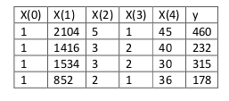

[TOC]

上一章介绍了梯度下降法的参数调整策略，梯度下降法是一种找出 J 最小值的办法。这一章我们介绍另一种实现方法，这种方法寻找起来简单明了，而且不需要使用迭代算法。这种方法就是，我们直接利用找对应导数为 0 位置的 $\theta_j$，这样就能找到 J 的最小值了。我们想实现这个目的，还不想写一大堆代数公式或者好几页的矩阵积分，所以就要介绍一些做矩阵积分的记号。

# 1、矩阵记号

## 1.1、矩阵导数（Matrix derivatives）

所谓矩阵求导，本质上只不过是多元函数求导，仅仅是把函数的自变量以及求导的结果排列成了矩阵的形式，方便表达与计算而已。假如有一个函数 $f: R_{m\times n} → R$ 从 $m\times n$ 大小的矩阵映射到实数域，那么就可以定义当矩阵为 A 的时候有导函数 $f​$ 如下所示：

$ \nabla_A f(A)=\begin{bmatrix} \frac {\partial f}{\partial A_{11}} & \vdots  & \frac {\partial f}{\partial A_{1n}} \\ \vdots  & \vdots & \vdots  \\ \frac {\partial f}{\partial A_{m1}} & \vdots  & \frac {\partial f}{\partial A_{mn}} \\ \end{bmatrix}$

因此，这个梯度 $\nabla_A f(A)$本身也是一个 m*n 的矩阵，其中的第 (i,j) 个元素是 $\frac {\partial f}{\partial A_{ij}} $ 。
假如 $ A =\begin{bmatrix} A_{11} & A_{12} \\ A_{21} & A_{22} \\ \end{bmatrix} $ 是一个 $2\times 2$  矩阵，然后给定的函数 $f:R^{2\times 2} → R$ 为:

$ f(A) = \frac 32A_{11}+5A^2_{12}+A_{21}\times A_{22}$

这里面的 $A_{ij}$ 表示的意思是矩阵 A 的第 (i,j) 个元素。

然后就有了梯度：

$ \nabla _A f(A) =\begin{bmatrix} \frac  32 & 10 \times A_{12} \\ A_{22} & A_{21} \\ \end{bmatrix} $

## 1.2、矩阵求迹

然后咱们还要引入 trace 求迹运算，简写为 tr。对于一个给定的 $n\times n$ 方形矩阵 A，它的迹定义为对角项和：

$ trA = \sum^n_{i=1} A_{ii}$

假如 A 是一个实数，实际上 A 就可以看做是一个 $1\times 1$ 的矩阵，那么就有 A 的迹 $tr a = a$。(如果你之前没有见到过这个“运算记号”，就可以把 A 的迹看成是 $tr(A)$，或者理解成为一个对矩阵 A 进行操作的 trace 函数。不过通常情况都是写成不带括号的形式更多一些。) 
如果有两个矩阵 A 和 B，能够满足 $AB$ 为方阵，trace 求迹运算就有一个特殊的性质： $trAB = trBA$ (自己想办法证明)。在此基础上进行推论，就能得到类似下面这样的等式关系：

$trABC=trCAB=trBCA$
$trABCD=trDABC=trCDAB=trBCDA$

下面这些和求迹运算相关的等量关系也很容易证明。其中 A 和 B 都是方形矩阵，A 是一个实数：
$ trA=trA^T$
$ tr(A+B)=trA+trB$
$ tr a A=a trA$

接下来咱们就来在不进行证明的情况下提出一些矩阵导数（其中的一些直到本节末尾才用得上）。另外要注意等式（4）A 必须是**非奇异方形矩阵（non-singular square matrices**），而 $|A|$ 表示的是矩阵 A 的行列式。那么我们就有下面这些等量关系：

$
\begin{aligned}
   \nabla_A tr AB & = B^T & \text{(1)}\\
   \nabla_{A^T} f(A) & = (\nabla_{A} f(A))^T &\text{(2)}\\
   \nabla_A tr ABA^TC& = CAB+C^TAB^T &\text{(3)}\\
   \nabla_A|A| & = |A|(A^{-1})^T &\text{(4)}\\
\end{aligned}
$

为了让咱们的矩阵运算记号更加具体，咱们就详细解释一下这些等式中的第一个。加入我们有俩一个确定的矩阵 $B ∈ R^{n\times m}$（注意顺序，是$m\times n$，这里的意思也就是 B 的元素都是实数，B 的形状是 $n\times m$ 的一个矩阵），那么接下来就可以定义一个函数$ f: R^{m\times n} → R$ ，对应这里的就是 $f(A) = trAB$。这里要注意，这个矩阵是有意义的，因为如果 $A ∈ R^{m\times n} $，那么 $AB$ 就是一个方阵，是方阵就可以应用 trace 求迹运算；因此，实际上 f 映射的是从 $R^{m\times n} $ 到实数域 $R$。这样接下来就可以使用矩阵导数来找到 $\nabla_Af(A)$ ，这个导函数本身也是一个 $m \times n $的矩阵。上面的等式(1) 表明了这个导数矩阵的第 (i,j)个元素等同于 $B^T$ （B的转置）的第 (i,j) 个元素，或者更直接表示成 $B_{ji}$。
上面等式(1-3) 都很简单，证明就都留给读者做练习了。等式(4)需要用逆矩阵的伴随矩阵来推导出。

> 注：假如咱们定义一个矩阵 $A′$，它的第 (i,j) 个元素是$ (−1)^{i+j}$ 与矩阵 $A $移除 第 i 行 和 第 J 列 之后的行列式的乘积，则可以证明有$A^{−1} = (A′)^T /|A|$。（你可以检查一下，比如在 A 是一个 $2\times 2$ 矩阵的情况下看看 $A^{-1}$ 是什么样的，然后以此类推。如果你想看看对于这一类结果的证明，可以参考一本中级或者高级的线性代数教材，比如Charles Curtis, 1991, Linear Algebra, Springer。）这也就意味着 $A′ = |A|(A−1)^T $。此外，一个矩阵 A 的行列式也可以写成 $|A| = A_{ij}A′$ 。因为 $(A′)_{ij}$ 不依赖 $A_{ij}$ （通过定义也能看出来），这也就意味着$(\frac  \partial {\partial A_{ij}})|A| = A′_{ij} $，综合起来也就得到上面的这个结果了。

# 2、正规方程

到目前为止，我们都在使用梯度下降算法，但是对于某些线性回归问题，正规方程方法是更好的解决方案。如：


正规方程是通过求解下面的方程来找出使得代价函数最小的参数的：$\frac{\partial}{\partial{\theta_{j}}}J\left( {\theta_{j}} \right)=0$ 。
 假设我们的训练集特征矩阵为 $X$（包含了 ${{x}_{0}}=1$）并且我们的训练集结果为向量 $y$，则利用正规方程解出向量 $\theta ={{\left( {X^T}X \right)}^{-1}}{X^{T}}y$ 。
上标**T**代表矩阵转置，上标-1 代表矩阵的逆。设矩阵$A={X^{T}}X$，则：${{\left( {X^T}X \right)}^{-1}}={A^{-1}}$
以下表示数据为例：



即：


运用正规方程方法求解参数：


在 **Octave** 中，正规方程写作：

```
pinv(X'*X)*X'*y
```

注：对于那些不可逆的矩阵（通常是因为特征之间不独立，如同时包含英尺为单位的尺寸和米为单位的尺寸两个特征，也有可能是特征数量大于训练集的数量），正规方程方法是不能用的。

梯度下降与正规方程的比较：

| 梯度下降                      | 正规方程                                                     |
| ----------------------------- | ------------------------------------------------------------ |
| 需要选择学习率$\alpha$        | 不需要                                                       |
| 需要多次迭代                  | 一次运算得出                                                 |
| 当特征数量$n$大时也能较好适用 | 需要计算${{\left( {{X}^{T}}X \right)}^{-1}}$ 如果特征数量n较大则运算代价大，因为矩阵逆的计算时间复杂度为$O\left( {{n}^{3}} \right)$，通常来说当$n$小于10000 时还是可以接受的 |
| 适用于各种类型的模型          | 只适用于线性模型，不适合逻辑回归模型等其他模型               |

总结一下，只要特征变量的数目并不大，标准方程是一个很好的计算参数$\theta $的替代方法。具体地说，只要特征变量数量小于一万，我通常使用标准方程法，而不使用梯度下降法。

随着我们要讲的学习算法越来越复杂，例如，当我们讲到分类算法，像逻辑回归算法，我们会看到，实际上对于那些算法，并不能使用标准方程法。对于那些更复杂的学习算法，我们将不得不仍然使用梯度下降法。因此，梯度下降法是一个非常有用的算法，可以用在有大量特征变量的线性回归问题。或者我们以后在课程中，会讲到的一些其他的算法，因为标准方程法不适合或者不能用在它们上。但对于这个特定的线性回归模型，标准方程法是一个比梯度下降法更快的替代算法。所以，根据具体的问题，以及你的特征变量的数量，这两种算法都是值得学习的。

正规方程的**python**实现：

```python
import numpy as np
    
 def normalEqn(X, y):
    
   theta = np.linalg.inv(X.T@X)@X.T@y #X.T@X等价于X.T.dot(X)
    
   return theta
```

# 3、正规方程公式推导

通过刚才的内容，咱们大概掌握了矩阵导数这一工具，接下来咱们就继续用逼近模型（closed-form）来找到能让 $J(\theta)$ 最小的 θ 值。首先咱们把 J 用矩阵-向量的记号来重新表述。
给定一个训练集，把设计矩阵（design matrix） x 设置为一个 $m\times n$ 矩阵（实际上，如果考虑到截距项，也就是 $\theta_0$ 那一项，就应该是 $m\times (n+1)$ 矩阵），这个矩阵里面包含了训练样本的输入值作为每一行：
$ X =\begin{bmatrix}
-(x^{(1)}) ^T-\\
-(x^{(2)}) ^T-\\
\vdots \\
-(x^{(m)}) ^T-\\
\end{bmatrix} $


然后，咱们设 $\vec{y}$ 是一个 $m$ 维向量（m-dimensional vector），其中包含了训练集中的所有目标值：

$ y =\begin{bmatrix}
y^{(1)}\\
y^{(2)}\\
\vdots \\
y^{(m)}\\
\end{bmatrix} $

因为 $h_\theta (x^{(i)}) = (x^{(i)})^T\theta $（译者注：这个怎么推出来的我目前还没尝试，目测不难），所以可以证明存在下面这种等量关系：

$
\begin{aligned}
X\theta - \vec{y}  &=
\begin{bmatrix}
(x^{(1)})^T\theta \\
\vdots \\
(x^{(m)})^T\theta\\
\end{bmatrix} -
\begin{bmatrix}
y^{(1)}\\
\vdots \\
y^{(m)}\\
\end{bmatrix}\\
& =
\begin{bmatrix}
h_\theta (x^{1}) -y^{(1)}\\
\vdots \\
h_\theta (x^{m})-y^{(m)}\\
\end{bmatrix}\\
\end{aligned}
$

对于向量 $\vec{z}$ ，则有 $z^T z = z^2$ ，因此利用这个性质，可以推出:


$
\begin{aligned}
\frac 12(X\theta - \vec{y})^T (X\theta - \vec{y}) &=\frac 12 \sum^m_{i=1}(h_\theta (x^{(i)})-y^{(i)})^2\\
\end{aligned}
$

最后，要让 J 的值最小，就要找到导数为 0 的点。结合等式（2）和等式（3），就能得到下面这个等式（5）：

$ \nabla_{A^T} trABA^TC =B^TA^TC^T+BA^TC   \text{(5)}$

因此就有：

$
\begin{aligned}
\nabla_\theta J(\theta) &= \nabla_\theta \frac 12 (X\theta - \vec{y})^T (X\theta - \vec{y}) \\
&= \frac  12 \nabla_\theta (\theta ^TX^TX\theta -\theta^T X^T \vec{y} - \vec{y} ^TX\theta +\vec{y}^T \vec{y})\\
&= \frac  12 \nabla_\theta tr(\theta ^TX^TX\theta -\theta^T X^T \vec{y} - \vec{y} ^TX\theta +\vec{y}^T \vec{y})\\
&= \frac  12 \nabla_\theta (tr \theta ^TX^TX\theta - 2tr\vec{y} ^T X\theta)\\
&= \frac  12 (X^TX\theta+X^TX\theta-2X^T\vec{y}) \\
&= X^TX\theta-X^T\vec{y}\\
\end{aligned}
$

在第三步，我们用到了一个定理，也就是一个实数的迹就是这个实数本身；第四步用到了 $trA = trA^T$ 这个定理；第五步用到了等式（5），其中 $A^T =\theta, B=B^T =X^TX, C=I$,还用到了等式 (1)。要让 J 取得最小值，就设导数为 0 ，然后就得到了下面的正规方程（normal equations）：

$ X^TX\theta =X^T\vec{y}$

所以让 $J(\theta)$ 取值最小的 θ 就是$\theta = (X^TX)^{-1}X^T\vec{y}$

