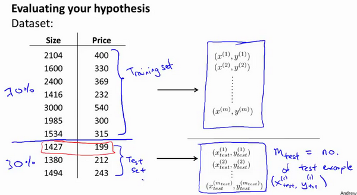

前面几章我们已经介绍了多种学习算法，但是在实际设计机器学习系统的时候，我们可能因为没有完全理解怎样运用这些算法，而总是把时间浪费在毫无意义的尝试上。这一章，我们将介绍一些有关模型选择的方法——"机器学习诊断法“，它能够指导我们如何选择并优化模型，从而节省时间成本。

# 1、机器学习诊断法

我们使用预测房价作为学习例子。假设我们已经完成了正则化线性回归，并得到了学习参数。如果将假设函数放到一组新的房屋样本上进行测试，发现在预测房价时产生了巨大的误差。那么接下来应该怎么办呢，该如何改进算法？其实可以想出很多种方法来改进这个算法的性能。

首先可以**使用更多的训练样本**。具体来说，可以通过电话调查或上门调查来获取更多的不同的房屋出售数据。遗憾的是，收集两倍甚至十倍数量的训练样本不一定会解决问题。有时候获得更多的训练数据实际上并没有作用。我们也将知道怎样避免把过多的时间浪费在收集更多的训练数据上。

其次我们可以**尝试选用更少的特征集**。因此如果有一系列特征比如$x_1,x_2,x_3$等等，我们可以花一点时间从这些特征中仔细挑选一小部分来防止过拟合。

或者我们可以**尝试使用更多的特征**，也许目前的特征集，对你来讲并不是很有帮助。你希望从获取更多特征的角度来收集更多的数据，同样地，你可以把这个问题扩展为一个很大的项目，比如使用电话调查来得到更多的房屋案例，或者再进行土地测量来获得更多有关，这块土地的信息等等，因此这是一个复杂的问题。同样的道理，我们非常希望在花费大量时间完成这些工作之前，我们就能知道其效果如何。

我们也可以**尝试增加多项式特征的方法**，比如$x_1$的平方，$x_2$的平方，$x_1,x_2$的乘积，我们可以花很多时间来考虑这一方法。

最后，我们也可以**考虑减小或增大正则化参数$\lambda$的值**。

我们列出的这个单子，上面的很多方法都可以扩展开来扩展成一个六个月或更长时间的项目。遗憾的是，大多数人用来选择这些方法的标准是凭感觉的，也就是说，大多数人的选择方法是随便从这些方法中选择一种，而在六个月或者更长时间后，他们很遗憾地发现自己选择的是一条不归路。幸运的是，有机器学习诊断法能让你事半功倍，排除掉单子上的至少一半的方法，留下那些确实有前途的方法，从而为你节省大量不必要花费的时间。最终达到改进机器学习系统性能的目的。“诊断法”的意思是：这是一种测试法，你通过执行这种测试，能够深入了解某种算法到底是否有用。这通常也能够告诉你，要想改进一种算法的效果，什么样的尝试，才是有意义的。

# 2、评估一个假设

首先介绍一下怎样用你学过的算法来评估假设函数。

当我们确定学习算法的参数的时候，我们考虑的是选择参量来使训练误差最小化，有人认为得到一个非常小的训练误差一定是一件好事，但我们已经知道，仅仅是因为这个假设具有很小的训练误差，并不能说明它就一定是一个好的假设函数。而且我们也学习了过拟合假设函数的例子，所以这推广到新的训练集上是不适用的。显然，我们不能通过画出假设函数来进行观察，从而确定是否过拟合。因此，我们需要另一种方法来评估我们的假设函数过拟合检验。

为了检验算法是否过拟合，我们将数据分成训练集和测试集，通常用70%的数据作为训练集，用剩下30%的数据作为测试集。很重要的一点是训练集和测试集均要含有各种类型的数据，通常我们要对数据进行“洗牌”，然后再分成训练集和测试集。

测试集评估在通过训练集让我们的模型学习得出其参数后，对测试集运用该模型，我们有两种方式计算误差：

1. 对于线性回归模型，我们利用测试集数据计算代价函数$J$

2. 对于逻辑回归模型，我们除了可以利用测试数据集来计算代价函数外：

   $$ J_{test}{(\theta)} = -\frac{1}{{m}_{test}}\sum_\limits{i=1}^{m_{test}}\log{h_{\theta}(x^{(i)}_{test})}+(1-{y^{(i)}_{test}})\log{h_{\theta}(x^{(i)}_{test})} $$

误分类的比率，对于每一个测试集样本，计算：

$$Test_error = \frac{1}{m_test}\sum_\limits{i=1}^{m_{test}}err(h_\theta(x),y)$$

然后对计算结果求平均。

# 3、模型选择和交叉验证集

假设我们要在10个不同次数的二项式模型之间进行选择：

显然越高次数的多项式模型越能够适应我们的训练数据集，但是适应训练数据集并不代表着能推广至一般情况，我们应该选择一个更能适应一般情况的模型。我们需要使用交叉验证集来帮助选择模型。

即：使用60%的数据作为训练集，使用 20%的数据作为交叉验证集，使用20%的数据作为测试集

模型选择的方法为：

1. 使用训练集训练出10个模型

2. 用10个模型分别对交叉验证集计算得出交叉验证误差（代价函数的值）

3. 选取代价函数值最小的模型

4. 用步骤3中选出的模型对测试集计算得出推广误差（代价函数的值）

   ***Train/validation/test error***

   **Training error:**

   ​			$J_{train}(\theta) = \frac{1}{2m}\sum_\limits{i=1}^{m}(h_{\theta}(x^{(i)})-y^{(i)})^2$

   **Cross Validation error:**

   ​			$J_{cv}(\theta) = \frac{1}{2m_{cv}}\sum_\limits{i=1}^{m}(h_{\theta}(x^{(i)}_{cv})-y^{(i)}_{cv})^2$

   **Test error:**

   ​			$J_{test}(\theta)=\frac{1}{2m_{test}}\sum_\limits{i=1}^{m_{test}}(h_{\theta}(x^{(i)}_{cv})-y^{(i)}_{cv})^2$

# 4、诊断偏差和方差

当你运行一个学习算法时，如果这个算法的表现不理想，那么多半是出现两种情况：要么是偏差比较大，要么是方差比较大。换句话说，出现的情况要么是欠拟合，要么是过拟合问题。那么这两种情况，哪个和偏差有关，哪个和方差有关，或者是不是和两个都有关？搞清楚这一点非常重要，因为能判断出现的情况是这两种情况中的哪一种。其实是一个很有效的指示器，指引着可以改进算法的最有效的方法和途径。在这段视频中，我想更深入地探讨一下有关偏差和方差的问题，希望你能对它们有一个更深入的理解，并且也能弄清楚怎样评价一个学习算法，能够判断一个算法是偏差还是方差有问题，因为这个问题对于弄清如何改进学习算法的效果非常重要，高偏差和高方差的问题基本上来说是欠拟合和过拟合的问题。

我们通常会通过将训练集和交叉验证集的代价函数误差与多项式的次数绘制在同一张图表上来帮助分析：

**Bias/variance**

**Training error:**				               $J_{train}(\theta) = \frac{1}{2m}\sum_\limits{i=1}^{m}(h_{\theta}(x^{(i)})-y^{(i)})^2$

**Cross Validation error:**				$J_{cv}(\theta) = \frac{1}{2m_{cv}}\sum_\limits{i=1}^{m}(h_{\theta}(x^{(i)}_{cv})-y^{(i)}_{cv})^2$

对于训练集，当 $d$ 较小时，模型拟合程度更低，误差较大；随着 $d$ 的增长，拟合程度提高，误差减小。

对于交叉验证集，当 $d$ 较小时，模型拟合程度低，误差较大；但是随着 $d$ 的增长，误差呈现先减小后增大的趋势，转折点是我们的模型开始过拟合训练数据集的时候。

如果我们的交叉验证集误差较大，我们如何判断是方差还是偏差呢？根据上面的图表，我们知道:

训练集误差和交叉验证集误差近似时：偏差/欠拟合

交叉验证集误差远大于训练集误差时：方差/过拟合

# 5、正则化和偏差/方差

在我们在训练模型的过程中，一般会使用一些正则化方法来防止过拟合。但是我们可能会正则化的程度太高或太小了，即我们在选择λ的值时也需要思考与刚才选择多项式模型次数类似的问题。

我们选择一系列的想要测试的 $\lambda$ 值，通常是 0-10之间的呈现2倍关系的值（如： 0,0.01,0.02,0.04,0.08,0.15,0.32,0.64,1.28,2.56,5.12,10共12个）。 我们同样把数据分为训练集、交叉验证集和测试集。

选择$\lambda$的方法为：

1. 使用训练集训练出12个不同程度正则化的模型
2. 用12个模型分别对交叉验证集计算的出交叉验证误差
3. 选择得出交叉验证误差**最小**的模型
4. 运用步骤3中选出模型对测试集计算得出推广误差，我们也可以同时将训练集和交叉验证集模型的代价函数误差与λ的值绘制在一张图表上：

- 当 $\lambda$ 较小时，训练集误差较小（过拟合）而交叉验证集误差较大
- 随着 $\lambda$ 的增加，训练集误差不断增加（欠拟合），而交叉验证集误差则是先减小后增加

# 6、学习曲线

- 学习曲线就是一种很好的工具，我经常使用学习曲线来判断某一个学习算法是否处于偏差、方差问题。学习曲线是学习算法的一个很好的**合理检验**（**sanity check**）。学习曲线是将训练集误差和交叉验证集误差作为训练集样本数量（$m$）的函数绘制的图表。
- 即，如果我们有100行数据，我们从1行数据开始，逐渐学习更多行的数据。思想是：当训练较少行数据的时候，训练的模型将能够非常完美地适应较少的训练数据，但是训练出来的模型却不能很好地适应交叉验证集数据或测试集数据。

如何利用学习曲线识别高偏差/欠拟合：作为例子，我们尝试用一条直线来适应下面的数据，可以看出，无论训练集有多么大误差都不会有太大改观：

也就是说在高偏差/欠拟合的情况下，增加数据到训练集不一定能有帮助。

如何利用学习曲线识别高方差/过拟合：假设我们使用一个非常高次的多项式模型，并且正则化非常小，可以看出，当交叉验证集误差远大于训练集误差时，往训练集增加更多数据可以提高模型的效果。

也就是说在高方差/过拟合的情况下，增加更多数据到训练集可能可以提高算法效果。

# 7、如何改进神经网络

我们已经介绍了怎样评价一个学习算法，我们讨论了模型选择问题，偏差和方差的问题。那么这些诊断法则怎样帮助我们判断，哪些方法可能有助于改进学习算法的效果，而哪些可能是徒劳的呢？

让我们再次回到最开始的例子，在那里寻找答案，这就是我们之前的例子。回顾 1.1 中提出的六种可选的下一步，让我们来看一看我们在什么情况下应该怎样选择：

1. 获得更多的训练样本——解决高方差
2. 尝试减少特征的数量——解决高方差
3. 尝试获得更多的特征——解决高偏差
4. 尝试增加多项式特征——解决高偏差
5. 尝试减少正则化程度λ——解决高偏差
6. 尝试增加正则化程度λ——解决高方差

神经网络的方差和偏差：

使用较小的神经网络，类似于参数较少的情况，容易导致高偏差和欠拟合，但计算代价较小使用较大的神经网络，类似于参数较多的情况，容易导致高方差和过拟合，虽然计算代价比较大，但是可以通过正则化手段来调整而更加适应数据。

通常选择较大的神经网络并采用正则化处理会比采用较小的神经网络效果要好。

对于神经网络中的隐藏层的层数的选择，通常从一层开始逐渐增加层数，为了更好地作选择，可以把数据分为训练集、交叉验证集和测试集，针对不同隐藏层层数的神经网络训练神经网络，

然后选择交叉验证集代价最小的神经网络。

# 8、总结

好的，以上就是我们介绍的偏差和方差问题，以及诊断该问题的学习曲线方法。在改进学习算法的表现时，你可以充分运用以上这些内容来判断哪些途径可能是有帮助的。而哪些方法可能是无意义的。如果你理解了以上几节视频中介绍的内容，并且懂得如何运用。那么你已经可以使用机器学习方法有效的解决实际问题了。你也能像硅谷的大部分机器学习从业者一样，他们每天的工作就是使用这些学习算法来解决众多实际问题。我希望这几节中提到的一些技巧，关于方差、偏差，以及学习曲线为代表的诊断法能够真正帮助你更有效率地应用机器学习，让它们高效地工作。

# 9、Couresa练习

本题需要实现正则化线性回归模型，并且研究其偏差和方差。本题给出的数据是水库水位和水库出水量，我们需要构建正则化线性回归模型进行预测。