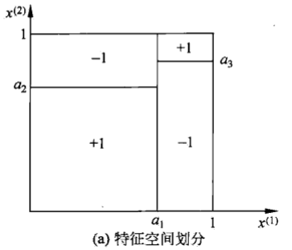

决策树是一种基本的分类与回归方法。预测时，对新的数据，利用决策树模型进行分类，决策树学习通常包括3个步骤：特征选择、决策树的生成和决策树的修剪。

# 决策树

## 特征空间的划分

决策树表示给定特定条件下类的条件概率分布。这一条件概率分布定义在特征空间的一个划分上，将特征空间划分为互不相交的单元区域，并在每个单元定义一个类的概率分布就构成了一个条件概率分布。决策树的一条路经对应于划分中的一个单元。如图

图中的大的正方形表示特征空间，小的正方形表示特征空间的划分。

## 决策树学习

决策树学习本质上是从训练数据集中归纳出一组分类规则。与训练数据集不想矛盾的决策树可能有多个，也可能一个也没有。我们需要的是一个与训练数据矛盾较小的决策树，同时具有很好的泛化能力。

# 特征选择

特征选择在于选择对训练数据具有分类能力的特征，如果一个特征进行分类的结果与随机分类的结果没有很大的差别，则称这个特征没有分类能力。通常根据信息增益或信息增益比选择特征。举例：

《统计学习方法P59》

由信息论的基本知识，我们知道**[熵](信息论.md#test)**，$H(X)=-\sum_{i=1}^{n}{p_i\log{p_i}}$是随机变量不确定性的度量，**条件熵**，即$H(Y|X)=\sum_{i=1}^{n}{p_iH(Y|X=x_i)}$表示$X$给定的条件下随机变量$Y$的条件概率分布的熵对$X$的数学期望。

**信息增益**表示得知特征$X$的信息而使类$Y$的信息的不确定性减少的程度。

信息增益大的特征具有更强的分类能力。

因为以信息增益作为划分训练集的特征，存在偏向于选择取值较多的特征，故提出**信息增益比**作为另一准则。

**信息增益比**：信息增益与训练集$D$关于特征$A$的值的熵之比
$$
g_R(D,A)=\frac{g(D,A)}{H_A(D)}
$$
其中，$H_A(D)=-\sum_{i=1}^{n}\frac{|D_i|}{|D|}\log_{2}{\frac{D_i}{D}}$，$n$是特征$A$取值的个数。

# 决策树的生成

## ID3算法思路

输入：训练数据集D，特征集A，阈值$\epsilon$
输出：决策树T

1. 若D中所有实例属于同一类$C_k$，则$T$为单结点树，并将类$C_k$作为该结点的类标记，返回$T$
2. 若$A=\varnothing$，则$T$为单结点树，并将$D$中实例数最大的类$C_k$作为该结点的类标记，返回$T$
3. 否则，计算$A$中各特征对$D$的信息增益，选择信息增益最大的特征$A_g$
4. 如果$A_g$的信息增益小于阈值$\epsilon$，则置$T$为单结点树，并将$D$中实例数最大的类$C_k$作为该结点的类标记，返回$T$
5. 否则，对$A_g$的每一可能值$a_i$，依$A_g=a_i$将$D$分割为若干非空子集$D_i$，剪$D_i$中实例数最大的类作为标记，构建子结点，由结点及其子结点构成树$T$，返回$T$
6. 对第$I$个子结点，以$D_i$为训练集，以$A-\{A_g\}$为特征集，递归地调用1～5，得到子树$T_i$，返回$T$

## C4.5算法思路

输入：训练数据集D，特征集A，阈值$\epsilon$
输出：决策树T

1. 若D中所有实例属于同一类$C_k$，则$T$为单结点树，并将类$C_k$作为该结点的类标记，返回$T$
2. 若$A=\varnothing$，则$T$为单结点树，并将$D$中实例数最大的类$C_k$作为该结点的类标记，返回$T$
3. 否则，计算$A$中各特征对$D$的信息增益，选择信息增益最大的特征$A_g$
4. 如果$A_g$的信息增益比小于阈值$\epsilon$，则置$T$为单结点树，并将$D$中实例数最大的类$C_k$作为该结点的类标记，返回$T$
5. 否则，对$A_g$的每一可能值$a_i$，依$A_g=a_i$将$D$分割为若干非空子集$D_i$，剪$D_i$中实例数最大的类作为标记，构建子结点，由结点及其子结点构成树$T$，返回$T$
6. 对第$I$个子结点，以$D_i$为训练集，以$A-\{A_g\}$为特征集，递归地调用1～5，得到子树$T_i$，返回$T$

# 剪枝

损失函数：

$$C_\alpha(T)=\sum_{t=1}^{|T|}N_tH_t(T)+\alpha|T|$$

$$H_t(T)=-\sum_{k}^{}\frac{N_{tk}}{N_t}\log{\frac{N_{tk}}{N_t}}$$

参数$\alpha$控制两者之间的影响，较大的$\alpha$促使选择较简单的模型，较小的$\alpha$促使选择较复杂的模型。

# CART（classification and regression tree）

分类回归树模型是由Breiman等人在1984年提出，是广泛应用的决策树学习方法。$CART$假设决策树是二叉树，内部结点特征的取值为"是"和”否“，左分支是取值为”是“的分支，右分支是取值为 ”否“的分支 。这样决策树等价于递归地二分每个特征，并将输入空间即特征空间 划分为有限个单元，并在这些单元上确定预测的概率分布。

## 回归树

## 分类树

## 特征选择

基尼指数：分类问题中，假设有$K$个类，样本点属于第$k$类的概率为$p_k$，则概率分布的基尼指数定义为

$$Gini(p)=\sum_{k=1}^{K}p_k(1-p_k)=1-\sum_{k=1}^{K}p_k^2$$

如果样本集合$D$根据特征$A$是否取值某一可能值$a$被分割成$D_1$和$D_2$两部分，即

$$D_1=\{(x,y) \in D|A(x)=a\},\ D_2=D-D_1$$

则在特征$A$的条件下，集合$D$的基尼指数定义为

$$Gini(D,A)=\frac{D_1}{|D|}Gini(D_1)+\frac{|D_2|}{|D|}Gini(D_2)$$

基尼指数$Gini(D)$表示集合$D$的不确定性，基尼指数$Gini(D,A)$表示经$A=a$分割后集合$D$的不确定性。基尼指数越大，样本集合的不确定性也越大。

## 决策树生成算法

输入：训练数据集$D$，停止计算的条件

输出：$CART$决策树

1. 设结点的训练数据集为$D$，计算现有特征对该数据集的基尼指数。此时，对每个特征$A$， 对器可能取的每个值$a$，根据样本点对$A=a$的测试为”是”或“否“将$D$分割为$D_1$和$D_2$两部分，计算$A=a$时的基尼指数
2. 在所有可能的特征$A$以及它们所有可能的切点$a$中，选择基尼指数最小的特征及其对应的切分点作为最优特征与最优切分点。依最优特征和最优切分点，从现结点生成两个子结点，将训练数据集一句分配到两个子结点中去
3. 对两个子结点递归调用1、2，直至满足停止条件
4. 生成$CART$决策树

## 剪枝

### 预剪枝

在构造决策树的同时进行剪枝。所有决策树的构建方法，都是在无法进一步降低熵的情况下才会停止创建分支的过程，为了避免过拟合，可以设定一个阈值，熵减小的数量小于这个阈值，即使还可以继续降低熵，也停止继续创建分支。

### 后剪枝

剪枝，形成一个子树序列

在剪枝得到的子树序列$T_0,T_1,...,T_n$中通过交叉验证选取最优子树$T_\alpha$

# 优缺点

优点：计算复杂度不高，输出结果易于理解，对中间值的缺失不敏感，可以处理不相关特征数据。

缺点：可能会产生过拟合

