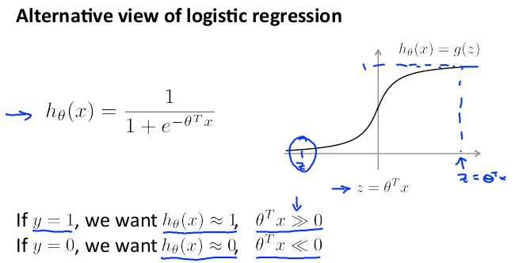
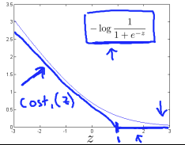
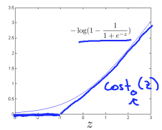
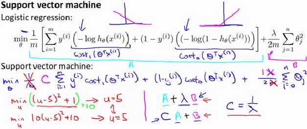
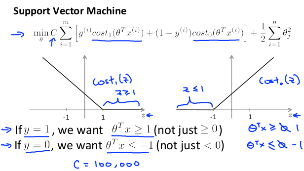

前面已经介绍了机器学习和深度学习的基础知识介绍，接下来我们开始进行机器学习相关内容的学习。本章将介绍机器学习中比较重要的算法：支持向量机(**Support Vector Machine**)。与逻辑回归和神经网络相比，支持向量机，或者简称**SVM**，在学习复杂的非线性方程时提供了一种更为清晰，更加强大的方式。我们将由简至繁，由逻辑回归引入线性可分支持向量机（最大边界分类器，也称硬间隔支持向量机），再到接近线性可分的线性支持向量机（软间隔支持向量机），最后介绍非线性支持向量机。同时，我们介绍核技巧和快速学习算法（序列最小最优化算法）。

# 1、硬间隔支持向量机

## 1.1、对逻辑回归的思考

考虑逻辑回归，其中的概率分布$p(y = 1|x;\theta)$ 是基于 h$_\theta(x) = g(\theta^Tx)$ 而建立的模型。当且仅当 $h_\theta(x) \geq 0.5$ ，也就是 $\theta^Tx \geq 0$ 的时候，我们才会预测出“1”。假如有一个正向(Positive)的训练样本(positive tra_ining example)(y = 1)。那么$\theta^Tx$ 越大，$h_\theta (x) = p(y = 1|x; w, b)$ 也就越大，我们对预测 Label 为 1 的“信心(confidence)”也就越强。所以如果 y = 1 且 $\theta^T x >> 0$(远大于 0)，那么我们就对这时候进行的预测非常有信心，当然这只是一种很不正式的粗略认识。与之类似，在逻辑回归中，如果有 y = 0 且 $\theta^T x << 0$(远小于 0)，我们也对这时候给出的预测很有信心。所以还是以一种非常不正式的方式来说，对于一个给定的训练集，如果我们能找到一个 $\theta$，满足当 $y^{(i)} = 1$ 的时候总有 $\theta^T x^{(i)} >> 0$，而 $y^{(i)} = 0$ 的时候则 $\theta^T x^{(i)} << 0$，我们就说这个对训练数据的拟合很好，因为这就能对所有训练样本给出可靠(甚至正确)的分类。似乎这样就是咱们要实现的目标了，稍后我们就要使用**函数边界记号**(**notion of functional margins**)来用正规的语言来表达该思路。

还有另外一种的直观表示，例如下面这个图当中，画叉的点表示的是正向训练样本，而小圆圈的点表示的是负向训练样本，图中还画出了**分类边界**(**decision boundary**)，这条线也就是通过等式 $\theta^T x = 0$ 来确定的，也叫做**分类超平面**(**separating hyperplane**)。图中还标出了三个点 A，B 和 C。

可以发现 A 点距离分界线很远。如果我们对 A 点的 y 值进行预测，估计我们会很有信心地认为在那个位置的 y = 1。与之相反的是 C，这个点距离边界线很近，而且虽然这个 C 点也在预测值 y = 1 的一侧，但看上去距离边界线的距离实在是很近的，所以也很可能会让我们对这个点的预测为 y = 0。因此，我们对 A 点的预测要比对 C 点的预测更有把握得多。B 点正好在上面两种极端情况之间，更广泛地说，如果一个点距离**分类超平面**(**separating hyperplane**)比较远，我们就可以对给出的预测很有信心。那么给定一个训练集，如果我们能够找到一个分类边界，利用这个边界我们可以对所有的训练样本给出正确并且有信心(也就是数据点距离分类边界要都很远)的预测，那这就是我们想要达到的状态了。当然上面这种说法还是很不正规，后面我们会使用**几何边界记号**(**notion of geometric margins**)来更正规地来表达。

## 1.2、记号(Notation) 

在讨论 SVMs 的时候，出于简化的目的，我们先要引入一个新的记号，用来表示分类。假设我们要针对一个二值化分类的问题建立一个线性分类器，其中用来分类的标签(label)为$y$，分类特征(feature)为$x$。从此以后我们就用 $y \in \{{-1},1\}$ (而不是之前的 $\{0, 1\}$) 来表示这个分类标签了。另外，以后咱们也不再使用向量 $\theta$ 来表示咱们这个线性分类器的参数了，而是使用参数 w 和 b，把分类器写成下面这样：
$$
h_{w,b}(x)=g(w^Tx+b)
$$
当 $z \geq 0$，则 $g(z) = 1$；而反之若 $z ＜ 0$，则$g(z) = -1$。这里的这个 “w, b” 记号就可以让我们能把截距项(intercept term)b 与其他的参数区别开。(此外我们也不用再像早些时候那样要去设定 $x_0 = 1$ 这样的一个额外的输入特征向量了。)所以，这里的这个参数 b 扮演的角色就相当于之前的参数 $\theta_0$ ，而参数 w 则相当于 $[\theta_1 . . . \theta_n]^T$。

还要注意的是，从我们上面对函数 g 的定义，可以发现我们的分类器给出的预测是 1 或者 -1 (参考 感知器算法 perceptron algorithm)，这样也就不需要先通过中间步骤(intermediate step)来估计 y 为 1 的概率(这就是逻辑回归中的步骤)。

## 1.3、函数边界和几何边界(Functional and geometric margins) 

咱们来用正规语言来将函数边界和几何边界的记号的概念进行正规化。给定一个训练集 $(x^{(i)}, y^{(i)})$，我们用下面的方法来定义对应该训练集的函数边界 (w, b)：
$$
\hat\gamma^{(i)}=y^{(i)}(w^Tx+b)
$$
要注意，如果 $y^{(i)} = 1$，那么为了让函数边界很大(也就是说，我们的预测很可信并且很正确)，我们就需要 $w^T x + b$ 是一个很大的正数。与此相对，如果 $y^{(i)} = -1$，那么为了让函数边界很大，我们就需要$w^T x + b$ 是一个很大(绝对值)的负数。而且，只要满足 $y^{(i)}(w^T x + b) \ge 0$，那我们针对这个样本的预测就是正确的。因此，一个大的函数边界就表示了一个可信且正确的预测。

对于一个线性分类器，选择上面给定的函数 g (取值范围为{-1, 1})，函数边界的一个性质却使得这个分类器并不具有对置信度的良好量度。例如上面给定的这个函数 g，我们会发现，如果用 2w 替换掉 w，然后用 2b 替换 b，那么由于有 $g(w^Tx + b) = g(2w^Tx + 2b)$，所以这样改变也并不会影响 $h_{w,b}(x)$。也就是说，函数 g 以及 $h_{w,b}(x)$ 只取决于 $w^T x + b$ 的正负符号(sign)，而不受其大小(magnitude)的影响。然而，把(w, b) 翻倍成 (2w,2b) 还会导致函数距离也被放大了 2 倍。因此，这样看来就是只要随意去调整 w 和 b 的范围，我们就可以人为调整函数边界到足够大了，而不用去改变任何有实际意义的变量。直观地看，这就导致我们有必要引入某种归一化条件，例如使 $||w||_2 = 1$；也就是说，我们可以将 (w, b) 替换成 $(w/||w||_2,b/||w||_2)$，然后考虑对应 $(w/||w||_2,b/||w||_2)$ 的函数边界。我们稍后再详细讨论这部分内容。

给定一个训练集 $S = {(x^{(i)},y^{(i)}); i = 1, ..., m}$，我们将对应 S 的函数边界 (w, b) 定义为每个训练样本的函数边界的最小值。记作 $\hat \gamma$，可以写成：
$$
\hat\gamma= \min_{i=1,...,m}\hat\gamma^{(i)}
$$
接下来，要讲的是几何边界(geometric margins)。例如下图所示：

图中给出了对应 (w, b) 的分类边界，其倾斜方向(即法线方向)为向量 w 的方向。这里的向量 w 是与**分类超平面**垂直的(orthogonal，即夹角为 90°)。(你需要说服自己现实情况一定是这样的。)假设有图中所示的一个点 A，此点表示的是针对某训练样本的输入特征为 $x^{(i)}$ ，对应的标签(label)为 $y^{(i)} = 1$。然后这个点到分类边界的距离 $\gamma^{(i)}$, 就通过 AB 之间的线段能够获得。

怎么找到的 $\gamma^{(i)}$ 值呢？这样，w/||w|| 是一个单位长度的向量，指向与 w 相同的方向。因为这里 A 点表示的是 $x^{(i)}$，所以就能找到一个点 B，其位置为 $x^{(i)} - \gamma^{(i)} \times w/||w||$。这个 B 点正好位于分类边界线上面，而这条线上的所有 x 都满足等式 $w^T x + b = 0$ ，所以有：
$$
w^T(x^{(i)}-\gamma^{(i)}\frac{w}{||w||})+b=0
$$
通过上面的方程解出来的 $\gamma^{(i)}$ 为：
$$
\gamma^{(i)}=\frac{w^Tx^{(i)}+b}{||w||}=(\frac{w}{||w||})^Tx^{(i)}+\frac{b}{||w||}
$$
这个解是针对图中 A 处于训练样本中正向部分这种情况，这时候位于“正向(positive)”一侧就是很理想的情况。如果更泛化一下，就可以定义对应训练样本 $(x^{(i)}, y^{(i)})$ 的几何边界 (w, b) 为：
$$
\gamma^{(i)}=y^{(i)}((\frac{w}{||w||})^Tx^{(i)}+\frac{b}{||w||})
$$
这里要注意，如果 $||w|| = 1$，那么函数边界(functional margin)就等于几何边界(geometric margin)——我们可以用这种方法来将两个边界记号联系起来。此外，几何边界是不受参数缩放的影响的；也就是说，如果我们把 w 改为 2w，b 改为 2b，那么几何边界并不会改变。稍后这个性质就会派上用场了。特别要注意的是，由于这个与参数缩放的无关性，当试图对某个数据集的 w 和 b 进行拟合的时候，我们就可以倒入一个任意设置的缩放参数来约束 w，而不会改变什么重要项；例如，我们可以设置 $||w|| = 1$，或者 $|w_1| = 5$，或者 $|w_1 +b|+|w_2| = 2$，等等都可以，这些都只需要对 w 和 b 进行缩放就可以满足了。

最后，给定一个训练集 $S = \{(x^{(i)}, y^{(i)}); i = 1, ..., m\}$，我们也可以我们将对应 S 的几何边界 (w, b) 定义为每个训练样本的几何边界的最小值：
$$
\gamma=\min_{i=1,...,m}\gamma^{(i)}
$$

## 1.4、间隔最大化  

我们假定给定的训练集是线性可分的，即能够在正向和负向的样本之间用某种分类超平面来进行划分。那要怎样找到能够得到最大几何边界的那一组呢？这个问题可以表述为下述的优化问题：
$$
\begin{aligned}
max_(\gamma,w,b) & \gamma \\
s.t.  y^{(i)}(w^Tx^{(i)}+b) &\geq \gamma,i=1,...,m\\
||w||&=1 \\
\end{aligned}
$$
也就是说，我们要让 $\gamma$ 取最大值，使得每一个训练样本的函数边界都至少为 $\gamma$。另外 $||w|| = 1$ 这个约束条件还能保证函数边界与几何边界相等，所以我们就还能够保证所有的几何边界都至少为 $\gamma$。因此，对上面这个优化问题进行求解，就能得出对应训练集的最大可能几何边界(largest possible geometric margin)的 (w, b)。

如果解出来上面的优化问题，那就全都搞定了。但 “$||w|| = 1$” 这个约束条件很讨厌，是非凸的(non-convex)，而且这个优化问题也明显不是那种我们随便扔给某些标准优化软件(standard optimization software)就能解决的。所以我们要把这个问题进行改善，让它更好解。例如：
$$
\begin{aligned}
max_(\gamma,w,b) & \frac{\hat \gamma}{||w||} \\
s.t.  y^{(i)}(w^Tx^{(i)}+b) &\geq \gamma,i=1,...,m\\
\end{aligned}
$$
这时候，我们要让 $\hat \gamma/||w||$ 的取值最大，使得函数边界都至少为 $\hat \gamma$。由于几何边界和函数边界可以通过 $\gamma = \hat \gamma/||w||$ 来联系起来，所以这样就能得到我们想要的结果了。而且，这样还能摆脱掉 $||w|| = 1$ 这个讨厌的约束条件。然而，悲剧的是我们以现在就有了一个很讨厌的(还是非凸的)目标函数 $\hat \gamma/||w||$；而且，我们还是没有什么现成的软件(off-the-shelf software)能够解出来这样的一个优化问题。

那接着看吧。还记得咱们之前讲过的可以对 w 和 b 设置任意的一个缩放约束参数，而不会改变任何实质性内容。咱们现在就要用到这个重要性质了。下面咱们就来引入一个缩放约束参数，这样针对训练集的函数边界 w, b 的这个参数就可以设置为 1：
$$
\hat \gamma =1
$$
对 w 和 b 使用某些常数来进行翻倍，结果就是函数边界也会以相同的常数进行加倍，这就确实是一个缩放约束了，而且只要对 w 和 b 进行缩放就可以满足。把这个性质用到咱们上面的优化问题中去，同时要注意到当$$\hat \gamma/||w|| = 1/||w|| $$取得最大值的时候，$$||w||^2 $$取得最小值，所以就得到了下面的这个优化问题：
$$
\begin{aligned}
max_(\gamma,w,b) & \frac{1}{2}||w||^2 \\
s.t.  y^{(i)}(w^Tx^{(i)}+b) &\geq \gamma,i=1,...,m\\
\end{aligned}
$$
通过上面这样的转换，这个问题就变得容易解决了。上面的问题有一个凸二次对象(a convex quadratic objective)，且仅受线性约束(only linear constra_ints)。对这个问题进行求解，我们就能得到最优边界分类器(optimal margin classifier)。这个优化问题的求解可以使用商业二次规划(commercial quadratic programming ，缩写QP)代码。1可能你更熟悉的是线性规划(linear programming)，这种方法适用的优化问题是有线性对象(linear objectives)和线性约束(linear constra_ints)。QP 软件的适用范围也很广泛，其中就包括这种凸二次对象(convex quadratic objectives)和线性约束的情况。

这样，差不多就可以说问题已经得到了解决，接下来咱们就要岔开话题，聊一聊拉格朗日对偶性(Lagrange duality)。这样就会引出我们这个优化问题的对偶形式(dual form)，这种形式会在我们后续要使用核(kernels)的过程中扮演重要角色，核(kernels)可以有效地对极高维度空间中的数据建立最优边界分类器。通过这种对偶形式，我们还能够推出一种非常有效的算法，来解决上面这个优化问题，而且通常这个算法那还能比通用的 QP 软件更好用。

## 1.6、最优边界分类器(Optimal margin classifiers )

在前面的内容中，我们讲到了下面这种(主要约束)优化问题(optimization problem)，用于寻找最优边界分类器(optimal margin classifier)：
$$
\begin{aligned}
min(\gamma,w,b) & \frac12 ||w||^2\\
&\\
s.t.&y^{(i)}(w^Tx^{(i)}+b)\geq 1,i=1,...,m\\
\end{aligned}
$$
这里的约束条件可以写成下面的形式：
$$
g_i(w)=-y^{(i)}(w^Tx^{(i)}+b)+1\leq 0
$$
对于训练集中的每一个样本，都有这样的一个约束条件。要注意，通过 KKT 对偶互补条件可知，只有训练样本的函数边界确定为 1 的情况下，才有 $\alpha_i \geq  0$ (这些样本对应的约束条件关系都是等式关系，也就是对应的 $g_i(w) = 0$)。如下图所示，其中用实线所表示的就是最大间隔分界超平面(maximum margin separating hyperplane)。

具有最小边界的样本点(points with the smallest margins)正好就是距离分类边界(decision boundary;)最近的那些点；图中所示，一共有三个这样的点，一个是空心圆的负值，两个是叉号的正值，他们所处的位置有虚线与分类边界线(即实线)相平行。因此，在这个优化问题中的最优解里面，只有这三个样本点所对应的$\alpha_i$是非零的。这种现象就是，支持向量的规模(number of support vectors)可以比整个训练集的规模(size of the tra_ining set)更小，这在稍后的内容中会用到。

接着往下来。我们已经给出了问题的对偶形式，那么一个关键的思路就是，接下来我们需要把算法写成仅包含内积的形式 $((x^{(i)},x^{(j)})$ ，也可以理解为 $(x^{(i)})^Tx^{(j)})$，即输入特征空间中的点相乘得到的内积。当使用核技巧(kernel trick)的时候，把算法用内积的形式表达就非常重要了。

在构建优化问题的拉格朗日函数(Lagrang_ian)的时候，有下面的等式：
$$
L(w,b,\alpha )=\frac{1}{2}||w||^2 - \sum^m_{i=1}\alpha_i [y^{(i)}(w^Tx^{(i)}+b)-1]  \text{      (8)}
$$
注意这里的拉格朗日乘数(Lagrange multipliers)中只有“$\alpha_i$” 而没有 “$\beta_i$”，因为这时候问题还只有不等式约束条件(inequality constra_ints)。

接下来咱们找一下这个问题的对偶性是。首先就要使 $L(w,b,\alpha)$ 取最小值，调整 w 和 b，而使 $\alpha$ 固定，这样就能得到 $\theta_D$，具体方法也就是令 L 关于 w 和 b 的导数(derivatives)为零。接下来得到下面的等式：

$\nabla_WL(w,b,\alpha)=w-\sum^m_{i=1}\alpha_i y^{(i)}x^{(i)} =0$

改写一下形式也就得到了：
$$
\begin{aligned}
w=\sum^m_{i=1}\alpha_i y^{(i)}x^{(i)}\text{      (9)}
\end{aligned}
$$
关于 b 的导数为零，就有：
$$
\begin{aligned}
\frac{\partial}{\partial b}L()=\sum^m_{i=1}\alpha_i y^{(i)}=0 &     \text{      (10)}
\end{aligned}
$$
通过上面的等式 (9)取得 w 的一种定义方式，然后把这个代入到拉格朗日函数，也就是等式(8) 中，然后简化一下，就得到：

$L(w,b,\alpha)=\sum^m_{i=1}\alpha_i-\frac12 \sum^m_{i,j=1} y^{(i)}y^{(j)}\alpha_i\alpha_j(x^{(i)})^Tx^{(j)}-b\sum^m_{i=1}\alpha_i y^{(i)}$

然后根据上面的等式 (10) 就能知道最后一项必然是 0，所以可以进一步简化得到：

$L(w,b,\alpha)=\sum^m_{i=1}\alpha_i-\frac12 \sum^m_{i,j=1} y^{(i)}y^{(j)}\alpha_i\alpha_j(x^{(i)})^Tx^{(j)}$

还记得之前我们得到的关于 w 和 b 来取 L 最小值的等式吧。把这些与约束条件 $\alpha_i \geq 0$ (这个一直都成立的)结合起来，然后再结合等式 (10)，就得到了下面的对偶优化问题了：
$$
\begin{aligned}
max_\alpha & W(\alpha) =\sum^m_{i=1}\alpha_i-\frac12\sum^m_{i,j=1}y^{(i)}y^{(j)}\alpha_i\alpha_j\langle	x^{(i)} x^{(j)}	\rangle\\
s.t.&  \alpha_i \geq 0,i=1,...,m\\
& \sum^m_{i=1} \alpha_iy^{(i)}=0
\end{aligned}
$$
你应该能够证明我们这个优化问题的条件是满足 $p\ast = d\ast$ 和 KKT 条件的(等式 (3-7))。这样，我们就可以通过解这个对偶问题来解决掉原来的主优化问题。具体来说，就是我们构建了一个以 $\alpha_i$ 作为参数的取最大值问题(maximization problem)，如果能把这个问题解出来(也就是说找到 $\alpha$ ，使得 $W(\alpha)$ 取最大值，且满足约束条件)那么就可以利用等式 (9) 来返回到问题中，找到最优的 w，作为一个关于 $\alpha$ 的函数。得到了 $w\ast$ 之后，再考虑主优化问题，就能直接找到截距项 b 的最优值了：
$$
\begin{aligned}
b\ast =- \frac{  \max_{i:y^{(i)}=-1}w\ast^Tx^{(i)}+\min_{i:y^{(i)}=-1}w\ast^Tx^{(i)}               }{2} &     \text{          (11)}\\
\end{aligned}
$$
(自己证明一下这个过程吧。)在继续之前，咱们再回头看一看等式 (9)，其中以 $\alpha$(最优值的)形式来表达了$w$的最优值。加入咱们已经使用一个训练集对模型的参数进行了拟合，然后接下来要对一个新输入的 x 的目标值进行预测。就要对$w^T x + b$进行计算，如果得到的值大于 0，就预测 y = 1。通过利用等式 (9)，这个性质也可以写成：
$$
\begin{aligned}
w^Tx+b&= (\sum^m_{i=1}\alpha_i y^{(i)}x^{(i)})^Tx+b & \text{          (12)}\\
&= \sum^m_{i=1}\alpha_i y^{(i)}\langle x^{(i)},x \rangle+b & \text{          (13)}\\
\end{aligned}
$$
这样的话，要进行一个预测，如果已经找到了 $\alpha_i$，那就必须要计算一个值，该值只依赖新的输入特征 x 与训练集中各个 点 的内积。另外，之前我们就已经发现所有支持向量(support vectors)的 $\alpha_i$ 的值都是 0。这样上面的求和项目中的很多项就都是 0 了，接下来咱们就只需要找到 x 与支持向量(support vectors)的内积(这样实际用于计算的只有一小部分，而不是整个的训练集)，然后就可以计算等式 (13)，得到结果，就可以用于预测了。

通过检验优化问题的对偶形式，我们对要解决的问题的结构有了深入的了解，并且还根据输入特征向量之间的内积来编写整个算法。 在下一节中，我们将充分利用这些内容，然后对我们的分类问题使用核(kernels)方法。 最终得到的算法，月就是支持向量机(support vector machines)算法，将能够在非常高的维度空间中有效地学习。

## 1.7 核(Kernels )

咱们之前讲线性回归的时候，遇到过这样一个问题，其中输入的特征 x 是一个房屋的居住面积，然后我们考虑使用特征 $x$，$x^2$ 以及 $x^3$ 来进行拟合得到一个立方函数(cub_ic function)。要区分出两组数据集，我们把“原始”的输入值称为一个问题的输入属性(input attributes)，例如住房面积 x。当这些值映射到另外的一些数据集来传递给学习算法的时候，这些新的数据值就称为输入特征(input features)。然后我们还要用 $\phi$ 来表示特征映射(feature mapping)，这种特征映射也就是从输入的属性(input attributes)到传递给学习算法的输入特征(input features)之间的映射关系。例如，还说刚刚这个居住面积 x 的例子，这里面的特征映射就可以表述为：
$$
\phi(x)=\left[ \begin{aligned}& x\\ & x^2\\ & x^3 \end{aligned}\right]
$$
现在我们就不再简单直接地利用 SVM(支持向量机算法)来处理原始的输入属性 x 了，而是可以尝试着利用映射产生的新的特征$\phi(x)$。那么，我们只需要简单回顾一下之前的算法，然后把所有的 x 替换成$\phi(x)$。

由于上面的算法可以整个用 $\langle x,z\rangle$ 的内积形式写出，这就意味着我们只需要把上面的所有内积都替换成 $\langle\phi(x),\phi(z)\rangle$ 的内积。更简洁地说，给定一个特征映射 $\phi$，那么就可以定义一个对应的核(Kernel)，如下所示：
$$
K(x,z)=\phi(x)^T\phi(z)
$$
然后，只需要把上面的算法里用到的 $\langle x, z\rangle$ 全部替换成 $K(x, z)$，这样就可以了，我们的算法就开始使用特征映射 $\phi$ 来进行机器学习了。

现在，给定一个特征映射 $\phi$，很容易就可以找出 $\phi(x)$ 和 $\phi(z)$，然后取一下内积，就能计算 $K (x, z)$了。不过还不仅如此，更有意思的是，通常情况下对这个$K (x,z)$ 的计算往往都会非常容易(very inexpensive)，甚至即便 $\phi(x)$ 本身很不好算的时候(可能是由于向量维度极高)也如此。在这样的背景下，给定一个特征映射 $\phi$，我们就可以使用 SVM(支持向量机算法)来对高纬度特征空间进行机器学习，而可能根本不用麻烦地区解出来对应的向量 $\phi(x)$。

接下来就看一个例子吧。假设有 $x, z \in R^n$，设有：
$$
K(x,z)= (x^Tz)^2
$$
这个也可以写成下面的形式：
$$
\begin{aligned}
K(x,z)&=(\sum^n_{i=1}x_iz_i)(\sum^n_{j=1}x_jz_j)\\
&=\sum^n_{i=1}\sum^n_{j=1}x_ix_jz_iz_j\\
&=\sum^n_{i,j=1}(x_ix_j)(z_iz_j)\\
\end{aligned}
$$
因此，可见 $K (x, z) = \phi(x)^T \phi(z)$，其中特征映射 $\phi$ 给出如下所示(这个例子中的 n = 3) ：
$$
\phi(x)= \left[ \begin{aligned} &x_1x_1\\&x_1x_2\\&x_1x_3\\&x_2x_1\\&x_2x_2\\&x_2x_3\\ &x_3x_1\\&x_3x_2\\&x_3x_3 \end{aligned}   \right]
$$
到这里就会发现，计算高维度的 $\phi(x)$ 需要的计算量是 O ($n^2$) 级别的，而计算 $K (x, z)$ 则只需要 O (n) 级的时间，也就是与输入属性的维度呈线性相关关系。

与之相关的核(Kernel)可以设为：
$$
\begin{aligned}
K(x,z)&= (x^Tz+c)^2 \\
&= \sum^n_{i,j=1}(x_ix_j)(z_iz_j)+\sum^n_{i=1}(\sqrt{2c}x_i)(\sqrt{2c}z_i)+c^2\\
\end{aligned}
$$

(自己检验。)对应的特征映射为(此处依然以 n = 3 为例)：
$$
\phi(x)= \left[ \begin{aligned} &x_1x_1\\&x_1x_2\\&x_1x_3\\&x_2x_1\\&x_2x_2\\&x_2x_3\\ &x_3x_1\\&x_3x_2\\&x_3x_3\\& \sqrt{2c}x_1\\& \sqrt{2c}x_2\\& \sqrt{2c}x_3\\&c\end{aligned}   \right]
$$

其中 参数 c 控制了第一组 $x_i$ 和第二组 $x_ix_j$ 的相对权重(relative weighting)。

在此基础上进一步扩展，核(Kernel)$K (x, z) = (x^T z + c)^d$，就对应了一个$\left( \begin{aligned} n&+d \\ &d  \end{aligned} \right)$维度的特征空间的特征映射，对应所有从 $x_{i1},x_{i2}, ...,x_{ik}$ 一直到 d 这种形式的所有多项式(monomials)。然而，即便是针对这种 $O(n^d)$ 维度的高维度空间，计算 $K (x, z)$ 让然只需要 O (n) 级的时间。所以我们就不需要在这个非常高的维度特征空间中对特征向量进行具体的表示。

现在，咱们来从另外一个角度来看一下核(Kernel)。凭直觉来看(这种直觉可能还有些错误，不过不要紧，先不用管)，如果 \phi(x) 和 $\phi(z)$ 非常接近(close together)，那么就可能会认为 $K (x, z) = \phi(x)^T\phi(z)$ 就可能会很大。与之相反，如果 $\phi(x)$ 和 $\phi(z)$ 距离很远，比如近似正交(nearly orthogonal)，那么$K (x, z) = \phi(x)^T\phi(z)$ 就可能会很小。这样，我们就可以把核 K (x, z) 理解成对$\phi(x)$ 和 $\phi(z)$ 的近似程度的一种度量手段，或者也可以说是对 x 和 z 的近似程度的一种度量手段。

有了这种直观认识之后，假如你正在尝试某些学习算法，并且已经建立了某个函数 $K (x, z)$，然后你想着也许可以用这个函数来对 x 和 z 的近似程度进行衡量。例如，假如你就选择了下面这个函数：
$$
K(x,z)=\exp (- \frac{||x-z||^2}{2\sigma^2 })
$$
这个函数是对 x 和 z 的近似程度的一个很好的衡量，二者相近的时候函数值接近 1，而二者远离的时候函数值接近 0。那咱们能不能用这样定义的一个函数 K 来作为一个 SVM(支持向量计算法)里面的核(Kernel)呢？在这个特定的样例里面，答案是可以的。(这个核(Kernel)也叫做 高斯核，对应的是一个无穷维度的特征映射 $\phi$。)那么接下来进一步推广一下，给定某个函数 K，我们该怎样能够确定这个函数是不是一个有效的核(valid kernel)呢？例如，我们能否说如果存在着某一个特征映射$\phi$，则对于所有的 x 和 z 都有 $K (x, z) = \phi(x)^T \phi(z)$？

现在暂时假设 K 就是一个有效的核，对应着某种特征映射 $\phi$。然后，考虑某个有 m 个点的有限集合 $\{x^{(1)},...,x^{(m)}\}$(这个集合并不一定就必须是训练集)，然后设一个方形的 m\times m 矩阵 K，定义方式为矩阵的第 (i, j) 个值 $K_{ij} = K (x^{(i)} , x^{(j)})$。这个矩阵就叫做核矩阵(Kernel matrix)。注意到没有，这里对符号 K 进行了重复使用，既指代了$K(x,z)$ 这个核函数(kernel function)，也指代了核矩阵 K，这是由于这两者有非常明显的密切关系。

如果 K 是一个有效的核(Kernel)，那么就有$K_{ij} = K (x^{(i)}, x^{(j)}) = \phi(x^{(i)})^T \phi(x^{(j)}) = \phi(x^{(j)})^T \phi(x^{(i)}) = K(x^{(j)}, x^{(i)}) = K_{ji}$，这就说明 K 是一个对称矩阵。此外，设 $\phi_k(x)$ 表示向量 $\phi(x)$ 的第 k 个坐标值(k-th coordinate)，挥发性对于任意的向量 z，都有：
$$
\begin{aligned}
z^TKz&=   \sum_i\sum_j z_iK_{ij}z_j \\
&=   \sum_i\sum_j z_i\phi(x^{(i)})\phi(x^{(j)})z_j\\
&=   \sum_i\sum_jz_i\sum_k \phi_k(x^{(i)})\phi_k(x^{(j)})z_j\\
&=   \sum_k\sum_i\sum_j z_i\phi_k(x^{(i)})\phi_k(x^{(j)})z_j\\
&= \sum_k(\sum_i z_i\phi_k(x^{(i)}))^2\\
&\geq 0 \\
\end{aligned}
$$
上面的推到中从第二步到最后一步都用到了习题集1第一题(Problem set 1 Q1)中的同样技巧。，由于 z 是任意的，这就表明了矩阵 K 是正半定(positive semi-definite)的矩阵($K \geq 0$)。

这样，我们就证明了，如果 K 是一个有效核函数(例如，假设该函数对应某种特征映射 $\phi$ )，那么对应的核矩阵(Kernel Matrix)$K \in R^{m\times m}$ 就是一个对称正半定矩阵(symmetric positive semidefinite)。进一步扩展，这就不仅仅是一个 K 是一个有效核函数的必要条件(necessary)，还成了充分条件(sufficient)，这个核函数也叫做默瑟核(Mercer kernel)。下面要展示的结果都是源自于 Mercer(due to Mercer)。

$^5$很多教材对默瑟定理(Mercer’s theorem)的描述都要更加复杂一些，里面牵涉到了 L2 函数，但如果输入属性(input attributes)只在实数域 Rn 中取值，那么这里给出的这种表述也是等价的(equivalent.)。

默瑟定理(Mercer’s theorem)：设给定的 $K: R^n \times  R^n \rightarrow   R$。然后要使 K 为一个有效的默瑟核(valid Mercer kernel)，其充分必要条件为：对任意的 $\{x^{(1)},...,x^{(m)}\, (m < \infty)$，都有对应的核矩阵(kernel matrix)为对称半正定矩阵(symmetric positive semi-definite)。

对于一个给定的函数 K，除了之前的找出对应的特征映射 \phi 之外，上面的定理还给出了另外一种方法来验证这个函数是否为有效核函数(valid kernel)。在习题集2(problem set 2) 里面有很多联系，大家可以尝试一下。

在课程中，我们也简要讲了核(Kernel)的若干样例。例如，手写数字识别问题当中，给定了一个手写数字(0-9)的图像(16x16 像素)，目的是要认出写的是哪个数字。选用的要么是简单的多项式核(polynomial kernel) $K (x, z) = (x^T z)^d$ 或者 高斯核(Gaussian kernel)，SVM(支持向量机算法)在这个样例中表现出了非常出色的性能。这个结果挺让人吃惊的，因为输入属性 x 是一个 256 维的向量，也就是待识别图像的像素密度值向量，而系统之前并没有对于视觉判断的预备知识，甚至对像素彼此间是否相邻都不了解。课堂上的另一个案例中，用于分类的目标 x 是字符串，例如x 可以使一系列的氨基酸(amino acids)，然后连接在一起形成了蛋白质(protein)；要构建一个适用于大多数机器学习算法的合理又足够“小规模”的特征集，是很困难的，而字符串的长度还各自不同，这就更增加了难度。然而也有解决方案，设 $\phi(x)$ 为一个特征向量，计算了 x 当中每一个 k 长度的字符串的出现次数(number of occurrences of each length-k substring in x)。如果考虑英语字母组成给的字符串，那么这样就存在 $26^k$ 个这样的字符。这样的话，$\phi(x)$ 就是一个 $26^k$ 维的向量；这时候，即便 k 的值并不算太大，这个值也会变得特别大，难以有效计算。(例如 $26^4 \approx 460000$。)不过，如果使用(动态编程风格，dynamic programming-ish)的字符串匹配算法，就可以有效率地计算 $K(x,z ) = \phi(x)^T\phi(z)$，也就是说，我们就能够对 $26^k$ 维的特征空间进行隐式处理，而根本不用去特地计算这个空间中的特征向量。

关于在支持向量机算法(support vector machines)中核(kernels)的使用，我们讲得已经够清楚了，所以就不在这里多做赘述了。不过有一个思路还是值得记住的，就是核(Kernel)的用法远远不仅限于 SVM 算法当中。具体来说，只要你的学习算法，能够写成仅用输入属性向量的内积来表达的形式，那么就可以通过引入 核K(Kernel)，替换成 $K(x,z)$，来对你的算法“强力”加速，使之能够在与 K 对应的高维度特征空间中有效率地运行。核(Kernel)与感知器(Perceptron)相结合，还可以产生内核感知器算法(kernel perceptron algorithm)。后文我们要学到的很多算法，也都可以适用于这样的处理，这个方法也就成为“核技巧(kernel trick)”

## 1.8 正则化和不可区分的情况(Regularization and the non-separable case)

到目前为止，咱们对 SVM(支持向量机算法)进行的推导，都是基于一个假设，也就是所有的数据都是线性可分的。在通过特征映射 \phi 来将数据映射到高维度特征空间的过程，通常会增加数据可分割的概率，但我们还是不能保证数据一直可以区分。而且，在某些案例中，查找一个分类超平面还不一定是我们的目的所在，因为也可能很容易就出现异常值。例如，如下图所示的是一个最优边界分类器(optimal margin classifier)，如果有一个单独的异常值投到了右上方的区域(如右图所示)，这就会导致分界线出现显著的偏移，还会导致分类器的边界缩小了很多。

要想让算法能够适用于非线性可分的数据集，并且使其对待异常值的敏感度降低一些，那就要把咱们的优化方法进行重构(reformulate)(使用 l1 正则化)，如下所示：
$$
\begin{aligned}
min_{\gamma,w,b}& \frac 12 ||w||^2+C\sum^m_{}\xi_i \\
s.t.& y^{(i)}(w^Tx^{(i)}+b) \geq1-\xi_i,i=1,...,m\\
& \xi_i \geq 0 ,i=1,...,m
\end{aligned}
$$
这样就允许数据集里面有(函数)边界小于1 的情况了，然后如果一个样本的函数边界为 $1 - \xi_i$ (其中 $\xi \geq  0$)，这就需要我们给出 $C\xi_i$ 作为**目标函数成本函数的降低值**(cost of the objective function being increased)。C 是一个参数，用于控制相对权重，具体的控制需要在一对目标之间进行考量，一个是使得 $||w||^2$ 取最小值(前面章节中的案例可以看到这样能够让边界最大化)，另一个是确保绝大部分的样本都有至少为 1 的函数边界。

然后按照惯例，给出拉格朗日函数(Lagrang_ian)：
$$
L(w,b,\xi,\alpha,r)=\frac12w^Tw+C\sum^m_{i=1}\xi_i-\sum^m_{i=1}\alpha_i[y^{(i)}(x^Tw+b)-1+\xi_i]-\sum^m_{i=1}r_i\xi_i
$$
上面的式子中的$\alpha_i$和$r_i$ 都是拉格朗日乘数(Lagrange multipliers 被限制为非负数$\geq 0$)。这次我们就不再对对偶形式进行详细推导了，不过如往常一样设 关于 w 和 b 的导数为零，然后再代回去进行简化，这样就能够得到下面的该问题的对偶形式：
$$
\begin{aligned}
\max_\alpha & W(\alpha) =\sum^m_{i=1}\alpha_i y^{(i)}y^{(j)}\alpha_i\alpha_j \langle  x^{(i)},x^{(j)} \rangle \\
 s.t. & 0\leq \alpha_i \leq C,i=1,...,m\\
 & \sum^m_{i=1}\alpha_iy^{(i)}=0  \\
\end{aligned}
$$
跟以前一样，我们还是可以把 w 用 $\alpha_i$ 来进行表述，如同等式 (9) 所示，所以解完了对偶问题之后，我们就可以接下来使用等式 (13) 来给出我们的预测。这里要注意，有一点很神奇，就是在加入了 l1 正则化之后，对对偶问题的唯一改变只是约束从原来的 $0 \leq \alpha_i$ 现在变成了 $0 \leq \alpha_i \leq C$。这里对 $b\ast$ 的计算也受到了影响而有所变动(等式 11 不再成立了(no longer valid))；具体内容参考下一节，或者阅读 Platt 的论文。

另外，KKT 对偶互补条件(dual complementarity condition，这个在下一节要用来测试 SMO 算法的收敛性)为：
$$
\begin{aligned}
\alpha_i&= 0 &\implies y^{(i)}(w^Tx^{(i)}+b)\ge 1 &\text{(14)}\\
\alpha_i&= C &\implies y^{(i)}(w^Tx^{(i)}+b)\le 1 &\text{(15)}\\
0\leq \alpha_i& \leq C &\implies y^{(i)}(w^Tx^{(i)}+b) = 1 &\text{(16)}\\
\end{aligned}
$$
现在，剩下的问题就只是给出一个算法来具体地解这个对偶问题了，我们下一节就来讲这个问题。

## 1.9 SMO 优化算法 

SMO 优化算法是对 sequential minimal optimization(意为序列最小化优化)的缩写，此算法于 1998 年由 John Platt 在微软研究院提出，对于从 SVM(支持向量机算法)推导出的对偶问题，这一算法提供了一种有效的解法。然后我们要先讲一下坐标上升算法(coordinate ascent algorithm)，这个算法很有趣，而且也是用来推导出 SMO 优化算法的一步。

### 1.9.1 坐标上升算法(Coordinate ascent )

假如要解决下面这样的无约束优化问题：
$$
\max_\alpha W(\alpha_1,\alpha_2,...,\alpha_m)
$$
这里的 W 就是关于参数 \alpha_i 的某种函数，此处暂时忽略掉这个问题和支持向量机算法(SVM)的任何关系。更早之前咱们就已经学过了两种优化算法了，梯度下降法和牛顿法。下面这个新的优化算法，就叫做坐标上升算法(coordinate ascent)：

循环直至收敛：{
​    For $i=1,...,m$
$$
\alpha_i:= \arg \max_{\hat \alpha_i}W(\alpha_1,...,\alpha_{i-1},\hat\alpha_i,\alpha_{i+1},...,\alpha_m)
$$
}

所以如上式中所示，算法最内层的循环(innermost loop)中，会对除了某些特定的 $\alpha_i$ 之外的所有变量进行保存，然后重新优化 W 来调整参数 $\alpha_i$。这里给出的这个版本的算法那，最内层循环对变量重新优化的顺序是按照变量排列次序 $\alpha_1, \alpha_2, . . ., \alpha_m, \alpha_1, \alpha_2, . . ..$ 进行的， 更复杂的版本可能还会选择其他的排列熟悉怒；例如，我们可以根据预测哪个变量可以使 $W(\alpha)$ 增加最多，来选择下一个更新的变量(we may choose the next variable to update according to wh_ich one we expect to allow us to make the largest increase in $W(\alpha)$)。

如果在函数 W 中，最内层循环中的 “$\arg \max$” 可以很有效地运行，那么坐标上升算法(coordinate ascent)就成了一个相当有效率的算法了。下面是一个坐标上升算法的示意图：

上图中的椭圆形就是我们要优化的二次函数的轮廓线。坐标上升算法的初始值设置为 (2, -2)，此外图中还标示了到全局最大值的路径。要注意，坐标上升法的每一步中，移动的方向都是平行于某个坐标轴的(parallel to one of the axes)，因为每次都只对一个变量进行了优化。

### 1.9.2 SMO 优化算法

接下来，我们来简单推导一下 SMO 算法，作为 SVM(支持向量机算法)相关讨论的收尾。一些具体的细节就省略掉了，放到作业里面了，其他的一些内容可以参考课堂上发的纸质材料。

下面就是一个(对偶)优化问题：
$$
\begin{aligned}
\max_\alpha & W(\alpha)= \sum^m_{i=1}\alpha_i-\frac12 \sum^m_{i,j=1}y^{(i)}y^{(j)}\alpha_i\alpha_j\langle x^{(i)},x^{(j)}\rangle & \text{(17)}\\
s.t.& 0\leq \alpha_i \leq C,i=1,...,m& \text{(18)}\\
& \sum^m_{i=1}\alpha_iy^{(i)}=0& \text{(19)}\\
\end{aligned}
$$
我们假设有一系列满足约束条件 (18-19) 的 $\alpha_i$ 构成的集合。接下来，假设我们要保存固定的 $\alpha_2, ..., \alpha_m$ 的值，然后进行一步坐标上升，重新优化对应 $\alpha_1$的目标值(re-optimize the objective with respect to $\alpha_1$)。这样能解出来么？很不幸，不能，因为约束条件 (19) 就意味着：
$$
\alpha_1y^{(1)}=-\sum^m_{i=2}\alpha_iy^{(i)}
$$
或者，也可以对等号两侧同时乘以 $y^{(1)}$ ，然后会得到下面的等式，与上面的等式是等价的：
$$
\alpha_1=-y^{(1)}\sum^m_{i=2}\alpha_iy^{(i)}
$$
(这一步用到了一个定理，即 $y^{(1)} \in {-1, 1}$，所以$(y^{(1)})2 = 1$)可见 $\alpha_1$ 是由其他的 $\alpha_i$ 决定的，这样如果我们保存固定的 $\alpha_2, ..., \alpha_m$ 的值，那就根本没办法对 $\alpha_1$ 的值进行任何修改了，否则不能满足优化问题中的约束条件 (19) 了。

所以，如果我们要对 \alpha_i 当中的一些值进行更新的话，就必须至少同时更新两个，这样才能保证满足约束条件。基于这个情况就衍生出了 SMO 算法，简单来说内容如下所示：

重复直到收敛 {

1. 选择某一对的 $\alpha_i$ 和 $\alpha_j$ 以在下次迭代中进行更新 (这里需要选择那种能朝全局最大值方向最大程度靠近的一对值，using a heuristic that tries to pick the two that will allow us to make the b_iggest progress towards the global maximum)。 
2. 使用对应的 $\alpha_i$ 和 $\alpha_j$ 来重新优化(Re-optimize) $W(\alpha)$ ，而保持其他的 $\alpha_k$ 值固定($k\neq i,j$)。

}

我们可以检查在某些收敛公差参数 *tol* 范围内，KKT 对偶互补条件能否被满足，以此来检验这个算法的收敛性。这里的 *tol* 是收敛公差参数(convergence tolerance parameter)，通常都是设定到大概 0.01 到 0.001。(更多细节内容参考文献以及伪代码。)

SMO 算法有效的一个关键原因是对 $\alpha_i, \alpha_j$ 的更新计算起来很有效率。接下来咱们简要介绍一下推导高效率更新的大概思路。

假设我们现在有某些 $\alpha_i$ 满足约束条件 (18-19)，如果我们决定要保存固定的 $\alpha_3, ..., \alpha_m$ 值，然后要使用这组 $\alpha_1$ 和 $\alpha_2$ 来重新优化 $W (\alpha_1, \alpha_2, ..., \alpha_m)$ ，这样成对更新也是为了满足约束条件。根据约束条件 (19)，可以得到：
$$
\alpha_1y^{(1)} + \alpha_2y^{(2)} = -\sum^m_{i=3}\alpha_iy^{(i)}
$$
等号右边的值是固定的，因为我们已经固定了$\alpha_3, ..., \alpha_m$ 的值，所以就可以把等号右边的项目简写成一个常数 $\zeta$:
$$
\alpha_1y^{(1)} + \alpha_2y^{(2)} = \zeta \text{(20)}
$$
然后我们就可以用下面的图来表述对 $\alpha_1$ 和 $\alpha_2$ 的约束条件：

根据约束条件(18)，可知 必须在图中 $\alpha_1$和 $\alpha_2$ 必须在 $[0, C] \times  [0, C]$ 所构成的方框中。另外图中还有一条线 $\alpha1y^{(1)} +\alpha_2y^{(2)}  = \zeta$，而我们知道$\alpha_1$和 $\alpha_2$ 必须在这条线上。还需要注意的是，通过上面的约束条件，还能知道 $L \leq \alpha_2 \leq H$；否则 ($\alpha_1,\alpha_2$) 就不能同时满足在方框内并位于直线上这两个约束条件。在上面这个例子中，$L = 0$。但考虑到直线 $\alpha1y^{(1)} + \alpha_2y^{(2)}  = \zeta$ 的形状方向，这个 $L = 0$ 还未必就是最佳的；不过通常来讲，保证$\alpha_1, \alpha_2$ 位于 $[0, C] \times  [0, C]$ 方框内的 $\alpha_2$ 可能的值，都会有一个下界 L 和一个上界 H。

利用等式(20)，我们还可以把 $\alpha_1$ 写成 $\alpha_2$ 的函数的形式：
$$
\alpha_1=(\zeta-\alpha_2y^{(2)})y^{(1)}
$$
(自己检查一下这个推导过程吧；这里还是用到了定理：$y^{(1)} \in {-1, 1}$，所以 $(y^{(1)})^2 = 1$。)所以目标函数 $W(\alpha)$ 就可以写成：
$$
W(\alpha_1,\alpha_2,...,\alpha_m)=W((\zeta-\alpha_2y^{(2)})y^{(1),\alpha_2,...,\alpha_m})
$$
把 $\alpha_3, ..., \alpha_m$ 当做常量，你就能证明上面这个函数其实只是一个关于 $\alpha_2$ 的二次函数。也就是说，其实也可以写成 $a\alpha_2 + b\alpha_2 + c$ 的形式，其中的 a, b, c 参数。如果我                                                                                                                                                                                                                                                                                                                                                                                                                                                                                                                                                                                                                                                                                                                                                                                                                                                                                                                                                     们暂时忽略掉方框约束条件(18)(也就是说 $L \leq \alpha_2 \leq H)$，那就很容易通过使导数为零来找出此二次函数的最大值，继而进行求解。我们设 $\alpha_2^{new, unclipped}$ 表示为 $\alpha$ 的结果值。你需要自己证明，如果我们要使关于 $\alpha_2$ 的函数 W取最大值，而又受到方框约束条件的限制，那么就可以把 $\alpha_2^{new, unclipped}$的值“粘贴”到[L, H] 这个间隔内(taking $\alpha_2^{new, unclipped}$ and “clipping” it to lie in the [L, H] interval)，这样来找到最优值结果，就得到了：
$$
\alpha_2^{new}= \begin{cases}  H & if \alpha_2^{new, unclipped}> H\\ \alpha_2^{new, unclipped} & if  L\leq \alpha_2^{new, unclipped}\leq H\\  L & if  \alpha_2^{new, unclipped} <L\\ \end{cases} 
$$
最终，找到了 $\alpha_2^{new}$ 之后，就可以利用等式(20)来代回这个结果，就能得到 $\alpha_1^{new}$ 的最优值。

此外还有一些其他的细节，也都挺简单，不过这里就不讲了，你自己去读一下 Platt 的论文吧：一个是用于对后续用于更新的 $\alpha_i, \alpha_j$ 启发式选择; 另一个是如何在 SMO算法 运行的同时来对 b 进行更新。  

# SVM和LR的异同

## 相同点

- LR和SVM都是分类算法
- 不考虑核函数，LR和SVM都是线性分类算法。LR也可以用核函数
- LR和SVM都是监督学习算法
- LR和SVM都是判别模型

## 不同点

**损失函数不同**

LR的损失函数
$$
J\left( \theta  \right)=-\frac{1}{m}\sum\limits_{i=1}^{m}{[{{y}^{(i)}}\log \left( {h_\theta}\left( {{x}^{(i)}} \right) \right)+\left( 1-{{y}^{(i)}} \right)\log \left( 1-{h_\theta}\left( {{x}^{(i)}} \right) \right)]}
$$
SVM的损失函数
$$
L(w,b,\alpha )=\frac{1}{2}||w||^2 - \sum^m_{i=1}\alpha_i [y^{(i)}(w^Tx^{(i)}+b)-1]
$$
不同的loss function代表了不同的假设前提，也就代表了不同的分类原理，也就代表了一切！！！简单来说，逻辑回归方法基于概率理论，假设样本为1的概率可以用sigmoid函数来表示，然后通过极大似然估计的方法估计出参数的值。支持向量机基于几何间隔最大化原理，认为存在最大几何间隔的分类面为最优分类面。

**支持向量机只考虑局部的边界线附近的点，而逻辑回归考虑全局（远离的点对边界线的确定也起作用）**

线性SVM不直接依赖于数据分布，分类平面不受一类点影响；LR则受所有数据点的影响，如果数据不同类别strongly unbalance，一般需要先对数据做balancing

**在解决非线性问题时，支持向量机采用核函数的机制，而LR通常不采用核函数的方法**

这个问题理解起来非常简单。分类模型的结果就是计算决策面，模型训练的过程就是决策面的计算过程。通过上面的第二点不同点可以了解，在计算决策面时，SVM算法里只有少数几个代表支持向量的样本参与了计算，也就是只有少数几个样本需要参与核计算（即kernal machine解的系数是稀疏的）。然而，LR算法里，每个样本点都必须参与决策面的计算过程，也就是说，假设我们在LR里也运用核函数的原理，那么每个样本点都必须参与核计算，这带来的计算复杂度是相当高的。所以，在具体应用时，LR很少运用核函数机制。

**线性SVM依赖数据表达的距离测度，所以需要对数据先做normalization，LR不受其影响**

**SVM的损失函数就自带正则！！！（损失函数中的1/2||w||^2项），这就是为什么SVM是结构风险最小化算法的原因！！！而LR必须另外在损失函数上添加正则项！！！**

# 参考

[Linear SVM 和 LR 有什么异同？](https://www.zhihu.com/question/26768865/answer/34078149)

# 1、优化目标

正如我们之前开发的学习算法，我们从优化目标函数开始。为了描述支持向量机，我将会从逻辑回归开始展示我们如何一点一点修改来得到本质上的支持向量机。

## 1.1、逻辑回归回顾

首先我们回顾以下逻辑回归到底做什么。上图展示了逻辑回归假设函数形式，和S型激励函数。对于逻辑回归，如果有一个 $y=1$的样本（训练集或测试集或交叉验证集），我们希望${{h}_{\theta }}\left( x \right)$ 趋近1。显然${{h}_{\theta }}\left( x \right)$越趋近于1，我们正确分类该样本的概率越大，此时$\theta^Tx$ 应当远大于0。相反地，如果$y=0$，我们希望假设函数的输出值将趋近于0，这对应于$\theta^Tx$，或者就是 $z$ 会远小于0。

接下来，我们回顾逻辑回归的目标函数（object function）

$J\left( \theta  \right)=\frac{1}{m}\sum\limits_{i=1}^{m}{[-{{y}^{(i)}}\log{\frac{1}{1+e^{-z}}}-( 1-{{y}^{(i)}} )\log(1-\frac{1}{1+e^{-z}}})+\frac{\lambda }{2m}\sum\limits_{j=1}^{n}{\theta _{j}^{2}}$

目标函数包括代价函数（cost function）和正则化项。这里，我们将负号移到表达式内部，方便得到支持向量机的目标函数。接下来，我们由逻辑回归的目标函数一点一点修改，得到支持向量机的目标函数。

## 1.2、代价函数

首先，我们计算支持向量机的代价函数。当 $y=1$时 ，目标函数中只有第一项起作用，我们得到 $-\log(\frac{1}{1+e^{-z}})$这一项，我们用 $z$ 表示$\theta^Tx$。如下图蓝色线所示，画出关于$z$ 的函数，我们发现当$z$ 增大时，也就是相当于$\theta^Tx$增大时，$z$ 对应的值会变的非常小。于是，我们作如下修改，得到支持向量机的代价函数。

我们取$z=1$得到两条射线（图中加粗），右边为水平线，左边为一条很接近逻辑回归的直线。

同理，当$y=0$时，目标函数只留下第二项$-\log(1-\frac{1}{1+e^{-z}})$，用相似的方法，我们得到两条射线。

如果我们用一个新的代价函数来代替，即这条从0点开始的水平直线，然后是一条斜线，像上图。那么，现在让我给这两个方程命名，左边的函数，称之为${\cos}t_1{(z)}$，同时，右边函数称它为${\cos}t_0{(z)}$。这里的下标是指在代价函数中，对应的 $y=1$ 和 $y=0$ 的情况。拥有了这些定义后，我们将两个表达式替换为${\cos}t_1{(z)}$和${\cos}t_0{(z)}$，得到新的目标函数：

$J\left( \theta  \right)=\frac{1}{m}\sum\limits_{i=1}^{m}{[-{{y}^{(i)}}cost_1(\theta^Tx^{(i)})-( 1-{{y}^{(i)}} )cost_0(\theta^Tx^{(i)})})+\frac{\lambda }{2m}\sum\limits_{j=1}^{n}{\theta _{j}^{2}}$

## 1.3、目标函数

替换后的目标函数并非支持向量机的目标函数，由于习惯的原因，我们再对该目标函数进行修改，得到正真的支持向量机的目标函数。

如上图所示，首先，我们做的第一改变是除去$1/m$这一项，因为这不影响最终得到的权重值。这只是因为习惯不同，并没有其他特殊含义。其次，对于逻辑回归，在目标函数中，我们有两项：第一个是训练样本的代价，第二个是正则化项，我们用$\lambda$来平衡。我们用$A$表示第一项，用**B**表示第二项，但不包括$\lambda$，则得到优化目标$A+\lambda\times B$。我们所做的是通过设置不同正则参数$\lambda$达到优化目的。但对于支持向量机，按照惯例，我们将使用参数$C$替换这里使用的$\lambda$来权衡这两项，优化目标改为：$C×A+B$。这里我们只是用一种不同的方式来控制这种权衡，即用参数来决定是更关心第一项的优化，还是更关心第二项的优化。这就得到了在支持向量机中我们的整个优化目标函数

$$\min_\limits{\theta}C\sum_\limits{i=1}^{m}\left[y^{(i)}{\cos}t_{1}\left(\theta^{T}x^{(i)}\right)+\left(1-y^{(i)}\right){\cos}t\left(\theta^{T}x^{(i)}\right)\right]+\frac{1}{2}\sum_\limits{i=1}^{n}\theta^{2}_{j}$$

最后有别于逻辑回归输出的概率，支持向量机的代价函数，当最小化代价函数，获得参数${{\theta }}$时，支持向量机所做的是它来直接预测$y$的值等于1，还是等于0。因此，当$\theta^Tx$大于或者等于0时，这个假设函数会预测1。学习参数${{\theta }}$就是支持向量机假设函数的形式。这就是支持向量机数学上的定义。

# 

# 2、支持向量机的直观理解

人们有时将支持向量机看作是大间距分类器。这一节我们将从直观的角度看看优化目标，实际上是在做什么，以及SVM的假设函数将会学习什么，同时也会谈谈如何做些许修改，学习更加复杂、非线性的函数。

## 2.1、参数C

首先回顾下目标函数，左图是关于$z$的代价函数${\cos}t_1{(z)}$，此函数用于正样本，右图是关于$z$的代价函数${\cos}t_0{(z)}$，横轴表示$z$，现在让我们考虑一下，最小化这些代价函数的必要条件是什么。

如果你有一个正样本，$y=1$，则只有在$z>=1$时，代价函数${\cos}t_1{(z)}$才等于0。换句话说，如果你有一个正样本，我们会希望$\theta^Tx>=1$，反之，如果$y=0$，我们观察一下，函数${\cos}t_0{(z)}$，它只有在$z<=1$的区间里函数值为0。这是支持向量机的一个有趣性质。相比于逻辑回归，支持向量机的要求更高，不仅仅要能正确分开输入的样本，即不仅仅要求$\theta^Tx$\>0，我们需要的是比0值大很多，比如大于等于1，我也想这个比0小很多，比如我希望它小于等于-1，这就相当于在支持向量机中嵌入了一个额外的安全因子，或者说安全的间距因子。我们可以通过改变C 的值调整该间距。

## 2.2、如何调整参数C

假设$C$的值为100000或者其它非常大的数，然后来观察支持向量机会给出什么结果？

如果 $C$非常大，则最小化代价函数的时候，我们将会很希望找到一个使第一项为0的最优解。因此，让我们尝试在代价项的第一项为0的情形下理解该优化问题。比如我们可以把$C$设置成了非常大的常数，这将给我们一些关于支持向量机模型的直观感受。

我们已经看到输入一个训练样本标签为$y=1$，你想令第一项为0，你需要做的是找到一个${{\theta }}$，使得$\theta^Tx>=1$，类似地，对于一个训练样本，标签为$y=0$，为了使${\cos}t_0{(z)}$ 函数的值为0，我们需要$\theta^Tx<=-1$。因此，现在考虑我们的优化问题。选择参数，使得第一项等于0，就会导致下面的优化问题，因为我们将选择参数使第一项为0，因此这个函数的第一项为0，因此是$C$乘以0加上二分之一乘以第二项。这里第一项是$C$乘以0，因此可以将其删去，因为我知道它是0。这将遵从以下的约束：$\theta^Tx^{(i)}>=1$，如果 $y^{(i)}$是等于1 的，$\theta^Tx^{(i)}<=-1$，如果样本$i$是一个负样本，这样当你求解这个优化问题的时候，当你最小化这个关于变量${{\theta }}$的函数的时候，你会得到一个非常有趣的决策边界。

$$min\frac{1}{2}\sum_{j=1}^{n}\theta_j^2\\s.t
\left\{\begin{matrix}
\theta^Tx^{(i)}\geq 1\ if\ y^{(i)}=1\\ 
\theta^Tx^{(i)}\leq -1\ if\ y^{(i)}=0
\end{matrix}\right.$$

具体而言，如果一个数据集有正样本，也有负样本，且线性可分。我们可以找到多个决策边界把正样本和负样本分开。这些决策边界看起来都不是特别好的选择，但支持向量机将会选择这个黑色的决策边界，相较于粉色或者绿色的决策边界，这条黑色的看起来好得多，黑线看起来是更稳健的决策界。在分离正样本和负样本上它显得的更好。数学上来讲，这是什么意思呢？这条黑线有更大的距离，这个距离叫做间距(**margin**)。

当画出这两条额外的蓝线，我们看到黑色的决策界和训练样本之间有更大的最短距离。然而粉线和蓝线离训练样本就非常近，在分离样本的时候就会比黑线表现差。因此，这个距离叫做支持向量机的间距，而这是支持向量机具有鲁棒性的原因，因为它努力用一个最大间距来分离样本。因此支持向量机有时被称为**大间距分类器**。

事实上，支持向量机现在要比这个大间距分类器所体现得更成熟，尤其是当你使用大间距分类器的时候，你的学习算法会受异常点(outlier) 的影响。比如我们加入一个额外的正样本。

在这里，如果你加了这个样本，为了将样本用最大间距分开，也许我最终会得到一条类似这样的决策界，对么？就是这条粉色的线，仅仅基于一个异常值，仅仅基于一个样本，就将我的决策界从这条黑线变到这条粉线，这实在是不明智的。而如果正则化参数$C$，设置的非常大，这事实上正是支持向量机将会做的。它将决策界，从黑线变到了粉线，但是如果$C$ 设置的小一点，**如果你将C设置的不要太大，则你最终会得到这条黑线，**当然数据如果不是线性可分的，如果你在这里有一些正样本或者你在这里有一些负样本，则支持向量机也会将它们恰当分开。因此，大间距分类器的描述，仅仅是从直观上给出了正则化参数$C$非常大的情形，同时，要提醒你$C$的作用类似于$1/\lambda$，$\lambda$是我们之前使用过的正则化参数。这只是$C$非常大的情形，或者等价地 $\lambda$ 非常小的情形。你最终会得到类似粉线这样的决策界，但是实际上应用支持向量机的时候，**当$C$不是非常非常大的时候，它可以忽略掉一些异常点的影响，得到更好的决策界。**甚至当你的数据不是线性可分的时候，支持向量机也可以给出好的结果。

回顾 $C=1/\lambda$，因此：

$C$ 较大时，相当于 $\lambda$ 较小，可能会导致过拟合，高方差。

$C$ 较小时，相当于$\lambda$较大，可能会导致低拟合，高偏差。

# 3、大边界分类背后的数学

## 3.1、内积回顾

在节中将介绍大间隔分类背后的数学原理，首先复习一下关于向量内积的知识。

假设有两个二维向量$u$和$v$，$u^T v$叫做向量$u$和$v$之间的内积。根据线性代数的知识，$u^T v$就是$\left[ {{u}_{1}}\text{ }{{u}_{2}} \right]$ 这个一行两列的矩阵乘以$v$，因此可以得到${{u}_{1}}\times {{v}_{1}}+{{u}_{2}}\times {{v}_{2}}$，顺便提一下，$u^Tv=v^Tu$。

接下来，我们从图像角度理解内积。如左上图所示，我们画出$u$和$v$。$\left\| u \right\|$表示$u$的范数，即$u$的长度，即向量$u$的欧几里得长度。根据毕达哥拉斯定理，$\left\| u \right\|=\sqrt{u_{1}^{2}+u_{2}^{2}}$，这是向量$u$的长度，它是一个实数。我们将向量$v$投影到向量$u$上，如图红线所示。我们将向量$v$投影到向量$u$上的长度记为$p$，则向量内积可以表示为${{u}^{T}}v=p\centerdot \left\| u \right\|$，就是说如果你从几何上画出$p$的值，同时画出$u$的范数，你也会同样地计算出内积因为$u^Tv=v^Tu$，如果将$u$和$v$交换位置，将$u$投影到$v$上，而不是将$v$投影到$u$上，然后做同样地计算，可以得到同样的结果。

最后一点，需要注意的就是$p$事实上是有符号的，即它可能是正值，也可能是负值。如上右下图所示，$u$和$v$之间的夹角大于90度，则如果将$v$投影到$u$上，会得到这样的一个投影，这是$p$的长度，唯一一点不同的是$p$在这里是负的。在内积计算中，如果$u$和$v$之间的夹角小于90度，那么那条红线的长度$p$是正值，内积为正。如果这个夹角大于90度，则红线长度$p$是负的，内积为负。

## 3.2、目标函数的数学解释

我们接下来将会使用这些关于向量内积的性质试图来理解支持向量机中的目标函数。

$$min\frac{1}{2}\sum_{j=1}^{n}\theta_j^2\\s.t
\left\{\begin{matrix}
\theta^Tx^{(i)}\geq 1\ if\ y^{(i)}=1\\ 
\theta^Tx^{(i)}\leq -1\ if\ y^{(i)}=0
\end{matrix}\right.$$

这就是我们先前给出的支持向量机模型中的目标函数。为了更容易理解与画图，我们做一点简化。首先忽略掉截距，令${{\theta }_{0}}=0$，接着将特征数$n$置为2，因此我们仅有两个特征${{x}_{1}},{{x}_{2}}$。

当我们仅有两个特征，即$n=2$时，这个式子可以写作：$\frac{1}{2}\left({\theta_1^2+\theta_2^2}\right)=\frac{1}{2}\left(\sqrt{\theta_1^2+\theta_2^2}\right)^2$，我们只有两个参数${{\theta }_{1}},{{\theta }_{2}}$。你可能注意到括号里面的这一项是向量${{\theta }}$的范数，或者说是向量${{\theta }}$的长度，故我们的目标函数可以写成$\frac{1}{2}\left\| \theta \right\|^2$。因此支持向量机做的全部事情，就是**极小化参数向量**${{\theta }}$**范数的平方，或者说长度的平方**。

接下来我们深入理解$\theta^{T}x$。首先，给定参数向量$\theta $并给定一个样本$x$，如上图中下部所示，使用内积的知识，$\theta $和$x^{(i)}$就类似于$u$和$v$ 。对于样本$x^{(i)}$，在水平轴上取值为$x_1^{(i)}$，在竖直轴上取值为$x_2^{(i)}$。将$θ_1$画在横轴这里，将$θ_2$ 画在纵轴这里，那么内积$θ^T x^{(i)}$ 将会是什么呢？根据上一节的方法，我们知道$θ^Tx^{(i)}$将会等于$p$ 乘以向量 $θ$ 的长度或范数。这就等于$\theta_1\cdot{x_1^{(i)}}+\theta_2\cdot{x_2^{(i)}}$。这两种方式是等价的，都可以用来计算$θ$和$x^{(i)}$之间的内积，故$θ^Tx^{(i)}$变成了$p^{(i)}\cdot{\left\| \theta \right\|}$。

接下来，我们分析为什么这么多决策边界支持向量机会选择距离训练样本远的而不是近的。

如上左下图所示，绿色的决策边界对应一个与它90度正交的参数向量${{\theta }}$，我们要求${{\theta }_{0}}=0$仅仅意味着决策界必须通过原点$(0,0)$。现在让我们看一下这对于优化目标函数意味着什么。

假设有一个样本$x^{(1)}$，如果我考察这个样本到参数${{\theta }}$的投影，投影是这个短的红线段，就等于$p^{(1)}$。类似地，还有一个样本$x^{(2)}$，则它到参数${{\theta }}$的投影如图中粉色线段，即$p^{(2)}$。因为$x^{(2)}$和参数参数向量${{\theta }}$的夹角大于90度，故$p^{(2)}$的值小于0。从图中可知，$p^{(i)}$将会是非常小的数，因此当我们考察优化目标函数的时候，对于正样本而言，我们需要$p^{(i)}\cdot{\left\| \theta \right\|}>=1$,但是 $p^{(i)}$在这里非常小,那就意味着我们需要${{\theta }}$的范数非常大。类似地，对于负样本而言我们需要$p^{(2)}\cdot{\left\|\theta \right\|}<=-1$。我们已经在这个样本中看到$p^{(2)}$会是一个非常小的数，因此唯一的办法就是${{\theta }}$的范数变大。但是我们的目标函数是希望找到一个参数${{\theta }}$，它的范数是小的。因此，这看起来不像是一个好的参数向量${{\theta }}$的选择。

相反的，如上右下图所示，来看一个不同的决策边界。比如说，支持向量机选择了这个绿色线段作为决策界，则相对应的参数${{\theta }}$的方向为图中蓝色水平线。这个时候将样本$x^{(1)}$投影到横轴$x$上，或说投影到${{\theta }}$上，就会得到这样$p^{(1)}$。另一个样本$x^{(2)}$做同样的投影，则$p^{(2)}$的长度是负值。相比于上一个决策边界，现在的$p^{(1)}$ 和$p^{(2)}$这些投影长度是长多了。如果我们仍然要满足约束$P^{(i)}\cdot{\left\| \theta \right\|}$\>1，因为$p^{(1)}$变大了，${{\theta }}$的范数就可以变小了。因此这意味着通过选择右边的决策界，而不是左边的那个，支持向量机可以使参数${{\theta }}$的范数变小很多。因此，如果我们想令${{\theta }}$的范数变小，从而令${{\theta }}$范数的平方变小，就能让支持向量机选择右边的决策界。

以上就是为什么支持向量机最终会找到大间距分类器的原因。因为它试图极大化这些$p^{(i)}$的范数，它们是训练样本到决策边界的距离。最后一点，我们的推导自始至终使用了这个简化假设，就是参数$θ_0=0$。$θ_0=0$的意思是我们让决策界通过原点。如果你令$θ_0$不是0的话，含义就是希望决策界不通过原点。即便$θ_0$不等于0，支持向量机要做的事情都是优化这个目标函数对应着$C$值非常大的情况，但是可以说明的是，即便$θ_0$不等于0，支持向量机仍然会找到正样本和负样本之间的大间距分隔。

# 4、核函数

回顾我们之前讨论过可以使用高级数的多项式模型来解决无法用直线进行分隔的分类问题：

为了获得上图所示的判定边界，我们的模型可能是${{\theta }_{0}}+{{\theta }_{1}}{{x}_{1}}+{{\theta }_{2}}{{x}_{2}}+{{\theta }_{3}}{{x}_{1}}{{x}_{2}}+{{\theta }_{4}}x_{1}^{2}+{{\theta }_{5}}x_{2}^{2}+\cdots $的形式。

我们可以用一系列的新的特征f来替换模型中的每一项。例如令：
${{f}_{1}}={{x}_{1}},{{f}_{2}}={{x}_{2}},{{f}_{3}}={{x}_{1}}{{x}_{2}},{{f}_{4}}=x_{1}^{2},{{f}_{5}}=x_{2}^{2}$

得到$h_θ(x)=f_1+f_2+...+f_n$。然而，除了对原有的特征进行组合以外，有没有更好的方法来构造$f_1,f_2,f_3$？我们可以利用核函数来计算出新的特征。给定一个训练样本$x$，我们利用$x$的各个特征与我们预先选定的**地标**(**landmarks**)$l^{(1)},l^{(2)},l^{(3)}$的近似程度来选取新的特征$f_1,f_2,f_3$。

例如：${{f}_{1}}=similarity(x,{{l}^{(1)}})=e(-\frac{{{\left\| x-{{l}^{(1)}} \right\|}^{2}}}{2{{\sigma }^{2}}})$

其中：${{\left\| x-{{l}^{(1)}} \right\|}^{2}}=\sum{_{j=1}^{n}}{{({{x}_{j}}-l_{j}^{(1)})}^{2}}$，为实例$x$中所有特征与地标$l^{(1)}$之间的距离的和。上例中的$similarity(x,{{l}^{(1)}})$就是核函数，具体而言，这里是一个**高斯核函数**(**Gaussian Kernel**)。 **注：这个函数与正态分布没什么实际上的关系，只是看上去像而已。**

这些地标的作用是什么？如果一个训练样本$x$与地标$l$之间的距离近似于0，则新特征 $f$近似于$e^{-0}=1$，如果训练样本$x$与地标$l$之间距离较远，则$f$近似于$e^{-(一个较大的数)}=0$。

假设我们的训练样本含有两个特征[$x_{1}$ $x{_2}$]，给定地标$l^{(1)}$与不同的$\sigma$值，见下图：

图中水平面的坐标为 $x_{1}$，$x_{2}$而垂直坐标轴代表$f$。可以看出，只有当$x$与$l^{(1)}$重合时$f$才具有最大值。随着$x$的改变$f$值改变的速率受到$\sigma^2$的控制。

在下图中，当样本处于洋红色的点位置处，因为其离$l^{(1)}$更近，但是离$l^{(2)}$和$l^{(3)}$较远，因此$f_1$接近1，而$f_2$,$f_3$接近0。因此$h_θ(x)=θ_0+θ_1f_1+θ_2f_2+θ_1f_3>0$，因此预测$y=1$。同理可以求出，对于离$l^{(2)}$较近的绿色点，也预测$y=1$，但是对于蓝绿色的点，因为其离三个地标都较远，预测$y=0$。

这样，图中红色的封闭曲线所表示的范围，便是我们依据一个单一的训练样本和我们选取的地标所得出的判定边界，在预测时，我们采用的特征不是训练样本本身的特征，而是通过核函数计算出的新特征$f_1,f_2,f_3$。

那么如何选择地标？我们通常是根据训练集的数量选择地标的数量，即如果训练集中有$m$个样本，则我们选取$m$个地标，并且令:$l^{(1)}=x^{(1)},l^{(2)}=x^{(2)},.....,l^{(m)}=x^{(m)}$。这样做的好处在于：现在我们得到的新特征是建立在原有特征与训练集中所有其他特征之间距离的基础之上的，即：

下面我们将核函数运用到支持向量机中，修改我们的支持向量机假设为：

• 给定$x$，计算新特征$f$，当$θ^Tf>=0$ 时，预测 $y=1$，否则反之。 

相应地修改代价函数为：$\sum{_{j=1}^{n=m}}\theta _{j}^{2}={{\theta}^{T}}\theta $，

$min C\sum\limits_{i=1}^{m}{[{{y}^{(i)}}cos {{t}_{1}}}( {{\theta }^{T}}{{f}^{(i)}})+(1-{{y}^{(i)}})cos {{t}_{0}}( {{\theta }^{T}}{{f}^{(i)}})]+\frac{1}{2}\sum\limits_{j=1}^{n=m}{\theta _{j}^{2}}$
在具体实施过程中，我们还需要对最后的正则化项进行些微调整，在计算$\sum{_{j=1}^{n=m}}\theta _{j}^{2}={{\theta}^{T}}\theta $时，我们用$θ^TMθ$代替$θ^Tθ$，其中$M$是根据我们选择的核函数而不同的一个矩阵。这样做的原因是为了简化计算。

理论上讲，我们也可以在逻辑回归中使用核函数，但是上面使用 $M$来简化计算的方法不适用与逻辑回归，因此计算将非常耗费时间。

在此，我们不介绍最小化支持向量机的代价函数的方法，你可以使用现有的软件包（如**liblinear**,**libsvm**等）。在使用这些软件包最小化我们的代价函数之前，我们通常需要编写核函数，并且如果我们使用高斯核函数，那么在使用之前进行特征缩放是非常必要的。

另外，支持向量机也可以不使用核函数，不使用核函数又称为**线性核函数**(**linear kernel**)，当我们不采用非常复杂的函数，或者我们的训练集特征非常多而样本非常少的时候，可以采用这种不带核函数的支持向量机。

下面是支持向量机的两个参数$C$和$\sigma$的影响：

$C=1/\lambda$

$C$ 较大时，相当于$\lambda$较小，可能会导致过拟合，高方差；

$C$ 较小时，相当于$\lambda$较大，可能会导致低拟合，高偏差；

$\sigma$较大时，可能会导致低方差，高偏差；

$\sigma$较小时，可能会导致低偏差，高方差。

# 5、使用支持向量机

目前为止，我们已经讨论了**SVM**比较抽象的层面，在这个视频中我将要讨论到为了运行或者运用**SVM**。你实际上所需要的一些东西：支持向量机算法，提出了一个特别优化的问题。但是就如在之前的视频中我简单提到的，我真的不建议你自己写软件来求解参数${{\theta }}​$，因此由于今天我们中的很少人，或者其实没有人考虑过自己写代码来转换矩阵，或求一个数的平方根等我们只是知道如何去调用库函数来实现这些功能。同样的，用以解决**SVM**最优化问题的软件很复杂，且已经有研究者做了很多年数值优化了。因此你提出好的软件库和好的软件包来做这样一些事儿。然后强烈建议使用高优化软件库中的一个，而不是尝试自己落实一些数据。有许多好的软件库，我正好用得最多的两个是**liblinear**和**libsvm**，但是真的有很多软件库可以用来做这件事儿。你可以连接许多你可能会用来编写学习算法的主要编程语言。

在高斯核函数之外我们还有其他一些选择，如：多项式核函数（**Polynomial Kerne**l）、字符串核函数（**String kernel**）、卡方核函数（ **chi-square kernel**）、直方图交集核函数（**histogram intersection kernel**）等等。

这些核函数的目标也都是根据训练集和地标之间的距离来构建新特征，这些核函数需要满足Mercer's定理，才能被支持向量机的优化软件正确处理。

## 5.1、多类分类问题

假设我们利用之前介绍的一对多方法来解决一个多类分类问题。如果一共有$k$个类，则我们需要$k$个模型，以及$k$个参数向量${{\theta }}$。我们同样也可以训练$k$个支持向量机来解决多类分类问题。但是大多数支持向量机软件包都有内置的多类分类功能，我们只要直接使用即可。

尽管你不去写你自己的**SVM**的优化软件，但是你也需要做几件事：

1、是提出参数$C$的选择。我们在之前的视频中讨论过误差/方差在这方面的性质。

2、你也需要选择内核参数或你想要使用的相似函数，其中一个选择是：我们选择不需要任何内核参数，没有内核参数的理念，也叫线性核函数。因此，如果有人说他使用了线性核的**SVM**（支持向量机），这就意味这他使用了不带有核函数的**SVM**（支持向量机）。

## 5.2、逻辑回归与支持向量机 

从逻辑回归模型，我们得到了支持向量机模型，在两者之间，我们应该如何选择呢？

**下面是一些普遍使用的准则：**

$n$为特征数，$m$为训练样本数。

(1)如果相较于$m$而言，$n$要大许多，即训练集数据量不够支持我们训练一个复杂的非线性模型，我们选用逻辑回归模型或者不带核函数的支持向量机。

(2)如果$n$较小，而且$m$大小中等，例如$n$在 1-1000 之间，而$m$在10-10000之间，使用高斯核函数的支持向量机。

(3)如果$n$较小，而$m$较大，例如$n$在1-1000之间，而$m$大于50000，则使用支持向量机会非常慢，解决方案是创造、增加更多的特征，然后使用逻辑回归或不带核函数的支持向量机。

值得一提的是，神经网络在以上三种情况下都可能会有较好的表现，但是训练神经网络可能非常慢，选择支持向量机的原因主要在于它的代价函数是凸函数，不存在局部最小值。

今天的**SVM**包会工作得很好，但是它们仍然会有一些慢。当你有非常非常大的训练集，且用高斯核函数是在这种情况下，我经常会做的是尝试手动地创建，拥有更多的特征变量，然后用逻辑回归或者不带核函数的支持向量机。如果你看到这个幻灯片，看到了逻辑回归，或者不带核函数的支持向量机。在这个两个地方，我把它们放在一起是有原因的。原因是：逻辑回归和不带核函数的支持向量机它们都是非常相似的算法，不管是逻辑回归还是不带核函数的**SVM**，通常都会做相似的事情，并给出相似的结果。但是根据你实现的情况，其中一个可能会比另一个更加有效。但是在其中一个算法应用的地方，逻辑回归或不带核函数的**SVM**另一个也很有可能很有效。但是随着**SVM**的复杂度增加，当你使用不同的内核函数来学习复杂的非线性函数时，这个体系，你知道的，当你有多达1万（10,000）的样本时，也可能是5万（50,000），你的特征变量的数量这是相当大的。那是一个非常常见的体系，也许在这个体系里，不带核函数的支持向量机就会表现得相当突出。你可以做比这困难得多需要逻辑回归的事情。

最后，神经网络使用于什么时候呢？ 对于所有的这些问题，对于所有的这些不同体系一个设计得很好的神经网络也很有可能会非常有效。有一个缺点是，或者说是有时可能不会使用神经网络的原因是：对于许多这样的问题，神经网络训练起来可能会特别慢，但是如果你有一个非常好的**SVM**实现包，它可能会运行得比较快比神经网络快很多，尽管我们在此之前没有展示，但是事实证明，**SVM**具有的优化问题，是一种凸优化问题。因此，好的**SVM**优化软件包总是会找到全局最小值，或者接近它的值。对于**SVM**你不需要担心局部最优。在实际应用中，局部最优不是神经网络所需要解决的一个重大问题，所以这是你在使用**SVM**的时候不需要太去担心的一个问题。根据你的问题，神经网络可能会比**SVM**慢，尤其是在这样一个体系中，至于这里给出的参考，看上去有些模糊，如果你在考虑一些问题，这些参考会有一些模糊，但是我仍然不能完全确定，我是该用这个算法还是改用那个算法，这个没有太大关系，当我遇到机器学习问题的时候，有时它确实不清楚这是否是最好的算法，但是就如在之前的视频中看到的算法确实很重要。但是通常更加重要的是：你有多少数据，你有多熟练是否擅长做误差分析和排除学习算法，指出如何设定新的特征变量和找出其他能决定你学习算法的变量等方面，通常这些方面会比你使用逻辑回归还是**SVM**这方面更加重要。但是，已经说过了，**SVM**仍然被广泛认为是一种最强大的学习算法，这是一个体系，包含了什么时候一个有效的方法去学习复杂的非线性函数。因此，实际上与逻辑回归、神经网络、**SVM**一起使用这些方法来提高学习算法，我认为你会很好地建立很有技术的状态。（编者注：当时**GPU**计算比较慢，神经网络还不流行。）

机器学习系统对于一个宽泛的应用领域来说，这是另一个在你军械库里非常强大的工具，你可以把它应用到很多地方，如硅谷、在工业、学术等领域建立许多高性能的机器学习系统。

# 1、支持向量机(Support Vector Machines)

本章的讲义主要讲述的是 支持向量机( Support Vector Machine ，缩写为 SVM) 学习算法。SVM 算得上是现有的最好的现成的(“off-the-shelf”)监督学习算法之一，很多人实际上认为这里没有“之一”这两个字的必要，认为 SVM 就是最好的现成的监督学习算法。讲这个 SVM 的来龙去脉之前，我们需要先讲一些关于边界的内容，以及对数据进行分割成大的区块(gap)的思路。接下来，我们要讲一下最优边界分类器(optimal margin classifier,)，其中还会引入一些关于拉格朗日对偶(Lagrange duality)的内容。然后我们还会接触到核(Kernels)，这提供了一种在非常高的维度(例如无穷维度)中进行 SVM 学习的高效率方法，最终本章结尾部分会讲 SMO 算法，也就是 SVM 算法的一个有效实例。

## 1.1、边界(Margins):直觉(Intuition) 

咱们这回讲 SVM 学习算法，从边界(margins)开始说起。这一节我们会给出关于边界的一些直观展示(intuitions)，以及过对于我们做出的预测的信心(confidence)；在本章的第三节中，会对这些概念进行更正式化的表述。

考虑逻辑回归，其中的概率分布$p(y = 1|x;\theta)$ 是基于 h$_\theta(x) = g(\theta^Tx)$ 而建立的模型。当且仅当 $h_\theta(x) \geq 0.5$ ，也就是 $\theta^Tx \geq 0$ 的时候，我们才会预测出“1”。假如有一个正向(Positive)的训练样本(positive tra_ining example)(y = 1)。那么$\theta^Tx$ 越大，$h_\theta (x) = p(y = 1|x; w, b)$ 也就越大，我们对预测 Label 为 1 的“信心(confidence)”也就越强。所以如果 y = 1 且 $\theta^T x >> 0$(远大于 0)，那么我们就对这时候进行的预测非常有信心，当然这只是一种很不正式的粗略认识。与之类似，在逻辑回归中，如果有 y = 0 且 $\theta^T x << 0$(远小于 0)，我们也对这时候给出的预测很有信心。所以还是以一种非常不正式的方式来说，对于一个给定的训练集，如果我们能找到一个 $\theta$，满足当 $y^{(i)} = 1$ 的时候总有 $\theta^T x^{(i)} >> 0$，而 $y^{(i)} = 0$ 的时候则 $\theta^T x^{(i)} << 0$，我们就说这个对训练数据的拟合很好，因为这就能对所有训练样本给出可靠(甚至正确)的分类。似乎这样就是咱们要实现的目标了，稍后我们就要使用**函数边界记号**(**notion of functional margins**)来用正规的语言来表达该思路。

还有另外一种的直观表示，例如下面这个图当中，画叉的点表示的是正向训练样本，而小圆圈的点表示的是负向训练样本，图中还画出了**分类边界**(**decision boundary**)，这条线也就是通过等式 $\theta^T x = 0$ 来确定的，也叫做**分类超平面**(**separating hyperplane**)。图中还标出了三个点 A，B 和 C。

可以发现 A 点距离分界线很远。如果我们对 A 点的 y 值进行预测，估计我们会很有信心地认为在那个位置的 y = 1。与之相反的是 C，这个点距离边界线很近，而且虽然这个 C 点也在预测值 y = 1 的一侧，但看上去距离边界线的距离实在是很近的，所以也很可能会让我们对这个点的预测为 y = 0。因此，我们对 A 点的预测要比对 C 点的预测更有把握得多。B 点正好在上面两种极端情况之间，更广泛地说，如果一个点距离**分类超平面**(**separating hyperplane**)比较远，我们就可以对给出的预测很有信心。那么给定一个训练集，如果我们能够找到一个分类边界，利用这个边界我们可以对所有的训练样本给出正确并且有信心(也就是数据点距离分类边界要都很远)的预测，那这就是我们想要达到的状态了。当然上面这种说法还是很不正规，后面我们会使用**几何边界记号**(**notion of geometric margins**)来更正规地来表达。

