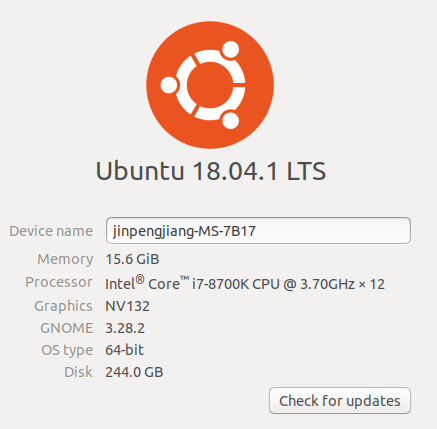
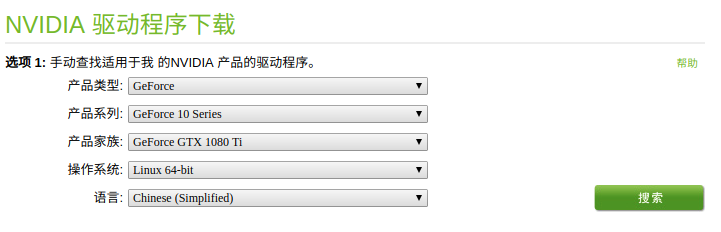
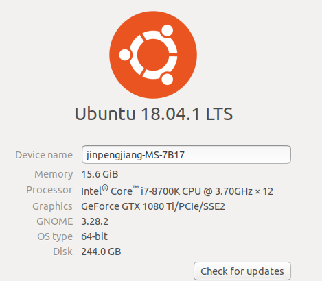
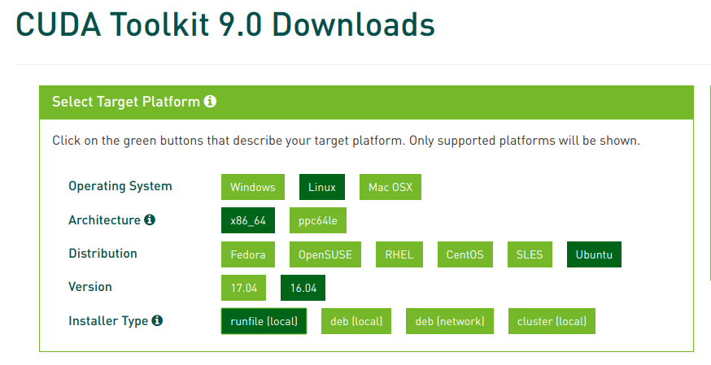
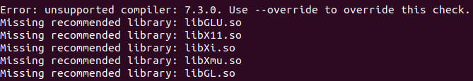
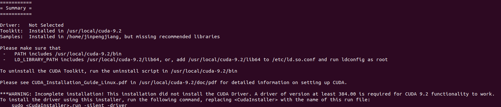
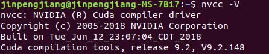
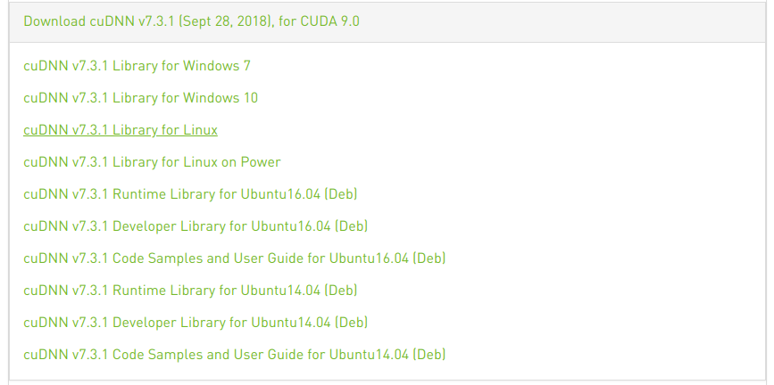
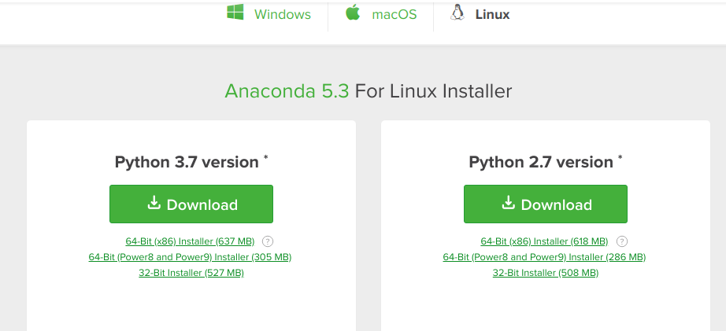
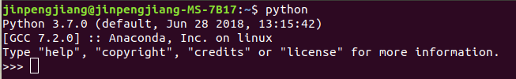

[TOC]

# Ubuntu18.04+Python3.6+GTX1080ti配置cuda9.0+ cudnn7.3.1+tensorflow1.11GPU版本

# 1、安装显卡驱动

## 1.1、卸载旧版显卡驱动

首先卸载NVIDIA驱动，如果是通过附加驱动安装显卡的，则输入如下

```
sudo apt-get remove --purge nvidia-driver-390
```

如果是安装的是官万下载的驱动，则重新运行run文件来卸载

```
sh ./nvidia.run --uninstall
```

此时，显卡驱动现实如下：

​

## 1.2、下载显卡驱动

去Nvidia[官网](https://www.nvidia.cn/Download/index.aspx?lang=cn)，下载相应的驱动程序



点击搜索，下载驱动

## 1.3、禁用自带显卡驱动

打开黑名单列表`sudo gedit /etc/modprobe.d/blacklist.conf`，在列表最后加入一行`blacklist nouveau`保存后输入 `sudo update-initramfs -u`更新更改

停止X-windows服务，输入`sudo service lightdm stop`

## 1.4、安装新的显卡驱动

重启电脑，输入ctrl+alt+f6进入终端，进入nvidia安装包目录，输入

```
sudo sh NVIDIA-Linux-x86_64-410.73.run
```

按照提示安装，安装成功后，执行

```
sudo service lightdm restart
```

重启电脑，查看显卡驱动



# 2、安装Cuda9.0

## 2.1、下载cuda

目前只支持Cuda9.0，前往cuda官网，找到对应版本下载




## 2.2、降低gcc、g++版本

若现在直接安装cuda，则会提示



其原因是Ubuntu18.04的编译器版本过高，因此只需要安装较低版本的gcc、g++即可

```
sudo apt install gcc-4.8 g++-4.8
sudo ln -s /usr/bin/gcc-4.8 /usr/local/bin/gcc
sudo ln -s /usr/bin/g++-4.8 /usr/local/bin/g++
```

## 2.3、安装Cuda

接下来进入到下载目录，执行下面的安装命令：

```
sudo sh cuda_9.0.176_384.81_linux.run
```

看到一大段协议后一直回车，接下来会有一大堆问题

```
Do you accept the previously read EULA?(accept/deny/quit) 选择accept
Install NVIDIA Accelerated Graphics Driver for Linux-x86_64 384.81? 
因为已经安装过显卡驱动了,所以选择no
Install the CUDA 9.0 Toolkit? 选择yes
Enter Toolkit Location 直接回车默认 [ default is /usr/local/cuda-9.0 ]: 直接回车默认即可
Do you want to install a symbolic link at /usr/local/cuda?  选择yes
Install the CUDA 9.0 Samples? 问你是否安装样例，安装了吧，也占不了多少空间
Installing the CUDA Toolkit in /usr/local/cuda-9.0 ... 等待安装完成即可
```

安装完成后，显示以下内容



提示若想要上出cuda工具，直接运行pl脚本即可，进入目录

```
sudo perl uninstall_cuda_9.2.pl
```

最后一步，将cuda添加到环境变量，完成后，重启终端输入`nvcc -V`，显示如下则表示cuda工具安装成功



# 3、安装cuDNN

进入cuDNN[官网](https://developer.nvidia.com/rdp/cudnn-archive)，下载对应版本



解压压缩包，将文件复制到cuda-9.2的安装目录，并修改权限：

```
sudo cp cuda/include/cudnn.h /usr/local/cuda/include 
sudo cp cuda/lib64/libcudnn* /usr/local/cuda/lib64 
sudo chmod a+r /usr/local/cuda/include/cudnn.h /usr/local/cuda/lib64/libcudnn*
```

# 4、安装Anaconda3

anaconda指的是一个开源的Python发行版本，其包含了conda、Python等180多个科学包及其依赖项。可以帮助python开发者省去很多安装科学包的工作。去[官网](https://www.anaconda.com/download/#linux)下载对应版本



进入下载目录，输入以下指令下载

```
sudo bash Anaconda3-5.3.0-Linux-x86_64.sh
```

一直按回车或yes完成安装，输入python，查看是否安装成功



# 5、安装TensorFlow

Anaconda能够创建不同环境以满足不同需求，我们创建一个tensorflow的环境

```
conda create -n tensorflow pip python=3.6
```

接着激活conda环境

```
source activate tensorflow
```

最后为该环境安装tensorflow-gpu

```
sudo pip3 install -i https://pypi.tuna.tsinghua.edu.cn/simple tensorflow-gpu
```

# 5、参考文献

1. [TensorFlow安装指南](https://www.tensorflow.org/install/install_linux)
2. 

