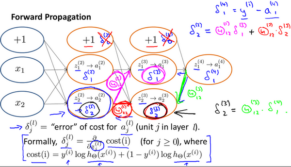
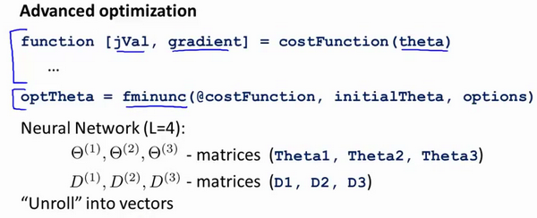
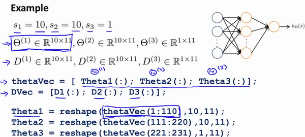

本章将介绍神经网络的符号定义、基本原理与实现，后面几章将会深入探讨技术细节。$g$和$\sigma$都表示激活函数

# 表示

神经网络是很多神经元模型堆叠形成的一个网络。一个简单的神经网络模型如下图所示，从左到右，我们有输入特征$x_1$、$x_2$、$x_3$，它们被竖直地堆叠起来表示，这叫做神经网络的**输入层**(input layer)；后面三层我们称之为**隐藏层**（hidden layer），我们看不见中间节点的准确值，故称"隐藏"；最后一层只由一个结点构成，称为**输出层**（output layer），它负责产生预测值。为了准确描述神经网络，我们引入一些符号。


符号$^{[l]}$表示神经网络第$l$层相关的节点，这些节点的集合被称为第$l$层网络，这样可以保证$^{[l]}$不会和我们之前用来表示单个的训练样本的$^{(i)}$(表示第$i$个训练样本)混淆。

我们用$L$表示神经网络的层数，上图所示的神经网络$L$为4，输入层为第0层，第一个隐藏层为第1层，以此类推，输出层为第4层。这里需要注意，上图所示网络只能叫做一个四层的神经网络。原因是当我们计算网络的层数时，输入层是不算入总层数内。$n$表示神经元数量，${n}^{[1]}=5$表示第一层有5个隐藏神经元，同理${n}^{[2]}=5$，${n}^{[3]}=3$，${{n}^{[4]}}$=${{n}^{[L]}}=1$（输出单元为1），而输入层${n}^{[0]}={n}_{x}=3$。

每一层都用${a}^{[l]}$来记作该层激活后的结果，在正向传播算法中，我们会算出每一层的${{a}^{[l]}}$。输入特征$x$是0层的激活函数，所以$x={a}^{[0]}$。最后一层的激活函数${a}^{[L]}$是这个神经网络所预测的输出结果，即$ \hat y$。

每一层都用$g^{[l]}$来表示该层的激活函数，不同层的激活函数可以不同。${z}^{[l]}$表示中间值，用${w}^{[l]}$表示权重矩阵，${b}^{[l]}$表示偏移量。

上述表示方式都是借鉴吴恩达Couresa上课程的表示方式，当然也可以用其他符号表示，只是这种符号定义更加普遍。

接下来，在讨论权重矩阵维度的问题。以上图神经网络为例， $a_{i}^{[l]}$代表第$l$ 层的第 $i$ 个激活单元。${{W }^{[l]}}$代表从第 $l-1$ 层映射到第$ l$ 层时的权重的矩阵，例如${{W}^{[1]}}$代表从第0层映射到第1层的权重的矩阵。其尺寸为：以第 $l$层的激活单元数量为行数，以第 $l-1$ 层的激活单元数为列数的矩阵。例如：上图所示的神经网络中${{W}^{[1]}}$的尺寸为 5*3。而$b^{[l]}$的尺寸是该层激活单元数为行数，列数为1。

当我们有不止两种分类时（也就是$y=1,2,3….$），比如以下这种情况，该怎么办？如果我们要训练一个神经网络算法来识别路人、汽车、摩托车和卡车，在输出层我们应该有4个值。例如，第一个值为1或0用于预测是否是行人，第二个值用于判断是否为汽车。

输入向量$x$有三个维度，两个中间层，输出层4个神经元分别用来表示4类，也就是每一个数据在输出层都会出现${{\left[ a\text{ }b\text{ }c\text{ }d \right]}^{T}}$，且$a,b,c,d$中仅有一个为1，表示当前类。下面是该神经网络的可能结构示例：


神经网络算法的输出结果为四种可能情形之一：


但是在过去的几年中，**DLI**（深度学习学院 **deep learning institute**）已经意识到有一些函数，只有非常深的神经网络能学会，而更浅的模型则办不到。尽管对于任何给定的问题很难去提前预测到底需要多深的神经网络，所以先去尝试逻辑回归，尝试一层然后两层隐含层，然后把隐含层的数量看做是另一个可以自由选择大小的超参数，然后再保留交叉验证数据上评估，或者用你的开发集来评估。

# 前向传播（Forward  propagation）

介绍完神经网络的表示方式后，这里介绍神经网络的前向传播算法。如下图所示，给出一个只有一个隐藏层的简单两层**神经网络结构**，先考虑只有一个训练样本的情况。


其中，$X$表示输入特征，$a$表示每个神经元的输出，$W$表示特征的权重，$w_i^{[l]}$表示第$l$层网络权重矩阵的第$i$行。

我们从隐藏层的第一个神经元开始计算，分两个步骤：

第一步，计算$z^{[1]}_1,z^{[1]}_1 = w^{[1]T}_1x + b^{[1]}_1$。

第二步，通过激活函数计算$a^{[1]}_1,a^{[1]}_1 = \sigma(z^{[1]}_1)$。

隐藏层的第二个以及后面两个神经元的计算过程一样，只是注意符号表示不同，最终分别得到$a^{[1]}_2、a^{[1]}_3、a^{[1]}_4$，详细结果见下:

$z^{[1]}_1 = w^{[1]T}_1x + b^{[1]}_1, a^{[1]}_1 = \sigma(z^{[1]}_1)$

$z^{[1]}_2 = w^{[1]T}_2x + b^{[1]}_2, a^{[1]}_2 = \sigma(z^{[1]}_2)$

$z^{[1]}_3 = w^{[1]T}_3x + b^{[1]}_3, a^{[1]}_3 = \sigma(z^{[1]}_3)$

$z^{[1]}_4 = w^{[1]T}_4x + b^{[1]}_4, a^{[1]}_4 = \sigma(z^{[1]}_4)$

完成隐藏层的计算后，将隐藏层激活后的结果作为输出层的输入。首先把四个输出堆积在一起形成一个向量：

$$a^{[1]} =
​	\left[
​		\begin{array}{c}
​		a^{[1]}_{1}\\
​		a^{[1]}_{2}\\
​		a^{[1]}_{3}\\
​		a^{[1]}_{4}
​		\end{array}
​		\right]
​		= \sigma(z^{[1]})$$

接着计算输出层：

$$z^{[2]} = w^{[2]T}x + b^{[2]}_1, a^{[2]} = \sigma(z^{[2]})$$

将整个过程向量化，我们得到下图右侧计算公式，此处注意维度！！！


当有多个训练样本时，类似逻辑回归的计算，我们将各个训练样本组合成矩阵，对矩阵的各列进行计算。
$$
X =
	\left[
		\begin{array}{c}
		\vdots & \vdots & \vdots & \vdots\\
		x^{(1)} & x^{(2)} & \cdots & x^{(m)}\\
		\vdots & \vdots & \vdots & \vdots\\
		\end{array}
		\right]
$$

$$
Z^{[1]} =
	\left[
		\begin{array}{c}
		\vdots & \vdots & \vdots & \vdots\\
		z^{[1](1)} & z^{[1](2)} & \cdots & z^{[1](m)}\\
		\vdots & \vdots & \vdots & \vdots\\
		\end{array}
		\right]
$$

$$
A^{[1]} =
	\left[
		\begin{array}{c}
		\vdots & \vdots & \vdots & \vdots\\
		\alpha^{[1](1)} & \alpha^{[1](2)} & \cdots & \alpha^{[1](m)}\\
		\vdots & \vdots & \vdots & \vdots\\
		\end{array}
		\right]
$$

$$
\left.
		\begin{array}{r}
		\text{$z^{[1](i)} = W^{[1](i)}X^{(i)} + b^{[1]}$}\\
		\text{$\alpha^{[1](i)} = \sigma(z^{[1](i)})$}\\
		\text{$z^{[2](i)} = W^{[2](i)}\alpha^{[1](i)} + b^{[2]}$}\\
		\text{$\alpha^{[2](i)} = \sigma(z^{[2](i)})$}\\
		\end{array}
		\right\}
		\implies
		\begin{cases}
		\text{$A^{[1]} = \sigma(z^{[1]})$}\\
		\text{$z^{[2]} = W^{[2]}A^{[1]} + b^{[2]}$}\\ 
		\text{$A^{[2]} = \sigma(z^{[2]})$}\\ 
		\end{cases}
$$

定义矩阵$X$等于训练样本，将它们组合成矩阵的各列，形成一个$n$维或$n$乘以$m$维矩阵。同理，$z^{[1](1)}$，$z^{[1](2)}$等等都是$z^{[1](m)}$的列向量，将所有$m$都组合在各列中，就的到矩阵$Z^{[1]}$。同理，$a^{[1](1)}$，$a^{[1](2)}$，……，$a^{[1](m)}$将其组合在矩阵各列中，如同从向量$x$到矩阵$X$，以及从向量$z$到矩阵$Z$一样，就能得到矩阵$A^{[1]}$。同样的，对于$Z^{[2]}$和$A^{[2]}$，也是这样得到。

最后，我们得到前向传播的一般步骤：

输入：$a^{[l-1]}$

输出：$a^{[l]}$，缓存$z^{[l]}$、$w^{[l]}$、$b^{[l]}$

前向传播的步骤可以写成： 

$${z}^{[l]}={W}^{[l]}\cdot{a}^{[l-1]}+{b}^{[l]}\\{{a}^{[l]}}={{g}^{[l]}}\left( {{z}^{[l]}}\right)$$

向量化实现过程可以写成： 

$${z}^{[l]}={W}^{[l]}\cdot {A}^{[l-1]}+{b}^{[l]}\\{A}^{[l]}={g}^{[l]}({Z}^{[l]})$$

# 激活函数（Activation functions）

在前向传播算法中，激活函数（$g$或$\sigma$）未直接给出。具体使用一个神经网络时，需要决定使用哪种激活函数用隐藏层上，哪种用在输出节点上。

## 四种激活函数

到目前为止，只用过**sigmoid**激活函数，但是，有时其他的激活函数效果会更好。常见的激活函数如下：


**sigmoid**函数的图像如上图左上所示，公式为：
$a = \sigma(z) = \frac{1}{{1 + e}^{- z}}$

**tanh**函数或者双曲正切函数如上图右上所示，是总体上都优于**sigmoid**函数的激活函数。$a = tan(z)$的值域位于+1和-1之间，公式为：
$a= tanh(z) = \frac{e^{z} - e^{- z}}{e^{z} + e^{- z}}$

事实上，**tanh**函数是**sigmoid**的向下平移和伸缩后的结果。对它进行了变形后，穿过了$(0,0)$点，并且值域介于+1和-1之间。在训练一个算法模型时，如果使用**tanh**函数代替**sigmoid**函数中心化数据，使得数据的平均值更接近0而不是0.5。故在神经网络中，基本已经不用**sigmoid**激活函数了，**tanh**函数在所有场合都优于**sigmoid**函数。

**sigmoid**函数和**tanh**函数两者共同的缺点是，在$z$特别大或者特别小的情况下，导数的梯度或者函数的斜率会变得特别小，最后就会接近于0，导致降低梯度下降的速度。

修正线性单元的函数（**ReLu**）很好地解决了上述问题，**ReLu**函数图像如上图左下所示，公式为：
$ a =max( 0,z) $

另一个版本的**Relu**被称为**Leaky Relu**：当$z$是负值时，这个函数的值不是等于0，而是轻微的倾斜，如上图右下所示。公式为：

$a = max( 0.01z,z)$
当然，0.01可以换成其他数字。这个函数通常比**Relu**激活函数效果要好，尽管在实际中**Leaky ReLu**使用的并不多。

**ReLu**和**Leaky Relu**函数的优点：

第一，在$z$的区间变动很大的情况下，激活函数的导数或者激活函数的斜率都会远大于0，在程序实现就是一个**if-else**语句，而**sigmoid**函数需要进行浮点四则运算，在实践中，使用**ReLu**激活函数神经网络通常会比使用**sigmoid**或者**tanh**激活函数学习的更快。

第二，**sigmoid**和**tanh**函数的导数在正负饱和区的梯度都会接近于0，这会造成梯度弥散，而**Relu**和**Leaky ReLu**函数大于0部分都为常熟，不会产生梯度弥散现象。(同时应该注意到的是，**Relu**进入负半区的时候，梯度为0，神经元此时不会训练，产生所谓的稀疏性，而**Leaky ReLu**不会有这问题)。$z$在**ReLu**的梯度一半都是0，但是，有足够的隐藏层使得z值大于0，所以对大多数的训练数据来说学习过程仍然可以很快。

最后我们总结下选择激活函数的经验法则：

- **sigmoid**激活函数：除了输出层是一个二分类问题基本不会用它

- **tanh**激活函数：**tanh**是非常优秀的，几乎适合所有场合
- **ReLu**激活函数：最常用的默认函数，，如果不确定用哪个激活函数，就使用**ReLu**或者**Leaky ReLu**


## 激活函数的导数

在反向传播算法中，我们需要计算激活函数的斜率或导数，这里我们先对它们进行求导：


$\frac{d}{dz}g(z) = {\frac{1}{1 + e^{-z}} (1-\frac{1}{1 + e^{-z}})}=g(z)(1-g(z))$

注：

当$z$ = 10或$z= -10$ ; $\frac{d}{dz}g(z)\approx0$

当$z $= 0 , $\frac{d}{dz}g(z)\text{=g(z)(1-g(z))=}{1}/{4}$

在神经网络中$a= g(z)$; $g{{(z)}^{'}}=\frac{d}{dz}g(z)=a(1-a)$


其具体的求导如下：
$g(z) = tanh(z) = \frac{e^{z} - e^{-z}}{e^{z} + e^{-z}} $
$\frac{d}{{d}z}g(z) = 1 - (tanh(z))^{2}$
注：

当$z$ = 10或$z= -10$  $\frac{d}{dz}g(z)\approx0$

当$z$ = 0,  $\frac{d}{dz}g(z)\text{=1-(0)=}1$


$g(z) =max (0,z)$
$$
g(z)^{'}=
  \begin{cases}
  0&	\text{if z < 0}\\
  1&	\text{if z > 0}\\
undefined&	\text{if z = 0}
\end{cases}
$$


注：通常在$z$= 0的时候给定其导数1,0；当然$z$=0的情况很少

**Leaky linear unit (Leaky ReLU)**

与**ReLU**类似
$$
g(z)=\max(0.01z,z) \\
	\\
	\\
g(z)^{'}=
\begin{cases}
0.01& 	\text{if z < 0}\\
1&	\text{if z > 0}\\
undefined&	\text{if z = 0}
\end{cases}
$$
注：通常在$z = 0$的时候给定其导数1,0.01；当然$z=0$的情况很少。

## 非线性激活函数的作用

为什么神经网络需要非线性激活函数？事实证明：要让你的神经网络能够计算出有趣的函数，你必须使用非线性激活函数。神经网络正向传播的方程：

$${z}^{[l]}={W}^{[l]}\cdot{a}^{[l-1]}+{b}^{[l]}\\{{a}^{[l]}}={{g}^{[l]}}\left( {{z}^{[l]}}\right)$$

现在我们去掉函数$g$，然后令$a^{[l]} = z^{[l]}$，或者我们也可以令$g(z)=z$，这个有时被叫做线性激活函数（更学术点的名字是恒等激励函数，因为它们就是把输入值输出）。若神经网络只有一个隐藏层，我们证明去掉激活函数$g$，我们输出的$\hat y $或$a^{[2]}$仅仅只是输入特征$x$的线性组合。

如果我们改变前面的式子，令：
(1) $a^{[1]} = z^{[1]} = W^{[1]}x + b^{[1]}$

(2) $a^{[2]} = z^{[2]} = W^{[2]}a^{[1]}+ b^{[2]}$
将式子(1)代入式子(2)中，则：
$a^{[2]} = z^{[2]} = W^{[2]}(W^{[1]}x + b^{[1]}) + b^{[2]}$

(3) $a^{[2]} = z^{[2]} = W^{[2]}W^{[1]}x + W^{[2]}b^{[1]} + b^{[2]} $
简化多项式得
$a^{[2]} = z^{[2]} = W^{'}x + b^{'} $
如果你是用线性激活函数或者叫恒等激励函数，那么神经网络只是把输入线性组合再输出。事实证明如果在隐藏层用线性激活函数，在输出层用激活函数，那么这个模型的复杂度和没有任何隐藏层的标准**Logistic**回归是一样的。

总而言之，不能在隐藏层用线性激活函数，可以用**ReLU**或者**tanh**或者**leaky ReLU**或者其他的非线性激活函数，唯一可以用线性激活函数的通常就是输出层，除了一些特殊情况，比如与压缩有关的，那方面在这里将不深入讨论。

# 反向传播算法（Backward propagation）

这一节，很多内容都是吴恩达机器学习符号定义，与前述表示形式不同，等待更新。

## 损失函数

首先引入一些便于稍后讨论的新符号方法：

假设神经网络的训练样本有$m$个，每个包含一组输入$x$和一组输出信号$y$，$L$表示神经网络层数，$S_I$表示每层的**neuron**个数($S_l$表示输出层神经元个数)，$S_L$代表最后一层中处理单元的个数。

将神经网络的分类定义为两种情况：二类分类和多类分类，

二类分类：$S_L=1, y=0\, or\, 1$表示哪一类；

$K$类分类：$S_L=k, y_i = 1$表示分到第$i$类；$(k>2)$


我们回顾逻辑回归问题中我们的代价函数为：

$  J\left(\theta \right)=-\frac{1}{m}\left[\sum_\limits{i=1}^{m}{y}^{(i)}\log{h_\theta({x}^{(i)})}+\left(1-{y}^{(i)}\right)log\left(1-h_\theta\left({x}^{(i)}\right)\right)\right]+\frac{\lambda}{2m}\sum_\limits{j=1}^{n}{\theta_j}^{2}  $

在逻辑回归中，我们只有一个输出变量，又称标量（**scalar**），也只有一个因变量$y$，但是在神经网络中，我们可以有很多输出变量，我们的$h_\theta(x)$是一个维度为$K$的向量，并且我们训练集中的因变量也是同样维度的一个向量，因此我们的代价函数会比逻辑回归更加复杂一些，为：$\newcommand{\subk}[1]{ #1_k }$
$$h_\theta\left(x\right)\in \mathbb{R}^{K}$$ $${\left({h_\theta}\left(x\right)\right)}_{i}={i}^{th} \text{output}$$

$J(\Theta) = -\frac{1}{m} \left[ \sum\limits_{i=1}^{m} \sum\limits_{k=1}^{k} {y_k}^{(i)} \log \subk{(h_\Theta(x^{(i)}))} + \left( 1 - y_k^{(i)} \right) \log \left( 1- \subk{\left( h_\Theta \left( x^{(i)} \right) \right)} \right) \right] + \frac{\lambda}{2m} \sum\limits_{l=1}^{L-1} \sum\limits_{i=1}^{s_l} \sum\limits_{j=1}^{s_l+1} \left( \Theta_{ji}^{(l)} \right)^2$

这个看起来复杂很多的代价函数背后的思想还是一样的，我们希望通过代价函数来观察算法预测的结果与真实情况的误差有多大，唯一不同的是，对于每一行特征，我们都会给出$K$个预测，基本上我们可以利用循环，对每一行特征都预测$K$个不同结果，然后在利用循环在$K$个预测中选择可能性最高的一个，将其与$y$中的实际数据进行比较。

正则化的那一项只是排除了每一层$\theta_0$后，每一层的$\theta$ 矩阵的和。最里层的循环$j$循环所有的行（由$s_l$ +1 层的激活单元数决定），循环$i$则循环所有的列，由该层（$s_l$层）的激活单元数所决定。即：$h_\theta(x)$与真实值之间的距离为每个样本-每个类输出的加和，对参数进行**regularization**的**bias**项处理所有参数的平方和。

## 梯度下降

之前我们在计算神经网络预测结果的时候我们采用了一种正向传播方法，我们从第一层开始正向一层一层进行计算，直到最后一层的$h_{\theta}\left(x\right)$。

现在，为了计算代价函数的偏导数$\frac{\partial}{\partial\Theta^{(l)}_{ij}}J\left(\Theta\right)$，我们需要采用一种反向传播算法，也就是首先计算最后一层的误差，然后再一层一层反向求出各层的误差，直到倒数第二层。
以一个例子来说明反向传播算法。

假设我们的训练集只有一个样本$\left({x}^{(1)},{y}^{(1)}\right)$，我们的神经网络是一个四层的神经网络，其中$K=4，S_{L}=4，L=4$：

前向传播算法：


我们从最后一层的误差开始计算，误差是激活单元的预测（${a^{(4)}}$）与实际值（$y^k$）之间的误差，（$k=1:k$）。
我们用$\delta$来表示误差，则：$\delta^{(4)}=a^{(4)}-y$
我们利用这个误差值来计算前一层的误差：$\delta^{(3)}=\left({\Theta^{(3)}}\right)^{T}\delta^{(4)}\ast g'\left(z^{(3)}\right)$
其中 $g'(z^{(3)})$是 $S$ 形函数的导数，$g'(z^{(3)})=a^{(3)}\ast(1-a^{(3)})$（通过求导得到，$\alpha$是激励值）。而$(θ^{(3)})^{T}\delta^{(4)}$则是权重导致的误差的和。下一步是继续计算第二层的误差：
$ \delta^{(2)}=(\Theta^{(2)})^{T}\delta^{(3)}\ast g'(z^{(2)})$
因为第一层是输入变量，不存在误差。我们有了所有的误差的表达式后，便可以计算代价函数的偏导数了，假设$λ=0$，即我们不做任何正则化处理时有：
$\frac{\partial}{\partial\Theta_{ij}^{(l)}}J(\Theta)=a_{j}^{(l)} \delta_{i}^{l+1}$

重要的是清楚地知道上面式子中上下标的含义：

- $l$ 代表目前所计算的是第几层
- $j$ 代表目前计算层中的激活单元的下标，也将是下一层的第$j$个输入变量的下标
- $i$ 代表下一层中误差单元的下标，是受到权重矩阵中第$i$行影响的下一层中的误差单元的下标

如果我们考虑正则化处理，并且我们的训练集是一个特征矩阵而非向量。在上面的特殊情况中，我们需要计算每一层的误差单元来计算代价函数的偏导数。在更为一般的情况中，我们同样需要计算每一层的误差单元，但是我们需要为整个训练集计算误差单元，此时的误差单元也是一个矩阵，我们用$\Delta^{(l)}_{ij}$来表示这个误差矩阵。第 $l$  层的第 $i$ 个激活单元受到第 $j$ 个参数影响而导致的误差。

我们的算法表示为：
$$
\begin{align*}
 for\ i&=1:m\ \{\\
 &set\ a^{(i)}=x^{(i)}\\
 &perform\ forward\ propagation\ to\ computer\ a^{(l)}\ for\  l=1,2,3...L\\
 &Using\ \delta^{(L)}=a^{(L)}-y^i\\
 &perform\ back\ propagation\ to\ compute\ all\ previous\ layer\ error\ vector\\
 &\Delta_{ij}^{(l)}:=\Delta_{ij}^{(l)}+a_j^{(l)}\delta_i^{(l+1)}
 \end{align*}
$$
即首先用正向传播方法计算出每一层的激活单元，利用训练集的结果与神经网络预测的结果求出最后一层的误差，然后利用该误差运用反向传播法计算出直至第二层的所有误差。

在求出了$\Delta_{ij}^{(l)}$之后，我们便可以计算代价函数的偏导数了，计算方法如下：
$ D_{ij}^{(l)} :=\frac{1}{m}\Delta_{ij}^{(l)}+\lambda\Theta_{ij}^{(l)}$              ${if}\; j \neq  0$

$ D_{ij}^{(l)} :=\frac{1}{m}\Delta_{ij}^{(l)}$                             ${if}\; j = 0$

在**Octave** 中，如果我们要使用 `fminuc`这样的优化算法来求解求出权重矩阵，我们需要将矩阵首先展开成为向量，在利用算法求出最优解后再重新转换回矩阵。

假设我们有三个权重矩阵，Theta1，Theta2 和 Theta3，尺寸分别为 10\*11，10\*11 和1*11，
下面的代码可以实现这样的转换：

```
thetaVec = [Theta1(:) ; Theta2(:) ; Theta3(:)]

...optimization using functions like fminuc...

Theta1 = reshape(thetaVec(1:110, 10, 11);

Theta2 = reshape(thetaVec(111:220, 10, 11);

Theta1 = reshape(thetaVec(221:231, 1, 11);
```

## 反向传播算法的直观理解

在上一段视频中，我们介绍了反向传播算法，对很多人来说，当第一次看到这种算法时，第一印象通常是，这个算法需要那么多繁杂的步骤，简直是太复杂了，实在不知道这些步骤，到底应该如何合在一起使用。就好像一个黑箱，里面充满了复杂的步骤。如果你对反向传播算法也有这种感受的话，这其实是正常的，相比于线性回归算法和逻辑回归算法而言，从数学的角度上讲，反向传播算法似乎并不简洁，对于反向传播这种算法，其实我已经使用了很多年了，但即便如此，即使是现在，我也经常感觉自己对反向传播算法的理解并不是十分深入，对于反向传播算法究竟是如何执行的，并没有一个很直观的理解。做过编程练习的同学应该可以感受到这些练习或多或少能帮助你，将这些复杂的步骤梳理了一遍，巩固了反向传播算法具体是如何实现的，这样你才能自己掌握这种算法。

在这段视频中，我想更加深入地讨论一下反向传播算法的这些复杂的步骤，并且希望给你一个更加全面直观的感受，理解这些步骤究竟是在做什么，也希望通过这段视频，你能理解，它至少还是一个合理的算法。但可能你即使看了这段视频，你还是觉得反向传播依然很复杂，依然像一个黑箱，太多复杂的步骤，依然感到有点神奇，这也是没关系的。即使是我接触反向传播这么多年了，有时候仍然觉得这是一个难以理解的算法，但还是希望这段视频能有些许帮助，为了更好地理解反向传播算法，我们再来仔细研究一下前向传播的原理：

前向传播算法：


反向传播算法做的是：




### 9.4 实现注意：展开参数

在上一段视频中，我们谈到了怎样使用反向传播算法计算代价函数的导数。在这段视频中，我想快速地向你介绍一个细节的实现过程，怎样把你的参数从矩阵展开成向量，以便我们在高级最优化步骤中的使用需要。






### 9.5 梯度检验

当我们对一个较为复杂的模型（例如神经网络）使用梯度下降算法时，可能会存在一些不容易察觉的错误，意味着，虽然代价看上去在不断减小，但最终的结果可能并不是最优解。

为了避免这样的问题，我们采取一种叫做梯度的数值检验（**Numerical Gradient Checking**）方法。这种方法的思想是通过估计梯度值来检验我们计算的导数值是否真的是我们要求的。

对梯度的估计采用的方法是在代价函数上沿着切线的方向选择离两个非常近的点然后计算两个点的平均值用以估计梯度。即对于某个特定的 $\theta$，我们计算出在 $\theta$-$\varepsilon $ 处和 $\theta$+$\varepsilon $ 的代价值（$\varepsilon $是一个非常小的值，通常选取 0.001），然后求两个代价的平均，用以估计在 $\theta$ 处的代价值。


**Octave** 中代码如下：

`gradApprox = (J(theta + eps) – J(theta - eps)) / (2*eps)`

当$\theta$是一个向量时，我们则需要对偏导数进行检验。因为代价函数的偏导数检验只针对一个参数的改变进行检验，下面是一个只针对$\theta_1$进行检验的示例：
$$ \frac{\partial}{\partial\theta_1}=\frac{J\left(\theta_1+\varepsilon_1,\theta_2,\theta_3...\theta_n \right)-J \left( \theta_1-\varepsilon_1,\theta_2,\theta_3...\theta_n \right)}{2\varepsilon} $$

最后我们还需要对通过反向传播方法计算出的偏导数进行检验。

根据上面的算法，计算出的偏导数存储在矩阵 $D_{ij}^{(l)}$ 中。检验时，我们要将该矩阵展开成为向量，同时我们也将 $\theta$ 矩阵展开为向量，我们针对每一个 $\theta$ 都计算一个近似的梯度值，将这些值存储于一个近似梯度矩阵中，最终将得出的这个矩阵同 $D_{ij}^{(l)}$ 进行比较。


### 9.6 随机初始化

任何优化算法都需要一些初始的参数。到目前为止我们都是初始所有参数为0，这样的初始方法对于逻辑回归来说是可行的，但是对于神经网络来说是不可行的。如果我们令所有的初始参数都为0，这将意味着我们第二层的所有激活单元都会有相同的值。同理，如果我们初始所有的参数都为一个非0的数，结果也是一样的。

我们通常初始参数为正负ε之间的随机值，假设我们要随机初始一个尺寸为10×11的参数矩阵，代码如下：

`Theta1 = rand(10, 11) * (2*eps) – eps`

### 9.7 综合起来

参考视频: 9 - 7 - Putting It Together (14 min).mkv

小结一下使用神经网络时的步骤：

网络结构：第一件要做的事是选择网络结构，即决定选择多少层以及决定每层分别有多少个单元。

第一层的单元数即我们训练集的特征数量。

最后一层的单元数是我们训练集的结果的类的数量。

如果隐藏层数大于1，确保每个隐藏层的单元个数相同，通常情况下隐藏层单元的个数越多越好。

我们真正要决定的是隐藏层的层数和每个中间层的单元数。

训练神经网络：

1. 参数的随机初始化
2. 利用正向传播方法计算所有的$h_{\theta}(x)$
3. 编写计算代价函数 $J$ 的代码
4. 利用反向传播方法计算所有偏导数
5. 利用数值检验方法检验这些偏导数
6. 使用优化算法来最小化代价函数
7. 

### 3.9 神经网络的梯度下降（Gradient descent for neural networks）

在这个视频中，我会给你实现反向传播或者说梯度下降算法的方程组0，在下一个视频我们会介绍为什么这几个特定的方程是针对你的神经网络实现梯度下降的正确方程。

你的单隐层神经网络会有$W^{[1]}$，$b^{[1]}$，$W^{[2]}$，$b^{[2]}$这些参数，还有个$n_x$表示输入特征的个数，$n^{[1]}$表示隐藏单元个数，$n^{[2]}$表示输出单元个数。

在我们的例子中，我们只介绍过的这种情况，那么参数:

矩阵$W^{[1]}$的维度就是($n^{[1]}, n^{[0]}$)，$b^{[1]}$就是$n^{[1]}$维向量，可以写成$(n^{[1]}, 1)$，就是一个的列向量。
矩阵$W^{[2]}$的维度就是($n^{[2]}, n^{[1]}$)，$b^{[2]}$的维度就是$(n^{[2]},1)$维度。

你还有一个神经网络的成本函数，假设你在做二分类任务，那么你的成本函数等于：

**Cost function**:
公式：
$J(W^{[1]},b^{[1]},W^{[2]},b^{[2]}) = {\frac{1}{m}}\sum_{i=1}^mL(\hat{y}, y)$
**loss function**和之前做**logistic**回归完全一样。

训练参数需要做梯度下降，在训练神经网络的时候，随机初始化参数很重要，而不是初始化成全零。当你参数初始化成某些值后，每次梯度下降都会循环计算以下预测值：

$\hat{y}^{(i)},(i=1,2,…,m)$
公式3.28：
$dW^{[1]} = \frac{dJ}{dW^{[1]}},db^{[1]} = \frac{dJ}{db^{[1]}}$
公式3.29：
${d}W^{[2]} = \frac{{dJ}}{dW^{[2]}},{d}b^{[2]} = \frac{dJ}{db^{[2]}}$

其中

公式3.30：
$W^{[1]}\implies{W^{[1]} - adW^{[1]}},b^{[1]}\implies{b^{[1]} -adb^{[1]}}$

公式3.31：
$W^{[2]}\implies{W^{[2]} - \alpha{\rm d}W^{[2]}},b^{[2]}\implies{b^{[2]} - \alpha{\rm d}b^{[2]}}$
正向传播方程如下（之前讲过）：
**forward propagation**：
(1)
$z^{[1]} = W^{[1]}x + b^{[1]}$
(2)
$a^{[1]} = \sigma(z^{[1]})$
(3)
$z^{[2]} = W^{[2]}a^{[1]} + b^{[2]}$
(4)
$a^{[2]} = g^{[2]}(z^{[z]}) = \sigma(z^{[2]})$

反向传播方程如下:

**back propagation**：
公式3.32：
$ dz^{[2]} = A^{[2]} - Y , Y = \begin{bmatrix}y^{[1]} & y^{[2]} & \cdots & y^{[m]}\\ \end{bmatrix} $
公式3.33：
$ dW^{[2]} = {\frac{1}{m}}dz^{[2]}A^{[1]T} $
公式3.34：
$ {\rm d}b^{[2]} = {\frac{1}{m}}np.sum({d}z^{[2]},axis=1,keepdims=True)$
公式3.35：
$ dz^{[1]} = \underbrace{W^{[2]T}{\rm d}z^{[2]}}_{(n^{[1]},m)}\quad*\underbrace{{g^{[1]}}^{'}}_{activation \; function \; of \; hidden \; layer}*\quad\underbrace{(z^{[1]})}_{(n^{[1]},m)} $
公式3.36：
$dW^{[1]} = {\frac{1}{m}}dz^{[1]}x^{T}$
公式3.37：
${\underbrace{db^{[1]}}_{(n^{[1]},1)}} = {\frac{1}{m}}np.sum(dz^{[1]},axis=1,keepdims=True)$

上述是反向传播的步骤，注：这些都是针对所有样本进行过向量化，$Y$是$1×m$的矩阵；这里`np.sum`是python的numpy命令，`axis=1`表示水平相加求和，`keepdims`是防止**python**输出那些古怪的秩数$(n,)$，加上这个确保阵矩阵$db^{[2]}$这个向量输出的维度为$(n,1)$这样标准的形式。 

目前为止，我们计算的都和**Logistic**回归十分相似，但当你开始计算反向传播时，你需要计算，是隐藏层函数的导数，输出在使用**sigmoid**函数进行二元分类。这里是进行逐个元素乘积，因为$W^{[2]T}dz^{[2]}$和$(z^{[1]})$这两个都为$(n^{[1]},m)$矩阵；

还有一种防止**python**输出奇怪的秩数，需要显式地调用`reshape`把`np.sum`输出结果写成矩阵形式。

以上就是正向传播的4个方程和反向传播的6个方程，这里我是直接给出的，在下个视频中，我会讲如何导出反向传播的这6个式子的。如果你要实现这些算法，你必须正确执行正向和反向传播运算，你必须能计算所有需要的导数，用梯度下降来学习神经网络的参数；你也可以许多成功的深度学习从业者一样直接实现这个算法，不去了解其中的知识。

### 4.2 反向传播（Forward and ）

下面讲反向传播的步骤：

输入：${{da}^{[l]}}$

输出：${{da}^{[l-1]}}$，${{dw}^{[l]}}$, ${{db}^{[l]}}$


所以反向传播的步骤可以写成：

（1）$d{{z}^{[l]}}=d{{a}^{[l]}}*{{g}^{[l]}}'( {{z}^{[l]}})$

（2）$d{{w}^{[l]}}=d{{z}^{[l]}}\cdot{{a}^{[l-1]}}~$

（3）$d{{b}^{[l]}}=d{{z}^{[l]}}~~$

（4）$d{{a}^{[l-1]}}={{w}^{\left[ l \right]T}}\cdot {{dz}^{[l]}}$

（5）$d{{z}^{[l]}}={{w}^{[l+1]T}}d{{z}^{[l+1]}}\cdot \text{ }{{g}^{[l]}}'( {{z}^{[l]}})~$

式子（5）由式子（4）带入式子（1）得到，前四个式子就可实现反向函数。

向量化实现过程可以写成：

（6）$d{{Z}^{[l]}}=d{{A}^{[l]}}*{{g}^{\left[ l \right]}}'\left({{Z}^{[l]}} \right)~~$

（7）$d{{W}^{[l]}}=\frac{1}{m}\text{}d{{Z}^{[l]}}\cdot {{A}^{\left[ l-1 \right]T}}$

（8）$d{{b}^{[l]}}=\frac{1}{m}\text{ }np.sum(d{{z}^{[l]}},axis=1,keepdims=True)$

（9）$d{{A}^{[l-1]}}={{W}^{\left[ l \right]T}}.d{{Z}^{[l]}}$

总结一下：


第一层你可能有一个**ReLU**激活函数，第二层为另一个**ReLU**激活函数，第三层可能是**sigmoid**函数（如果你做二分类的话），输出值为，用来计算损失；这样你就可以向后迭代进行反向传播求导来求${{dw}^{[3]}}$，${{db}^{[3]}}$ ，${{dw}^{[2]}}$ ，${{db}^{[2]}}$ ，${{dw}^{[1]}}$ ，${{db}^{[1]}}$。在计算的时候，缓存会把${{z}^{[1]}}$ ${{z}^{[2]}}$${{z}^{[3]}}$传递过来，然后回传${{da}^{[2]}}$，${{da}^{[1]}}$ ，可以用来计算${{da}^{[0]}}$，但我们不会使用它，这里讲述了一个三层网络的前向和反向传播，还有一个细节没讲就是前向递归——用输入数据来初始化，那么反向递归（使用**Logistic**回归做二分类）——对${{A}^{[l]}}$ 求导。

忠告：补补微积分和线性代数，多推导，多实践。

### 3.10（选修）直观理解反向传播（Backpropagation intuition）

这个视频主要是推导反向传播。

下图是逻辑回归的推导：

回想一下逻辑回归的公式(参考公式3.2、公式3.5、公式3.6、公式3.15)
公式3.38：
$$
\left.
	\begin{array}{l}
	{x }\\
	{w }\\
	{b }
	\end{array}
	\right\}
	\implies{z={w}^Tx+b}
	\implies{\alpha = \sigma(z)} 
	\implies{{L}\left(a,y \right)}
$$
所以回想当时我们讨论逻辑回归的时候，我们有这个正向传播步骤，其中我们计算$z$，然后$a$，然后损失函数$L$。

公式3.39：
$$
\underbrace{
	\left.
	\begin{array}{l}
	{x }\\
	{w }\\
	{b }
	\end{array}
	\right\}
	}_{dw={dz}\cdot x, db =dz}
	\impliedby\underbrace{{z={w}^Tx+b}}_{dz=da\cdot g^{'}(z),
	g(z)=\sigma(z),
	{\frac{{dL}}{dz}}={\frac{{dL}}{da}}\cdot{\frac{da}{dz}},
	{\frac{d}{ dz}}g(z)=g^{'}(z)}
	\impliedby\underbrace{{a = \sigma(z)} 
	\impliedby{L(a,y)}}_{da={\frac{{d}}{da}}{L}\left(a,y \right)=(-y\log{\alpha} - (1 - y)\log(1 - a))^{'}={-\frac{y}{a}} + {\frac{1 - y}{1 - a}{}} }
$$
神经网络的计算中，与逻辑回归十分类似，但中间会有多层的计算。下图是一个双层神经网络，有一个输入层，一个隐藏层和一个输出层。

前向传播：

计算$z^{[1]}$，$a^{[1]}$，再计算$z^{[2]}$，$a^{[2]}$，最后得到**loss function**。

反向传播：

向后推算出$da^{[2]}$，然后推算出$dz^{[2]}$，接着推算出$da^{[1]}$，然后推算出$dz^{[1]}$。我们不需要对$x$求导，因为$x$是固定的，我们也不是想优化$x$。向后推算出$da^{[2]}$，然后推算出$dz^{[2]}$的步骤可以合为一步：
公式3.40：
$dz^{[2]}=a^{[2]}-y\;，\;dW^{[2]}=dz^{[2]}{a^{[1]}}^{T}$
(注意：逻辑回归中；为什么$a^{[1]T}$多了个转置：$dw$中的$W$(视频里是$W^{[2]}_i$)是一个列向量，而$W^{[2]}$是个行向量，故需要加个转置);
公式3.41：
$db^{[2]}=dz^{[2]}$
公式3.42：
$dz^{[1]} = W^{[2]T}dz^{[2]}* g[1]^{'}(z^{[1]})$
注意：这里的矩阵：$W^{[2]}$的维度是：$(n^{[2]},n^{[1]})$。

$z^{[2]}$ ， $dz^{[2]}$的维度都是：$(n^{[2]},1)$，如果是二分类，那维度就是$(1,1)$。

$z^{[1]}$，$dz^{[1]}$的维度都是：$(n^{[1]},1)$。

证明过程：
见公式3.42，其中$W^{[2]T}dz^{[2]}$维度为：$(n^{[1]},n^{[2]})$、$(n^{[2]},1)$相乘得到$(n^{[1]},1)$，和$z^{[1]}$维度相同，

$g[1]^{'}(z^{[1]})$的维度为$(n^{[1]},1)$，这就变成了两个都是$(n^{[1]},1)$向量逐元素乘积。

实现后向传播有个技巧，就是要保证矩阵的维度相互匹配。最后得到$dW^{[1]}$和$db^{[1]}$，公式3.43：
$dW^{[1]} =dz^{[1]}x^{T},db^{[1]} = dz^{[1]}$

可以看出$dW^{[1]}$ 和$dW^{[2]}$ 非常相似，其中$x$扮演了$a^{[0]}$的角色，$x^{T}$ 等同于$a^{[0]T}$。

由：
$Z^{[1]} = W^{[1]}x + b^{[1]}\;,\;a^{[1]}=g^{[1]}(Z^{[1]})$
得到：
$Z^{[1]} = W^{[1]}x + b^{[1]}, A^{[1]} = g^{[1]}(Z^{[1]})$
$$
Z^{[1]} =
	\left[
		\begin{array}{c}
		\vdots &\vdots & \vdots & \vdots \\
		z^{[1](1)} & z^{[1](2)} & \vdots & z^{[1](m)} \\
		\vdots &\vdots & \vdots & \vdots \\
		\end{array}
		\right]
$$
注意：大写的$Z^{[1]}$表示$z^{[1](1)},z^{[1](2)},z^{[1](3)}...z^{[1](m)}$的列向量堆叠成的矩阵，以下类同。

下图写了主要的推导过程：
公式3.44：
$dZ^{[2]}=A^{[2]}-Y\;，\;dW^{[2]}={\frac{1}{m}}dZ^{[2]}{A^{[1]}}^{T}$
公式3.45：
$L = {\frac{1}{m}}\sum_i^n{L(\hat{y},y)}$
公式3.46：
$db^{[2]} = {\frac{1}{m}}np.sum(dZ^{[2]},axis=1,keepdims=True)$
公式3.47：
$\underbrace{dZ^{[1]}}_{(n^{[1]}, m)} = \underbrace{W^{[2]T}dZ^{[2]}}_{(n^{[1]}, m)}*\underbrace{g[1]^{'}(Z^{[1]})}_{(n^{[1]}, m)}$
公式3.48：
$dW^{[1]} = {\frac{1}{m}}dZ^{[1]}x^{T}$
公式3.49：
$db^{[1]} = {\frac{1}{m}}np.sum(dZ^{[1]},axis=1,keepdims=True) $

吴恩达老师认为反向传播的推导是机器学习领域最难的数学推导之一，矩阵的导数要用链式法则来求，如果这章内容掌握不了也没大的关系，只要有这种直觉就可以了。还有一点，就是初始化你的神经网络的权重，不要都是0，而是随机初始化，下一章将详细介绍原因。

# 随机初始化（Random+Initialization）

当你训练神经网络时，权重随机初始化是很重要的。对于逻辑回归，把权重初始化为0当然也是可以的。但是对于一个神经网络，如果你把权重或者参数都初始化为0，那么梯度下降将不会起作用。

让我们看看这是为什么。有两个输入特征，$n^{[0]} = 2$，2个隐藏层单元$n^{[1]}$就等于2。
因此与一个隐藏层相关的矩阵，或者说$W^{[1]}$是2\*2的矩阵，假设把它初始化为0的2\*2矩阵，$b^{[1]}$也等于 $[0\;0]^T$，把偏置项$b$初始化为0是合理的，但是把$w$初始化为0就有问题了。
那这个问题如果按照这样初始化的话，你总是会发现$a_{1}^{[1]}$ 和 $a_{2}^{[1]}$相等，这个激活单元和这个激活单元就会一样。因为两个隐含单元计算同样的函数，当你做反向传播计算时，这会导致$\text{dz}_{1}^{[1]}$ 和 $\text{dz}_{2}^{[1]}$也会一样，对称这些隐含单元会初始化得一样，这样输出的权值也会一模一样，由此$W^{[2]}$等于$[0\;0]$；


图3.11.1
但是如果你这样初始化这个神经网络，那么这两个隐含单元就会完全一样，因此他们完全对称，也就意味着计算同样的函数，并且肯定的是最终经过每次训练的迭代，这两个隐含单元仍然是同一个函数，令人困惑。$dW$会是一个这样的矩阵，每一行有同样的值因此我们做权重更新把权重$W^{[1]}\implies{W^{[1]}-adW}$每次迭代后的$W^{[1]}$，第一行等于第二行。

由此可以推导，如果你把权重都初始化为0，那么由于隐含单元开始计算同一个函数，所有的隐含单元就会对输出单元有同样的影响。一次迭代后同样的表达式结果仍然是相同的，即隐含单元仍是对称的。通过推导，两次、三次、无论多少次迭代，不管你训练网络多长时间，隐含单元仍然计算的是同样的函数。因此这种情况下超过1个隐含单元也没什么意义，因为他们计算同样的东西。当然更大的网络，比如你有3个特征，还有相当多的隐含单元。

如果你要初始化成0，由于所有的隐含单元都是对称的，无论你运行梯度下降多久，他们一直计算同样的函数。这没有任何帮助，因为你想要两个不同的隐含单元计算不同的函数，这个问题的解决方法就是随机初始化参数。你应该这么做：把$W^{[1]}$设为`np.random.randn(2,2)`(生成高斯分布)，通常再乘上一个小的数，比如0.01，这样把它初始化为很小的随机数。然后$b$没有这个对称的问题（叫做**symmetry breaking problem**），所以可以把 $b$ 初始化为0，因为只要随机初始化$W$你就有不同的隐含单元计算不同的东西，因此不会有**symmetry breaking**问题了。相似的，对于$W^{[2]}$你可以随机初始化，$b^{[2]}$可以初始化为0。

$W^{[1]} = np.random.randn(2,2)\;*\;0.01\;,\;b^{[1]} = np.zeros((2,1))$
$W^{[2]} = np.random.randn(2,2)\;*\;0.01\;,\;b^{[2]} = 0$

你也许会疑惑，这个常数从哪里来，为什么是0.01，而不是100或者1000。我们通常倾向于初始化为很小的随机数。因为如果你用**tanh**或者**sigmoid**激活函数，或者说只在输出层有一个**Sigmoid**，如果（数值）波动太大，当你计算激活值时$z^{[1]} = W^{[1]}x + b^{[1]}\;,\;a^{[1]} = \sigma(z^{[1]})=g^{[1]}(z^{[1]})$如果$W$很大，$z$就会很大或者很小，因此这种情况下你很可能停在**tanh**/**sigmoid**函数的平坦的地方(见图3.8.2)，这些地方梯度很小也就意味着梯度下降会很慢，因此学习也就很慢。

回顾一下：如果$w$很大，那么你很可能最终停在（甚至在训练刚刚开始的时候）$z$很大的值，这会造成**tanh**/**Sigmoid**激活函数饱和在龟速的学习上，如果你没有**sigmoid**/**tanh**激活函数在你整个的神经网络里，就不成问题。但如果你做二分类并且你的输出单元是**Sigmoid**函数，那么你不会想让初始参数太大，因此这就是为什么乘上0.01或者其他一些小数是合理的尝试。对于$w^{[2]}$一样，就是`np.random.randn((1,2))`，我猜会是乘以0.01。

事实上有时有比0.01更好的常数，当你训练一个只有一层隐藏层的网络时（这是相对浅的神经网络，没有太多的隐藏层），设为0.01可能也可以。但当你训练一个非常非常深的神经网络，你可能要试试0.01以外的常数。下一节课我们会讨论怎么并且何时去选择一个不同于0.01的常数，但是无论如何它通常都会是个相对小的数。

好了，这就是这周的视频。你现在已经知道如何建立一个一层的神经网络了，初始化参数，用前向传播预测，还有计算导数，结合反向传播用在梯度下降中。

# 核对矩阵的维数（Getting your matrix dimensions right）

当实现深度神经网络的时候，其中一个我常用的检查代码是否有错的方法就是拿出一张纸过一遍算法中矩阵的维数。

$w$的维度是（下一层的维数，前一层的维数），即${{w}^{[l]}}$: (${{n}^{[l]}}$,${{n}^{[l-1]}}$)；

$b$的维度是（下一层的维数，1），即:

${{b}^{[l]}}$ : (${{n}^{[l]}},1)$；

${{z}^{[l]}}$,${{a}^{[l]}}$: $({{n}^{[l]}},1)$;

${{dw}^{[l]}}$和${{w}^{[l]}}$维度相同，${{db}^{[l]}}$和${{b}^{[l]}}$维度相同，且$w$和$b$向量化维度不变，但$z$,$a$以及$x$的维度会向量化后发生变化。


向量化后：

${Z}^{[l]}$可以看成由每一个单独的${Z}^{[l]}$叠加而得到，${Z}^{[l]}=({{z}^{[l][1]}}，{{z}^{[l][2]}}，{{z}^{[l][3]}}，…，{{z}^{[l][m]}})$，

$m$为训练集大小，所以${Z}^{[l]}$的维度不再是$({{n}^{[l]}},1)$，而是$({{n}^{[l]}},m)$。

${A}^{[l]}$：$({n}^{[l]},m)$，${A}^{[0]} = X =({n}^{[l]},m)$


在你做深度神经网络的反向传播时，一定要确认所有的矩阵维数是前后一致的，可以大大提高代码通过率。下一节我们讲为什么深层的网络在很多问题上比浅层的好。

# 为什么使用深层表示？（Why deep representations?）

我们都知道深度神经网络能解决好多问题，其实并不需要很大的神经网络，但是得有深度，得有比较多的隐藏层，这是为什么呢？我们一起来看几个例子来帮助理解，为什么深度神经网络会很好用。

首先，深度网络在计算什么？


首先，深度网络究竟在计算什么？如果你在建一个人脸识别或是人脸检测系统，深度神经网络所做的事就是，当你输入一张脸部的照片，然后你可以把深度神经网络的第一层，当成一个特征探测器或者边缘探测器。在这个例子里，我会建一个大概有20个隐藏单元的深度神经网络，是怎么针对这张图计算的。隐藏单元就是这些图里这些小方块（第一张大图），举个例子，这个小方块（第一行第一列）就是一个隐藏单元，它会去找这张照片里“\|”边缘的方向。那么这个隐藏单元（第四行第四列），可能是在找（“—”）水平向的边缘在哪里。之后的课程里，我们会讲专门做这种识别的卷积神经网络，到时候会细讲，为什么小单元是这么表示的。你可以先把神经网络的第一层当作看图，然后去找这张照片的各个边缘。我们可以把照片里组成边缘的像素们放在一起看，然后它可以把被探测到的边缘组合成面部的不同部分（第二张大图）。比如说，可能有一个神经元会去找眼睛的部分，另外还有别的在找鼻子的部分，然后把这许多的边缘结合在一起，就可以开始检测人脸的不同部分。最后再把这些部分放在一起，比如鼻子眼睛下巴，就可以识别或是探测不同的人脸（第三张大图）。

你可以直觉上把这种神经网络的前几层当作探测简单的函数，比如边缘，之后把它们跟后几层结合在一起，那么总体上就能学习更多复杂的函数。这些图的意义，我们在学习卷积神经网络的时候再深入了解。还有一个技术性的细节需要理解的是，边缘探测器其实相对来说都是针对照片中非常小块的面积。就像这块（第一行第一列），都是很小的区域。面部探测器就会针对于大一些的区域，但是主要的概念是，一般你会从比较小的细节入手，比如边缘，然后再一步步到更大更复杂的区域，比如一只眼睛或是一个鼻子，再把眼睛鼻子装一块组成更复杂的部分。


这种从简单到复杂的金字塔状表示方法或者组成方法，也可以应用在图像或者人脸识别以外的其他数据上。比如当你想要建一个语音识别系统的时候，需要解决的就是如何可视化语音，比如你输入一个音频片段，那么神经网络的第一层可能就会去先开始试着探测比较低层次的音频波形的一些特征，比如音调是变高了还是低了，分辨白噪音，咝咝咝的声音，或者音调，可以选择这些相对程度比较低的波形特征，然后把这些波形组合在一起就能去探测声音的基本单元。在语言学中有个概念叫做音位，比如说单词ca，c的发音，“嗑”就是一个音位，a的发音“啊”是个音位，t的发音“特”也是个音位，有了基本的声音单元以后，组合起来，你就能识别音频当中的单词，单词再组合起来就能识别词组，再到完整的句子。


所以深度神经网络的这许多隐藏层中，较早的前几层能学习一些低层次的简单特征，等到后几层，就能把简单的特征结合起来，去探测更加复杂的东西。比如你录在音频里的单词、词组或是句子，然后就能运行语音识别了。同时我们所计算的之前的几层，也就是相对简单的输入函数，比如图像单元的边缘什么的。到网络中的深层时，你实际上就能做很多复杂的事，比如探测面部或是探测单词、短语或是句子。

有些人喜欢把深度神经网络和人类大脑做类比，这些神经科学家觉得人的大脑也是先探测简单的东西，比如你眼睛看得到的边缘，然后组合起来才能探测复杂的物体，比如脸。这种深度学习和人类大脑的比较，有时候比较危险。但是不可否认的是，我们对大脑运作机制的认识很有价值，有可能大脑就是先从简单的东西，比如边缘着手，再组合成一个完整的复杂物体，这类简单到复杂的过程，同样也是其他一些深度学习的灵感来源，之后的视频我们也会继续聊聊人类或是生物学理解的大脑。

**Small**：隐藏单元的数量相对较少

**Deep**：隐藏层数目比较多

深层的网络隐藏单元数量相对较少，隐藏层数目较多，如果浅层的网络想要达到同样的计算结果则需要指数级增长的单元数量才能达到。

另外一个，关于神经网络为何有效的理论，来源于电路理论，它和你能够用电路元件计算哪些函数有着分不开的联系。根据不同的基本逻辑门，譬如与门、或门、非门。在非正式的情况下，这些函数都可以用相对较小，但很深的神经网络来计算，小在这里的意思是隐藏单元的数量相对比较小，但是如果你用浅一些的神经网络计算同样的函数，也就是说在我们不能用很多隐藏层时，你会需要成指数增长的单元数量才能达到同样的计算结果。


我再来举个例子，用没那么正式的语言介绍这个概念。假设你想要对输入特征计算异或或是奇偶性，你可以算$x_{1}XOR x_{2} XOR x_{3} XOR ……x_{n}$，假设你有$n$或者$n_{x}$个特征，如果你画一个异或的树图，先要计算$x_{1}$，$x_{2}$的异或，然后是$x_{3}$和$x_{4}$。技术上来说如果你只用或门，还有非门的话，你可能会需要几层才能计算异或函数，但是用相对小的电路，你应该就可以计算异或了。然后你可以继续建这样的一个异或树图（上图左），那么你最后会得到这样的电路来输出结果$y$，$\hat{y}=y$，也就是输入特征的异或，或是奇偶性，要计算异或关系。这种树图对应网络的深度应该是$O(log(n))$，那么节点的数量和电路部件，或是门的数量并不会很大，你也不需要太多门去计算异或。

但是如果你不能使用多隐层的神经网络的话，在这个例子中隐层数为$O(log(n))$，比如你被迫只能用单隐藏层来计算的话，这里全部都指向从这些隐藏单元到后面这里，再输出$y$，那么要计算奇偶性，或者异或关系函数就需要这一隐层（上图右方框部分）的单元数呈指数增长才行，因为本质上来说你需要列举耗尽$2^{n}$种可能的配置，或是$2^{n}$种输入比特的配置。异或运算的最终结果是1或0，那么你最终就会需要一个隐藏层，其中单元数目随输入比特指数上升。精确的说应该是$2^{n-1}$个隐藏单元数，也就是$O(2^{n})$。

我希望这能让你有点概念，意识到有很多数学函数用深度网络计算比浅网络要容易得多，我个人倒是认为这种电路理论，对训练直觉思维没那么有用，但这个结果人们还是经常提到的，用来解释为什么需要更深层的网络。

除了这些原因，说实话，我认为“深度学习”这个名字挺唬人的，这些概念以前都统称为有很多隐藏层的神经网络，但是深度学习听起来多高大上，太深奥了，对么？这个词流传出去以后，这是神经网络的重新包装或是多隐藏层神经网络的重新包装，激发了大众的想象力。抛开这些公关概念重新包装不谈，深度网络确实效果不错，有时候人们还是会按照字面意思钻牛角尖，非要用很多隐层。但是当我开始解决一个新问题时，我通常会从**logistic**回归开始，再试试一到两个隐层，把隐藏层数量当作参数、超参数一样去调试，这样去找比较合适的深度。但是近几年以来，有一些人会趋向于使用非常非常深邃的神经网络，比如好几打的层数，某些问题中只有这种网络才是最佳模型。

这就是我想讲的，为什么深度学习效果拔群的直觉解释，现在我们来看看除了正向传播以外，反向传播该怎么具体实现。

# 搭建神经网络块（Building blocks of deep neural networks）

这周的前几个视频和之前几周的视频里，你已经看到过正向反向传播的基础组成部分了，它们也是深度神经网络的重要组成部分，现在我们来用它们建一个深度神经网络。


这是一个层数较少的神经网络，我们选择其中一层（方框部分），从这一层的计算着手。在第$l$层你有参数$W^{[l]}$和$b^{[l]}$，正向传播里有输入的激活函数，输入是前一层$a^{[l-1]}$，输出是$a^{[l]}$，我们之前讲过$z^{[l]} =W^{[l]}a^{[l-1]} +b^{[l]}$,$a^{[l]} =g^{[l]}(z^{[l]})$，那么这就是你如何从输入$a^{[l-1]}$走到输出的$a^{[l]}$。之后你就可以把$z^{[l]}$的值缓存起来，我在这里也会把这包括在缓存中，因为缓存的$z^{[i]}$对以后的正向反向传播的步骤非常有用。

然后是反向步骤或者说反向传播步骤，同样也是第$l$层的计算，你会需要实现一个函数输入为$da^{[l]}$，输出$da^{[l-1]}$的函数。一个小细节需要注意，输入在这里其实是$da^{[l]}$以及所缓存的$z^{[l]}$值，之前计算好的$z^{[l]}$值，除了输出$da^{[l-1]}$的值以外，也需要输出你需要的梯度$dW^{[l]}$和$db^{[l]}$，这是为了实现梯度下降学习。

这就是基本的正向步骤的结构，我把它成为称为正向函数，类似的在反向步骤中会称为反向函数。总结起来就是，在l层，你会有正向函数，输入$a^{[l-1]}$并且输出$a^{[l]}$，为了计算结果你需要用$W^{[l]}$和$b^{[l]}$，以及输出到缓存的$z^{[l]}$。然后用作反向传播的反向函数，是另一个函数，输入$da^{[l]}$，输出$da^{[l-1]}$，你就会得到对激活函数的导数，也就是希望的导数值$da^{[l]}$。$a^{[l-1]}$是会变的，前一层算出的激活函数导数。在这个方块（第二个）里你需要$W^{[l]}$和$b^{[l]}$，最后你要算的是$dz^{[l]}$。然后这个方块（第三个）中，这个反向函数可以计算输出$dW^{[l]}$和$db^{[l]}$。我会用红色箭头标注标注反向步骤，如果你们喜欢，我可以把这些箭头涂成红色。


然后如果实现了这两个函数（正向和反向），然后神经网络的计算过程会是这样的：


把输入特征$a^{[0]}$，放入第一层并计算第一层的激活函数，用$a^{[1]}$表示，你需要$W^{[1]}$和$b^{[1]}$来计算，之后也缓存$z^{[l]}$值。之后喂到第二层，第二层里，需要用到$W^{[2]}$和$b^{[2]}$，你会需要计算第二层的激活函数$a^{[2]}$。后面几层以此类推，直到最后你算出了$a^{[L]}$，第$L$层的最终输出值$\hat y$。在这些过程里我们缓存了所有的$z$值，这就是正向传播的步骤。


对反向传播的步骤而言，我们需要算一系列的反向迭代，就是这样反向计算梯度，你需要把$da^{[L]}$的值放在这里，然后这个方块会给我们${da}^{[L-1]}$的值，以此类推，直到我们得到${da}^{[2]}$和${da}^{[1]}$，你还可以计算多一个输出值，就是${da}^{[0]}$，但这其实是你的输入特征的导数，并不重要，起码对于训练监督学习的权重不算重要，你可以止步于此。反向传播步骤中也会输出$dW^{[l]}$和$db^{[l]}$，这会输出$dW^{[3]}$和$db^{[3]}$等等。目前为止你算好了所有需要的导数，稍微填一下这个流程图。

神经网络的一步训练包含了，从$a^{[0]}$开始，也就是 $x$ 然后经过一系列正向传播计算得到$\hat y$，之后再用输出值计算这个（第二行最后方块），再实现反向传播。现在你就有所有的导数项了，$W$也会在每一层被更新为$W=W-αdW$，$b$也一样，$b=b-αdb$，反向传播就都计算完毕，我们有所有的导数值，那么这是神经网络一个梯度下降循环。

继续下去之前再补充一个细节，概念上会非常有帮助，那就是把反向函数计算出来的$z$值缓存下来。当你做编程练习的时候去实现它时，你会发现缓存可能很方便，可以迅速得到$W^{[l]}$和$b^{[l]}$的值，非常方便的一个方法，在编程练习中你缓存了$z$，还有$W$和$b$对吧？从实现角度上看，我认为是一个很方便的方法，可以将参数复制到你在计算反向传播时所需要的地方。好，这就是实现过程的细节，做编程练习时会用到。

现在你们见过实现深度神经网络的基本元件，在每一层中有一个正向传播步骤，以及对应的反向传播步骤，以及把信息从一步传递到另一步的缓存。下一个视频我们会讲解这些元件具体实现过程，我们来看下一个视频吧。

# 参数VS超参数（Parameters vs Hyperparameters）

想要你的深度神经网络起很好的效果，你还需要规划好你的参数以及超参数。

什么是超参数？

比如算法中的**learning rate** $a$（学习率）、**iterations**(梯度下降法循环的数量)、$L$（隐藏层数目）、${{n}^{[l]}}$（隐藏层单元数目）、**choice of activation function**（激活函数的选择）都需要你来设置，这些数字实际上控制了最后的参数$W$和$b$的值，所以它们被称作超参数。

实际上深度学习有很多不同的超参数，之后我们也会介绍一些其他的超参数，如**momentum**、**mini batch size**、**regularization parameters**等等。


如何寻找超参数的最优值？


走**Idea—Code—Experiment—Idea**这个循环，尝试各种不同的参数，实现模型并观察是否成功，然后再迭代。

今天的深度学习应用领域，还是很经验性的过程，通常你有个想法，比如你可能大致知道一个最好的学习率值，可能说$a=0.01$最好，我会想先试试看，然后你可以实际试一下，训练一下看看效果如何。然后基于尝试的结果你会发现，你觉得学习率设定再提高到0.05会比较好。如果你不确定什么值是最好的，你大可以先试试一个学习率$a$，再看看损失函数J的值有没有下降。然后你可以试一试大一些的值，然后发现损失函数的值增加并发散了。然后可能试试其他数，看结果是否下降的很快或者收敛到在更高的位置。你可能尝试不同的$a$并观察损失函数$J$这么变了，试试一组值，然后可能损失函数变成这样，这个$a$值会加快学习过程，并且收敛在更低的损失函数值上（箭头标识），我就用这个$a$值了。

在前面几页中，还有很多不同的超参数。然而，当你开始开发新应用时，预先很难确切知道，究竟超参数的最优值应该是什么。所以通常，你必须尝试很多不同的值，并走这个循环，试试各种参数。试试看5个隐藏层，这个数目的隐藏单元，实现模型并观察是否成功，然后再迭代。这页的标题是，应用深度学习领域，一个很大程度基于经验的过程，凭经验的过程通俗来说，就是试直到你找到合适的数值。

另一个近来深度学习的影响是它用于解决很多问题，从计算机视觉到语音识别，到自然语言处理，到很多结构化的数据应用，比如网络广告或是网页搜索或产品推荐等等。我所看到过的就有很多其中一个领域的研究员，这些领域中的一个，尝试了不同的设置，有时候这种设置超参数的直觉可以推广，但有时又不会。所以我经常建议人们，特别是刚开始应用于新问题的人们，去试一定范围的值看看结果如何。然后下一门课程，我们会用更系统的方法，用系统性的尝试各种超参数取值。然后其次，甚至是你已经用了很久的模型，可能你在做网络广告应用，在你开发途中，很有可能学习率的最优数值或是其他超参数的最优值是会变的，所以即使你每天都在用当前最优的参数调试你的系统，你还是会发现，最优值过一年就会变化，因为电脑的基础设施，**CPU**或是**GPU**可能会变化很大。所以有一条经验规律可能每几个月就会变。如果你所解决的问题需要很多年时间，只要经常试试不同的超参数，勤于检验结果，看看有没有更好的超参数数值，相信你慢慢会得到设定超参数的直觉，知道你的问题最好用什么数值。

这可能的确是深度学习比较让人不满的一部分，也就是你必须尝试很多次不同可能性。但参数设定这个领域，深度学习研究还在进步中，所以可能过段时间就会有更好的方法决定超参数的值，也很有可能由于**CPU**、**GPU**、网络和数据都在变化，这样的指南可能只会在一段时间内起作用，只要你不断尝试，并且尝试保留交叉检验或类似的检验方法，然后挑一个对你的问题效果比较好的数值。

近来受深度学习影响，很多领域发生了变化，从计算机视觉到语音识别到自然语言处理到很多结构化的数据应用，比如网络广告、网页搜索、产品推荐等等；有些同一领域设置超参数的直觉可以推广，但有时又不可以，特别是那些刚开始研究新问题的人们应该去尝试一定范围内的结果如何，甚至那些用了很久的模型得学习率或是其他超参数的最优值也有可能会改变。

在下个课程我们会用系统性的方法去尝试各种超参数的取值。有一条经验规律：经常试试不同的超参数，勤于检查结果，看看有没有更好的超参数取值，你将会得到设定超参数的直觉。

